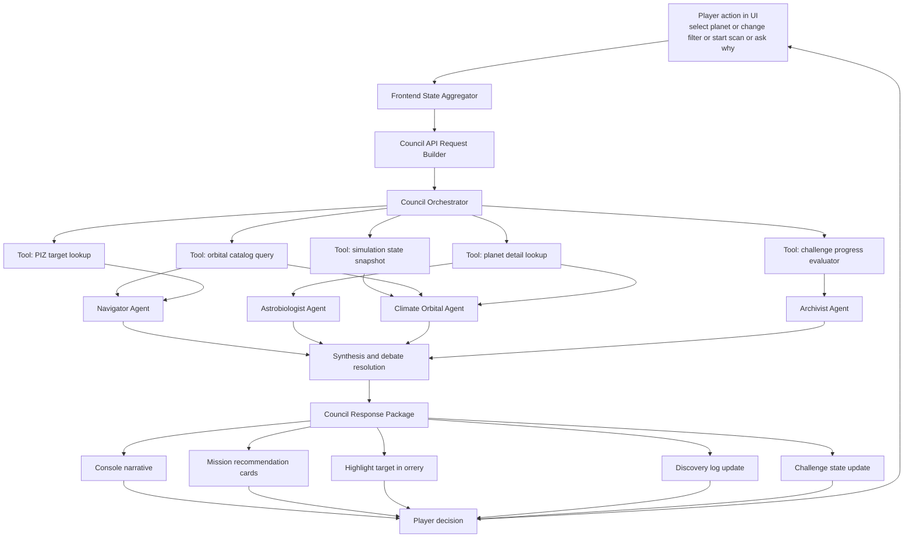
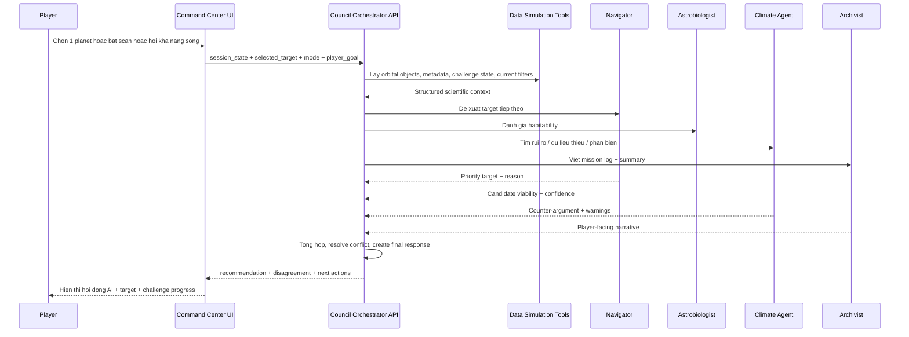
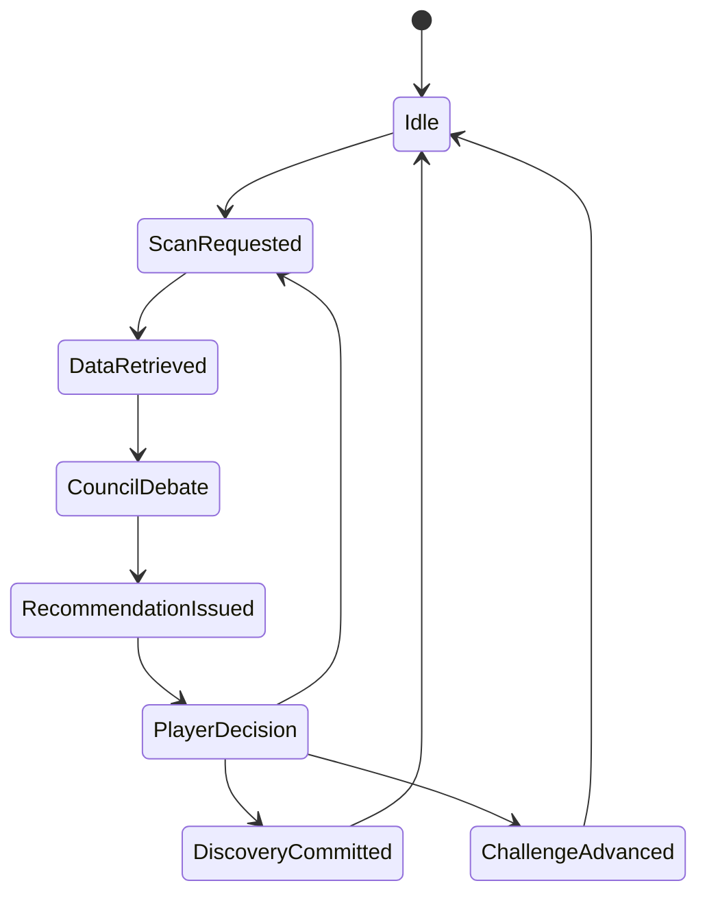

# AI Science Council Pipeline

## 1. Core Concept

`Atlas Orrery` khong chi la mot mo phong he sao. O phien ban "wow" nhat, he thong tro thanh mot **AI-driven exoplanet expedition**:

- Nguoi choi = `Mission Commander`
- He thong AI = `Science Council`
- Du lieu nen = `NASA Exoplanet Archive + TOI/K2 catalogs + orbital simulation`

Thay vi 1 chatbot duy nhat, he thong co mot hoi dong AI cung phan tich, tranh luan, de xuat va ghi nhan kham pha.

## 2. Council Roles

### `Council Orchestrator`
- Dieu phoi toan bo luong.
- Goi tool, cap context cho tung agent.
- Tong hop bat dong va tra ket qua cuoi cung ve UI.

### `Navigator Agent`
- Chon muc tieu uu tien tiep theo.
- De xuat scan pattern: `grid`, `spiral`, `targeted`.
- Toi uu hoa theo khoang cach, do hoan chinh du lieu, do hiem.

### `Astrobiologist Agent`
- Danh gia kha nang song duoc.
- Tap trung vao `temp`, `radius`, `insolation`, `host star`, `distance`.
- Dua ra `confidence + rationale`.

### `Climate/Orbital Agent`
- Phan bien gia thuyet qua lac quan.
- Kiem tra quy dao, eccentricity, period, thermal instability, runaway greenhouse risk.
- Bao khi du lieu thieu hoac khong du chac chan.

### `Archivist Agent`
- Bien ket qua thanh `discovery card`, `mission log`, `story beat`.
- Giai thich ngon ngu de hieu cho hoc sinh, sinh vien, giao vien.
- Tao challenge tiep theo dua tren lich su session.

## 3. System Pipeline



## 4. Runtime Loop



## 5. What AI Does vs What Code Must Stay Deterministic

### AI should do
- Giai thich.
- Lap ke hoach kham pha.
- So sanh va uu tien muc tieu.
- Tao mission/challenge dong.
- Tao tranh luan giua cac goc nhin khoa hoc.

### Deterministic code should do
- Tinh quy dao.
- Loc catalog.
- Tinh metric habitability baseline.
- Kiem tra challenge dung/sai.
- Highlight object trong scene.
- Quan ly session state.

### Hard rule
- AI khong duoc tu "che" gia tri khoa hoc.
- Moi ket luan phai map ve field co that trong dataset.
- Neu du lieu thieu, response phai noi ro: `insufficient evidence`.

## 6. Input Context to the Council

Moi turn, Orchestrator nen tao mot `mission context packet` nhu sau:

```json
{
  "mode": "discovery",
  "player_goal": "find potentially habitable worlds",
  "selected_planet_id": "Kepler-442 b",
  "selected_piz_id": "PIZ-00123",
  "filters": {
    "showConfirmed": true,
    "showHabitable": true,
    "radiusMin": 0.7,
    "radiusMax": 2.2,
    "periodMin": 1,
    "periodMax": 500
  },
  "simulation": {
    "timeScale": 8,
    "trackingTarget": "Kepler-442 b",
    "simDate": "2025-03-22T08:00:00Z"
  },
  "challenge_state": {
    "active": true,
    "objective": "Find 3 worlds inside the baseline habitable heuristic",
    "progress": 1
  },
  "recent_discoveries": ["TOI-700 d"],
  "recent_actions": ["spiral_scan", "open_planet_modal"]
}
```

## 7. Output Contract from the Council

Response cuoi cung khong nen chi la 1 doan van ban. No nen la mot payload co cau truc:

```json
{
  "mission_status": "candidate_found",
  "headline": "Council flags Kepler-442 b for deep review",
  "primary_recommendation": {
    "action": "targeted_scan",
    "target_id": "Kepler-442 b",
    "reason": "Radius and insolation are near the habitable heuristic band"
  },
  "council_votes": [
    {
      "agent": "Navigator",
      "stance": "support",
      "confidence": 0.82,
      "message": "This target should be prioritized next."
    },
    {
      "agent": "Astrobiologist",
      "stance": "support",
      "confidence": 0.76,
      "message": "Surface conditions may be favorable under baseline assumptions."
    },
    {
      "agent": "Climate",
      "stance": "caution",
      "confidence": 0.71,
      "message": "Eccentricity and missing atmosphere data limit certainty."
    }
  ],
  "player_options": [
    "Run targeted scan",
    "Compare with similar planets",
    "Open full data dossier"
  ],
  "discovery_log_entry": "Kepler-442 b promoted to high-interest candidate due to converging council evidence."
}
```

## 8. Mode-by-Mode Behavior

### Sandbox
- Player tu do chinh filter, time scale, target.
- Council phan tich tac dong cua thao tac.
- Agent dong vai tro `copilot + explainer`.

Pipeline:
- Detect user change
- Fetch impacted objects
- Council explain effect
- Recommend next experiment

### Challenge
- Council sinh objective theo level.
- Challenge duoc cham bang rule engine.
- Agent dong vai tro `mission master + scientific judge`.

Pipeline:
- Generate challenge
- Observe user actions
- Evaluate progress deterministically
- Council give hints or escalate difficulty

### Discovery
- Council tu phat hien object noi bat.
- Tao story beat va "science dossier".
- Agent dong vai tro `narrator + curator`.

Pipeline:
- Rank anomalies/candidates
- Debate significance
- Surface one "discovery event"
- Add to collection log

## 9. Recommended Architecture in This Repo

### Existing pieces to reuse
- Orbital data API: [server.py](/Users/nhokprovip/Documents/nasa hackathon/server.py)
- Frontend mission shell: [CommandCenterPage.jsx](/Users/nhokprovip/Documents/nasa hackathon/orrery_component/frontend/src/pages/CommandCenterPage.jsx)
- Mission action panel: [MissionControl.jsx](/Users/nhokprovip/Documents/nasa hackathon/orrery_component/frontend/src/components/MissionControl.jsx)
- Console UI: [ConsolePanel.jsx](/Users/nhokprovip/Documents/nasa hackathon/orrery_component/frontend/src/components/ConsolePanel.jsx)
- Data refresh job: [refresh_orbital_catalog.py](/Users/nhokprovip/Documents/nasa hackathon/scripts/refresh_orbital_catalog.py)

### New backend modules
- `council_orchestrator.py`
- `council_tools.py`
- `challenge_engine.py`
- `session_memory.py`
- `prompt_templates.py`

### New API endpoints
- `POST /api/council/turn`
- `POST /api/council/challenge/start`
- `POST /api/council/challenge/action`
- `GET /api/council/session/<id>`
- `POST /api/council/discovery/commit`

### New frontend components
- `CouncilPanel`
- `CouncilVoteStack`
- `MissionRecommendationCard`
- `ChallengeTracker`
- `DiscoveryDossierPanel`

## 10. Internal Tool Layer

Council agents should not query raw CSV directly. Orchestrator should expose tools:

- `tool_get_orbital_candidates(filters)`
- `tool_get_planet_details(planet_id)`
- `tool_rank_targets(criteria)`
- `tool_compare_planets(planet_ids)`
- `tool_evaluate_habitability_baseline(planet_id)`
- `tool_get_piz_context(piz_id)`
- `tool_get_session_history(session_id)`
- `tool_score_challenge_progress(session_id, objective)`

That keeps the system explainable and prevents hallucinated physics.

## 11. Debate Model

The "wow" factor does not come from many agents alone. It comes from **structured disagreement**.

Recommended synthesis policy:

- If all support: show `green consensus`
- If 1 support + 1 caution + 1 oppose: show `active scientific debate`
- If data is missing: show `insufficient evidence`
- If player asks "why not this one?": show direct comparison table plus council split

This makes the game feel like a real research briefing, not a chatbot skin.

## 12. State Machine



## 13. MVP Build Order

### Phase 1
- Add one `Council Orchestrator`
- One endpoint: `POST /api/council/turn`
- One frontend panel to render:
  - headline
  - 3 council votes
  - 3 next actions

### Phase 2
- Add `Challenge mode` mission generation
- Add `Discovery dossier`
- Add session memory

### Phase 3
- Add full `Science Council` debate with disagreement
- Add adaptive narrative and progression
- Add teacher mode with explainable reports

## 14. Judge Pitch

> Atlas Orrery turns NASA exoplanet data into an AI-led scientific expedition.  
> Instead of a single chatbot, a council of specialized agents debates real planetary evidence, guides the player through missions, and transforms astronomy learning into interactive scientific decision-making.

## 15. Final Positioning

This architecture makes the project feel like:

- a game
- a real-data science simulator
- an agentic AI system

not just:

- a dashboard
- a chatbot
- a visualization demo

That is the "wow" version.
