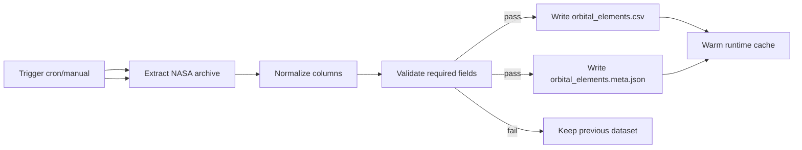
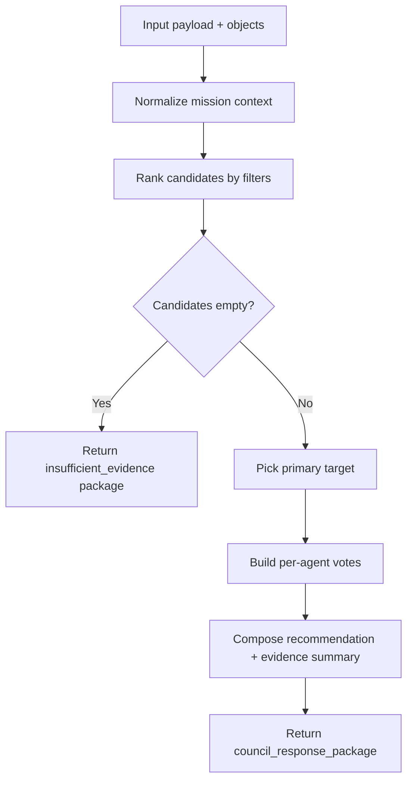
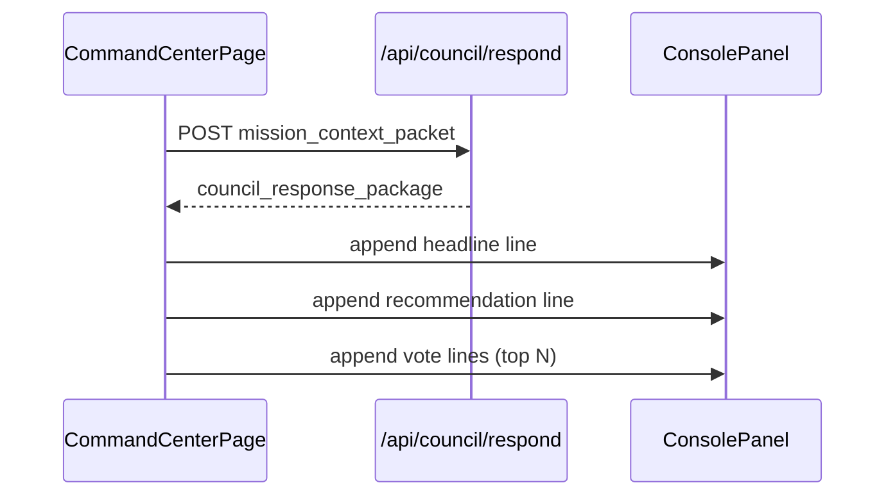
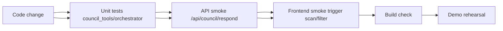

# Atlas Orrery — Pipeline chi tiết (Pipeline-only)

> File này chỉ mô tả **pipeline** (trình tự xử lý theo thời gian): offline data pipeline + online decision pipeline + pipeline test/release.

---

## 1) Pipeline A — Data refresh (offline)



### Input
- Raw rows từ NASA Exoplanet Archive.

### Output
- `data/orbital_elements.csv`
- `data/orbital_elements.meta.json`

### Failure behavior
- Nếu validation fail: không overwrite dataset cũ.
- Runtime API vẫn dùng bản cache trước đó.

---

## 2) Pipeline B — User interaction to Council response (online)

```mermaid
flowchart LR
    U[User action
scan or filter or select] --> FE[Frontend state aggregation]
    FE --> P[Build mission_context_packet]
    P --> API[Call Council Respond Endpoint]
scan/filter/select] --> FE[Frontend state aggregation]
    FE --> P[Build mission_context_packet]
    P --> API[POST /api/council/respond]
    API --> OR[Orchestrator parse + policy]
    OR --> TL1[rank_targets_for_context]
    OR --> TL2[compute_habitability_score]
    OR --> TL3[build_council_votes]
    TL1 --> OR
    TL2 --> OR
    TL3 --> OR
    OR --> R[council_response_package]
    R --> UI[Console + recommendation + options]
    UI --> U
```

### Step-by-step execution

1. FE bắt event từ scan/filter/selection.
2. FE gom state thành `mission_context_packet`.
3. API nhận payload và normalize schema.
4. Orchestrator lấy danh sách objects hiện có.
5. Gọi tools deterministic để lọc/rank/chấm điểm.
6. Branch:
   - không có candidate -> `insufficient_evidence`.
   - có candidate -> build votes + recommendation.
7. Trả response có cấu trúc ổn định.
8. FE render logs/action options cho vòng tương tác tiếp.

---

## 3) Pipeline C — Branching logic của council



---

## 4) Pipeline D — UI update pipeline



UI policy:
- line type `command` cho headline,
- `info` cho support votes,
- `warning` cho caution votes.

---

## 5) Pipeline E — Quality & test pipeline



Minimum gates:
- Unit test pass.
- Response contract keys luôn đủ.
- `insufficient_evidence` branch không lỗi.
- Frontend render được cả support + caution logs.

---

## 6) Pipeline SLO targets

- Council response p95 < 800ms (local demo env).
- FE update after response < 150ms.
- Error rate council endpoint < 1% trong demo session.

---

## 7) Pipeline risk controls

1. **Spam request khi đổi filter liên tục**
   - debounce FE + loading guard.

2. **Mismatch context do response đến muộn**
   - chỉ apply response mới nhất theo timestamp/request id.

3. **Candidate rỗng gây dead-end UX**
   - fallback options: widen filters / compare analogs.

4. **Data refresh lỗi gần giờ demo**
   - lock dataset stable trước demo window.

