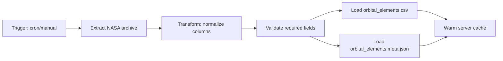
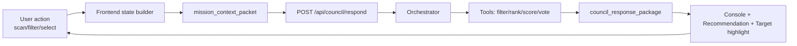
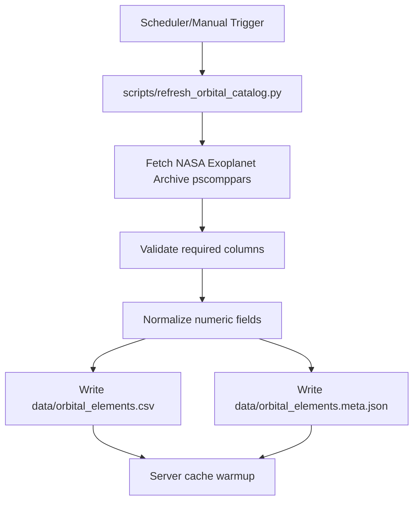
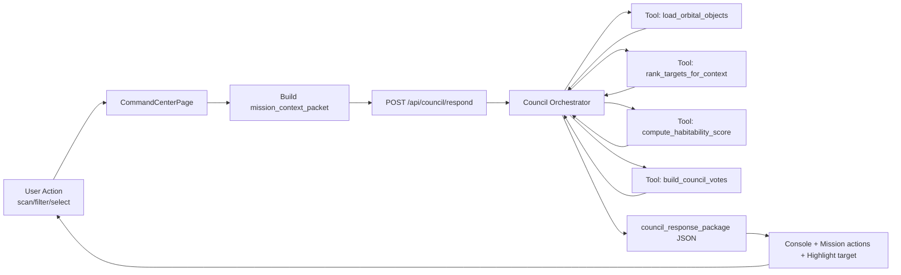

# Atlas Orrery — Kiến trúc hệ thống chi tiết (Architecture-only)

> File này chỉ mô tả **kiến trúc hệ thống** (thành phần, ranh giới, trách nhiệm, interfaces). Pipeline runtime/offline đã tách riêng sang `SYSTEM_PIPELINE.md`.

---

## 1) System architecture (layered view)

```mermaid
flowchart TB
    subgraph FE[Frontend Layer]
      FE1[Command Center Page]
      FE2[Orrery Engine]
      FE3[Console and Mission UI]
    end

    subgraph API[Application Layer]
      AP1[Orbital Objects Endpoint]
      AP2[Planet Detail Endpoint]
      AP3[Council Respond Endpoint]
      AP4[Orbital Meta Endpoint]
# Atlas Orrery — Pipeline & Kiến trúc hệ thống (Blueprint triển khai cực chi tiết)

> Mục tiêu: từ bản ý tưởng chuyển thành **kế hoạch code + vận hành** mà giám khảo kỹ thuật có thể kiểm chứng.

---

## 1) Kiến trúc tổng thể (System Architecture)

```mermaid
flowchart TB
    subgraph FE[Frontend Layer - React/Three.js]
      FE1[CommandCenterPage]
      FE2[OrreryEngine]
      FE3[ConsolePanel / MissionControl / Modals]
    end

    subgraph API[Application Layer - Flask API]
      AP1[GET /api/orbital-objects]
      AP2[GET /api/planet/:id]
      AP3[POST /api/council/respond]
      AP4[GET /api/orbital-meta]
    end

    subgraph CORE[Reasoning Core]
      RC1[Council Orchestrator]
      RC2[Council Schemas]
      RC3[Council Tools]
    end

    subgraph DATA[Data Layer]
      D1[Orbital Elements CSV]
      D2[Orbital Elements Meta JSON]
      D3[TOI and K2 Catalog CSV]
    end

    subgraph JOB[ETL Layer]
      J1[Refresh Orbital Catalog Script]
      D1[data/orbital_elements.csv]
      D2[data/orbital_elements.meta.json]
      D3[data/TOI_*.csv, data/k2*.csv]
    end

    subgraph JOB[ETL Layer]
      J1[scripts/refresh_orbital_catalog.py]
    end

    FE1 --> AP3
    FE2 --> AP1
    FE1 --> AP2
    AP3 --> RC1
    RC1 --> RC2
    RC1 --> RC3
    AP1 --> D1
    AP4 --> D2
    AP2 --> D1
    J1 --> D1
    J1 --> D2
    J1 --> D3
```

---

## 2) Module architecture (code map)

```mermaid
graph TD
    subgraph Frontend[Frontend Modules]
      F1[Command Center Page File]
      F2[Console Panel File]
      F3[Orrery Engine File]
    end

    subgraph Backend[Backend Modules]
      B1[Server File]
      B2[Council Orchestrator File]
      B3[Council Schemas File]
      B4[Council Tools File]
    end

    subgraph Data[Data Assets]
      D1[Orbital Elements Data]
      D2[Orbital Elements Metadata]
      D3[TOI and K2 Data]
    subgraph Frontend["Frontend modules"]
      F1["CommandCenterPage.jsx"]
      F2["ConsolePanel.jsx"]
      F3["OrreryEngine.js"]
    end

    subgraph Backend["Backend modules"]
      B1["server.py"]
      B2["council_orchestrator.py"]
      B3["council_schemas.py"]
      B4["council_tools.py"]
    end

    subgraph Data["Data assets"]
      D1["data/orbital_elements.csv"]
      D2["data/orbital_elements.meta.json"]
      D3["data/TOI_*.csv, data/k2*.csv"]
    end

    F1 --> B1
    B1 --> B2
    B2 --> B3
    B2 --> B4
    B1 --> D1
    B1 --> D2
    B1 --> D3
    F3 --> B1
```

---

## 3) Responsibility matrix (RACI-lite)

| Component | Responsibility chính | Không làm |
|---|---|---|
| `CommandCenterPage.jsx` | Thu user interactions, gọi API council, render log/action | Không tính score/ranking |
| `server.py` | Boundary HTTP + load datasets/cache + route responses | Không chứa policy phức tạp của council |
| `council_orchestrator.py` | Điều phối logic decision, chọn branch fallback/candidate | Không đọc file trực tiếp |
| `council_tools.py` | Pure deterministic functions (score/filter/rank/votes) | Không side effects/network I/O |
| `council_schemas.py` | Parse/normalize payload + typed response | Không business logic ranking |
| `scripts/refresh_orbital_catalog.py` | ETL refresh dữ liệu | Không phục vụ runtime API |

---

## 4) Interface boundaries

### 4.1 FE -> API
- Giao tiếp qua JSON contract (request/response council).
- FE không phụ thuộc implementation nội bộ orchestrator.

### 4.2 API -> Core
- API chỉ delegate sang orchestrator.
- Orchestrator nhận `objects + payload`, trả structured dict.

### 4.3 Core -> Data
- Core dùng data đã load sẵn từ API layer.
- Không tự truy cập filesystem.

---

## 5) Non-functional architecture constraints

- Deterministic-first cho lớp reasoning tools.
- Graceful degradation khi thiếu candidate (`insufficient_evidence`).
- Contract-stable để FE render không parse text tự do.
- Tách ranh giới module để dễ test độc lập.

---

## 6) Architecture readiness checklist

- [ ] Module boundaries rõ ràng, không chồng trách nhiệm.
- [ ] Endpoint council không nhúng logic khó test.
- [ ] Tools có thể test độc lập bằng unit tests.
- [ ] Không có dependency vòng giữa modules core.
- [ ] Dễ mở rộng thêm challenge engine mà không phá contract.
### 1.1 Vai trò theo lớp

- **Frontend Layer**: thu interaction và render decision.
- **Application Layer**: cung cấp transport/API boundary.
- **Reasoning Core**: xử lý logic council theo contract.
- **Data Layer**: nguồn sự thật khoa học.
- **ETL Layer**: làm mới dữ liệu định kỳ.

---

## 2) Pipeline thực thi (Execution Pipeline)

## 2.1 Pipeline A — Data refresh (offline)



### 2.1.1 Input
- NASA pscomppars rows.

### 2.1.2 Output
- `orbital_elements.csv` (catalog runtime).
- `orbital_elements.meta.json` (lineage + refreshed timestamp).

### 2.1.3 Failure policy
- ETL fail -> giữ dataset cũ.
- Không block runtime API.

---

## 2.2 Pipeline B — User decision loop (online)



### 2.2.1 Bước chi tiết

1. FE gom state hiện tại:
   - mode, filters, selected target, recent actions.
2. FE gửi packet lên endpoint council.
3. API parse payload + normalize schema.
4. Orchestrator gọi tools deterministic:
   - rank targets,
   - pick primary,
   - build votes.
5. Nếu không có candidate -> nhánh `insufficient_evidence`.
6. Trả payload có action để UI hành động ngay.
7. UI append logs + update mission flow.

---

## 2.3 Sequence diagram runtime
# Atlas Orrery — Pipeline & Kiến trúc kỹ thuật chi tiết (bản cho ban giám khảo)

> Mục tiêu tài liệu: chứng minh **tính khả thi công nghệ** của hệ Agentic AI bằng kiến trúc triển khai được ngay, có luồng dữ liệu rõ ràng, có ràng buộc an toàn và có roadmap vận hành thực tế.

---

## 1) Tổng quan hệ thống

Atlas Orrery được thiết kế thành 4 lớp chính:

1. **Experience Layer (Frontend)**
   - Giao diện Command Center (React + Three.js).
   - Nhận thao tác người dùng và hiển thị phản hồi của AI Council.

2. **Application Layer (Flask API)**
   - Endpoint dữ liệu quỹ đạo/chi tiết hành tinh.
   - Endpoint Council orchestration (`/api/council/respond`).

3. **Reasoning Layer (Council Orchestrator + Agents)**
   - Orchestrator + các agent vai trò (Navigator, Astrobiologist, Climate, Archivist).
   - Chỉ hoạt động trên dữ liệu đã chuẩn hóa từ tools.

4. **Science Data Layer**
   - Orbital catalog (`orbital_elements.csv`), TOI/K2.
   - Meta refresh + cache + deterministic scoring.

---

## 2) Pipeline end-to-end (siêu chi tiết)

## 2.1. Data refresh pipeline (offline / scheduled)



### Chi tiết kỹ thuật
- **Input source**: NASA Exoplanet Archive.
- **Validation gate**:
  - bắt buộc có `pl_name`, `pl_orbper`, `pl_orbsmax`.
- **Output ổn định**:
  - dataset chính + file meta (`refreshed_at_utc`, source).
- **Fail-safe**:
  - refresh lỗi thì giữ dataset cũ (không làm sập runtime).

---

## 2.2. Runtime interaction pipeline (online)



### Các bước xử lý cụ thể tại mỗi request council

1. Frontend tạo `mission_context_packet`:
   - mode, goal, selected target, filters, simulation state, recent actions.
2. Backend parse payload + sanity checks.
3. Load orbital catalog đã cache (`lru_cache`).
4. Áp filter từ UI và rank candidate.
5. Nếu rỗng candidate → trả `insufficient_evidence`.
6. Chọn primary candidate:
   - ưu tiên selected target nếu còn hợp lệ,
   - fallback top-ranked.
7. Tạo votes cho từng agent + confidence + evidence fields.
8. Tổng hợp `headline`, `primary_recommendation`, `player_options`, `evidence_summary`.
9. Trả JSON ổn định để frontend render không cần parse text tự do.

---

## 2.3. Sequence diagram chi tiết request-response

```mermaid
sequenceDiagram
    participant User
    participant FE as CommandCenterPage
    participant API as Flask /api/council/respond
    participant OR as Council Orchestrator
    participant TL as Council Tools
    participant DS as Orbital Data Cache

    User->>FE: click scan / adjust filter
    FE->>FE: build mission_context_packet
    FE->>API: POST packet
    API->>OR: generate_council_response(payload)
    OR->>DS: load orbital objects
    DS-->>OR: objects[]
    OR->>TL: rank_targets_for_context(objects, filters)

    alt no candidates
        TL-->>OR: []
        OR-->>API: insufficient_evidence payload
        API-->>FE: JSON response
        FE-->>User: fallback guidance
    else candidates
        TL-->>OR: ranked[]
        OR->>TL: build_council_votes(primary)
        TL-->>OR: votes[]
        OR-->>API: council_response_package
        API-->>FE: JSON response
        FE-->>User: headline + recommendation + votes
    participant FE as React Command Center
    participant API as Flask /api/council/respond
    participant Or as Council Orchestrator
    participant Data as Orbital Catalog Cache
    participant Agents as Navigator/Astro/Climate/Archivist

    User->>FE: Change filter / click scan
    FE->>FE: Build mission_context_packet
    FE->>API: POST council request

    API->>Or: parse + validate payload
    Or->>Data: load_orbital_objects()
    Data-->>Or: objects[]

    Or->>Or: rank_targets_for_context(filters)
    Or->>Or: compute_habitability_score(primary)

    alt No candidate after filtering
        Or-->>API: insufficient_evidence package
        API-->>FE: JSON(200)
        FE->>User: show fallback recommendation
    else Candidate available
        Or->>Agents: create per-agent votes
        Agents-->>Or: votes + confidence + evidence
        Or-->>API: council_response_package
        API-->>FE: JSON(200)
        FE->>User: headline + recommendation + votes
    end
```

---

## 3) Contract thiết kế (API contracts)

## 3.1 Request contract
## 3) Kiến trúc module chi tiết

```mermaid
graph TD
    subgraph Frontend["Frontend (orrery_component/frontend)"]
      A1["CommandCenterPage.jsx"]
      A2["ConsolePanel.jsx"]
      A3["MissionControl.jsx"]
      A4["OrreryEngine.js"]
    end

    subgraph Backend["Backend (Flask server.py)"]
      B1["GET /api/orbital-objects"]
      B2["GET /api/planet/:id"]
      B3["POST /api/council/respond"]
      B4["Scoring + Ranking + Votes"]
      B5["Cache loaders"]
    end

    subgraph Data["Data (data/)"]
      C1["orbital_elements.csv"]
      C2["orbital_elements.meta.json"]
      C3["TOI/K2 CSV"]
    end

    subgraph Jobs["Jobs (scripts/)"]
      D1["refresh_orbital_catalog.py"]
    subgraph Frontend [orrery_component/frontend]
      A1[CommandCenterPage.jsx]
      A2[ConsolePanel.jsx]
      A3[MissionControl.jsx]
      A4[OrreryEngine.js]
    end

    subgraph Backend [Flask server.py]
      B1[/api/orbital-objects]
      B2[/api/planet/:id]
      B3[/api/council/respond]
      B4[Scoring + Ranking + Votes]
      B5[Cache loaders]
    end

    subgraph Data [data/]
      C1[orbital_elements.csv]
      C2[orbital_elements.meta.json]
      C3[TOI/K2 CSV]
    end

    subgraph Jobs [scripts/]
      D1[refresh_orbital_catalog.py]
    end

    A1 --> B3
    A4 --> B1
    A1 --> B2
    B3 --> B4
    B4 --> B5
    B5 --> C1
    B5 --> C2
    B5 --> C3
    D1 --> C1
    D1 --> C2
```

### Trách nhiệm từng khối

- `CommandCenterPage.jsx`
  - Trigger council request theo interaction.
  - Hiển thị output council thành logs/actions.

- `server.py`
  - Host toàn bộ API.
  - Load dữ liệu một lần, phục vụ từ cache.
  - Tính score/rank/votes deterministic.

- `data/`
  - Nguồn sự thật cho tính toán khoa học.

- `scripts/refresh_orbital_catalog.py`
  - Cập nhật dữ liệu định kỳ.

---

## 4) Contract kỹ thuật (input/output)

## 4.1 Input contract: `mission_context_packet`

```json
{
  "mode": "discovery",
  "player_goal": "find potentially habitable worlds",
  "selected_planet_id": "Kepler-442 b",
  "selected_piz_id": "PIZ-00123",
  "filters": {
    "showConfirmed": true,
    "showHabitable": true,
    "radiusMin": 0.7,
    "radiusMax": 2.2,
    "periodMin": 1,
    "periodMax": 500
  },
  "challenge_state": {
    "active": false,
    "objective": "",
    "progress": 0
  },
  "recent_actions": ["spiral_scan", "filter_adjusted"]
}
```

## 3.2 Response contract
  "simulation": {
    "timeScale": 8,
    "trackingTarget": "Kepler-442 b",
    "simDate": "2026-03-28T10:00:00Z"
  },
  "challenge_state": {
    "active": true,
    "objective": "Find 3 promising worlds",
    "progress": 1
  },
  "recent_actions": ["filter_adjusted", "spiral_scan"]
}
```

## 4.2 Output contract: `council_response_package`

```json
{
  "mission_status": "candidate_with_risk",
  "headline": "Council ưu tiên Kepler-442 b cho bước kế tiếp",
  "primary_recommendation": {
    "action": "targeted_scan",
    "target_id": "Kepler-442 b",
    "reason": "Scored 0.78 on baseline habitability"
  },
  "council_votes": [
    {
      "agent": "Navigator",
      "stance": "support",
      "confidence": 0.83,
      "message": "Prioritize this target",
      "evidence_fields": ["pl_orbper", "pl_orbsmax", "sy_dist"]
    }
  ],
  "player_options": ["Run targeted scan", "Compare nearest analogs"],
  "discovery_log_entry": "Promoted after council triage",
    },
    {
      "agent": "Climate",
      "stance": "caution",
      "confidence": 0.71,
      "message": "Eccentricity uncertainty remains",
      "evidence_fields": ["pl_orbeccen", "pl_orbper"]
    }
  ],
  "player_options": [
    "Run targeted scan",
    "Compare nearest analogs",
    "Open full data dossier"
  ],
  "discovery_log_entry": "Kepler-442 b promoted after council triage",
  "evidence_summary": {
    "radius_earth": 1.34,
    "temp_k": 287,
    "insolation": 0.94,
    "eccentricity": 0.08,
    "period_days": 112.4
  }
}
```

---

## 4) Kế hoạch code chi tiết (implementation plan)

## 4.1 Backend decomposition

### `council_schemas.py`

Chứa dataclass:
- `MissionFilters`
- `ChallengeState`
- `MissionContext`
- `CouncilVote`
- `CouncilResponse`

Nhiệm vụ:
- parse payload thành object typed,
- cung cấp `to_dict()` nhất quán.

### `council_tools.py`

Chứa pure functions:
- `compute_habitability_score(planet)`
- `rank_targets_for_context(objects, filters)`
- `build_council_votes(primary, mode)`

Yêu cầu:
- không side-effect,
- deterministic,
- unit-testable độc lập.

### `council_orchestrator.py`

Entry point:
- `generate_council_response(objects, payload)`

Flow:
1. parse context,
2. rank candidates,
3. branch insufficient/candidate,
4. build final response payload.

### `server.py`

Boundary HTTP:
- `POST /api/council/respond`:
  - read JSON,
  - load orbital objects,
  - delegate orchestrator,
  - return JSON.

---

## 4.2 Frontend decomposition

### `CommandCenterPage.jsx`

Thêm:
- `requestCouncilBrief(reason, extra)`
- trigger points:
  - `handleScan(pattern)`
  - `handleFilterChange(patch)`

Nhiệm vụ:
- gửi `mission_context_packet`,
- append logs:
  - `COUNCIL: headline`
  - recommendation
  - top votes.

### `ConsolePanel.jsx`

Hiển thị line-by-line:
- command/info/warning.
- giữ history window để không tràn UI.

---

## 4.3 Test strategy chi tiết

### Unit tests

- `test_compute_habitability_score_range()`
- `test_rank_filters_exclude_out_of_range()`
- `test_orchestrator_returns_insufficient_evidence()`
- `test_orchestrator_returns_votes_and_evidence_summary()`

### API smoke tests

- POST `/api/council/respond` with valid payload -> 200.
- POST malformed payload -> normalized fallback (không crash).

### UI smoke tests

- trigger scan -> console có headline.
- chỉnh filter cực hẹp -> console có fallback cảnh báo.

---

## 5) NFR và SLO (để chứng minh feasibility)

## 5.1 Performance SLO

- p95 council latency < 800ms local.
- p99 < 1500ms với dataset hackathon scale.

## 5.2 Reliability SLO

- Không crash nếu payload thiếu key.
- Không crash nếu dataset tạm lỗi -> trả error JSON rõ.

## 5.3 Observability

- request_id cho mỗi council call.
- metrics:
  - latency_ms,
  - error_rate,
  - recommendation_accept_rate,
  - insufficient_evidence_rate.

## 5.4 Security

- sanitize input numeric range.
- giới hạn payload size.
- rate-limit endpoint khi public.

---

## 6) Risk register + mitigation

1. **Mermaid/docs khó render**
   - Giải pháp: dùng quoted labels cho node/subgraph.

2. **Filter đổi liên tục gây spam call**
   - Giải pháp: FE debounce + cancel request cũ.

3. **Decision không ổn định giữa các turn**
   - Giải pháp: deterministic scoring + fixed sorting.

4. **Giám khảo nghi ngờ tính thật của AI**
   - Giải pháp: show evidence fields cạnh recommendation.

---

## 7) Kế hoạch sprint thực thi (48 giờ hackathon)

## Sprint A (0–12h)
- chốt schema + endpoint council.
- unit test core tools.

## Sprint B (12–24h)
- nối frontend trigger + console output.
- hoàn thiện fallback states.

## Sprint C (24–36h)
- hardening performance.
- bổ sung metrics và log quan trọng.

## Sprint D (36–48h)
- freeze feature.
- rehearsal demo + backup video.
- tinh chỉnh script theo rubric.

---

## 8) Checklist “sẵn sàng cho ban giám khảo kỹ thuật”

- [ ] Có architecture diagram rõ lớp.
- [ ] Có runtime pipeline rõ bước.
- [ ] Có contract request/response cụ thể.
- [ ] Có code module tương ứng architecture.
- [ ] Có test tối thiểu cho success/fallback.
- [ ] Có NFR + SLO + risk mitigation.

---

## 9) Kết luận

Blueprint này đảm bảo 3 thứ cùng lúc:
1. **Có thể build được ngay** (module rõ, flow rõ, test rõ).
2. **Có thể demo thuyết phục** (agentic behavior nhìn thấy được).
3. **Có thể mở rộng sau hackathon** (contract-driven + layered architecture).
## 5) Chứng minh tính khả thi kỹ thuật

## 5.1 Tính khả thi triển khai

- **Không cần infra phức tạp**: Flask + React hiện tại đã đủ chạy E2E.
- **Không cần phụ thuộc model cloud để có MVP**: bản deterministic chạy độc lập.
- **Mở rộng dần**: có thể thêm LLM layer sau mà không phá contract.

## 5.2 Tính ổn định runtime

- Caching dataframe (`lru_cache`) giảm latency I/O.
- Fallback `insufficient_evidence` thay vì crash.
- Output schema cố định giúp frontend ổn định.

## 5.3 Tính minh bạch khoa học

- `evidence_fields` bắt buộc ở votes.
- Tách fact và narrative.
- Không phát sinh thông số ngoài dataset.

---

## 6) NFRs (Non-Functional Requirements) cho demo và production-lite

### Performance
- p95 council response < 800ms local.
- Render update UI < 150ms sau response.

### Reliability
- API uptime mục tiêu demo: > 99% trong phiên chấm.
- Graceful degradation khi thiếu dữ liệu.

### Security
- Validate payload types và range cho filter.
- Rate-limit council endpoint (nếu public).
- Không expose key/secret ở frontend.

### Observability
- Structured logs theo request id.
- Metrics tối thiểu:
  - request_count,
  - error_rate,
  - avg_latency_ms,
  - recommendation_accept_rate.

---

## 7) Lộ trình triển khai kỹ thuật theo mốc thời gian

## T0–T1 (6 giờ): ổn định council core
- Hoàn thiện parse/validate payload.
- Chuẩn hóa response schema.
- Test với nhiều filter edge-case.

## T1–T2 (8 giờ): nâng chất lượng UX
- Hiển thị votes + confidence rõ trong console.
- 1-click action từ recommendation.
- Highlight target trong scene.

## T2–T3 (8 giờ): hardening để demo
- Load test nhẹ endpoint.
- Chuẩn hóa log + telemetry.
- Chuẩn bị fallback mode offline.

## T3–T4 (4 giờ): chốt bài thi
- Freeze feature.
- Quay video backup demo.
- Chuẩn bị script thuyết trình theo rubric.

---

## 8) Rủi ro kỹ thuật và phương án giảm thiểu

1. **Rủi ro latency khi filter đổi liên tục**
   - Mitigation: debounce frontend + cache + hạn chế top-N ranking.

2. **Rủi ro response nhiễu do context không đồng bộ**
   - Mitigation: gắn timestamp + request_id, chỉ render response mới nhất.

3. **Rủi ro hiểu nhầm “AI bịa dữ liệu”**
   - Mitigation: luôn hiển thị `evidence_fields` + trạng thái `insufficient_evidence`.

4. **Rủi ro demo mạng yếu**
   - Mitigation: local mode + video backup + deterministic fallback.

---

## 9) Checklist trình bày tính khả thi trước giám khảo

- [ ] Có architecture diagram rõ thành phần và dependency.
- [ ] Có sequence diagram runtime từ user action đến council response.
- [ ] Có contract input/output cụ thể.
- [ ] Có cơ chế fallback và guardrails.
- [ ] Có metric đo hiệu năng và chất lượng.
- [ ] Có roadmap triển khai theo giờ/ngày.

---

## 10) Kết luận kỹ thuật

Atlas Orrery có lợi thế lớn vì nền tảng dữ liệu và mô phỏng đã có sẵn. Phần AI Agents được thiết kế theo hướng modular, deterministic-first và contract-driven nên vừa phù hợp chủ đề Agentic AI, vừa chứng minh được tính khả thi thực thi trong thời gian hackathon.

Nói ngắn gọn cho ban giám khảo:

> Chúng tôi không chỉ có ý tưởng Agentic AI, chúng tôi có pipeline chạy được, kiến trúc kiểm chứng được, và đường triển khai rõ ràng để đưa vào thực tế.

