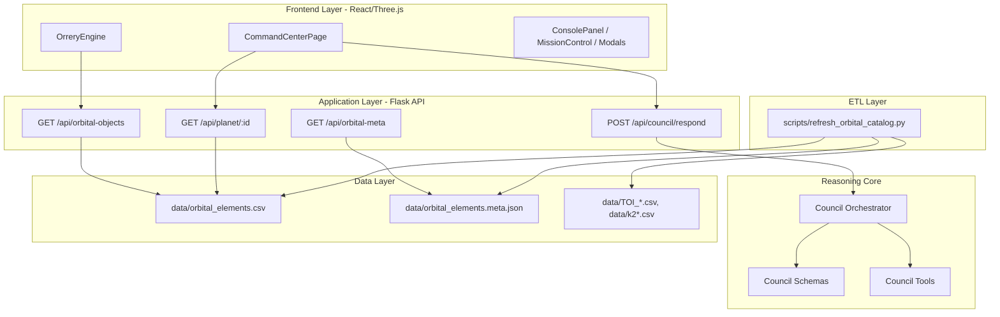
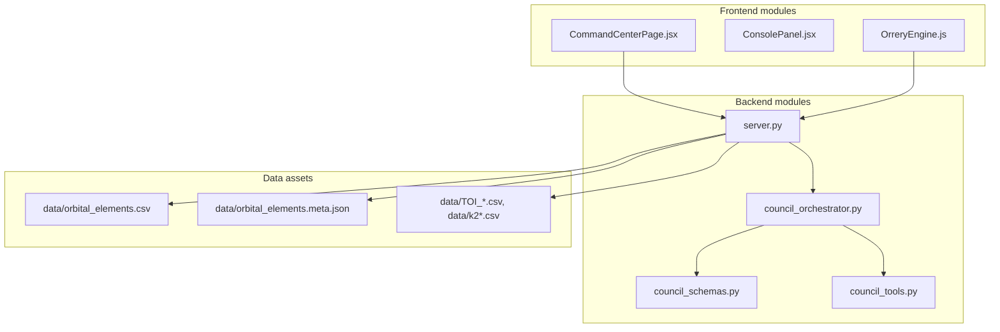

# Atlas Orrery — Kiến trúc hệ thống chi tiết (Architecture-only)

> File này chỉ mô tả **kiến trúc hệ thống** (thành phần, ranh giới, trách nhiệm, interfaces). Pipeline runtime/offline đã tách riêng sang `SYSTEM_PIPELINE.md`.

---

## 1) System architecture (layered view)

---

## 2) Module architecture (code map)

---

## 3) Responsibility matrix (RACI-lite)

| Component | Responsibility chính | Không làm |
|---|---|---|
| `CommandCenterPage.jsx` | Thu user interactions, gọi API council, render log/action | Không tính score/ranking |
| `server.py` | Boundary HTTP + load datasets/cache + route responses | Không chứa policy phức tạp của council |
| `council_orchestrator.py` | Điều phối logic decision, chọn branch fallback/candidate | Không đọc file trực tiếp |
| `council_tools.py` | Pure deterministic functions (score/filter/rank/votes) | Không side effects/network I/O |
| `council_schemas.py` | Parse/normalize payload + typed response | Không business logic ranking |
| `scripts/refresh_orbital_catalog.py` | ETL refresh dữ liệu | Không phục vụ runtime API |

---

## 4) Interface boundaries

### 4.1 FE -> API
- Giao tiếp qua JSON contract (request/response council).
- FE không phụ thuộc implementation nội bộ orchestrator.

### 4.2 API -> Core
- API chỉ delegate sang orchestrator.
- Orchestrator nhận `objects + payload`, trả structured dict.

### 4.3 Core -> Data
- Core dùng data đã load sẵn từ API layer.
- Không tự truy cập filesystem.

---

## 5) Non-functional architecture constraints

- Deterministic-first cho lớp reasoning tools.
- Graceful degradation khi thiếu candidate (`insufficient_evidence`).
- Contract-stable để FE render không parse text tự do.
- Tách ranh giới module để dễ test độc lập.

---

## 6) Architecture readiness checklist

- [ ] Module boundaries rõ ràng, không chồng trách nhiệm.
- [ ] Endpoint council không nhúng logic khó test.
- [ ] Tools có thể test độc lập bằng unit tests.
- [ ] Không có dependency vòng giữa modules core.
- [ ] Dễ mở rộng thêm challenge engine mà không phá contract.

