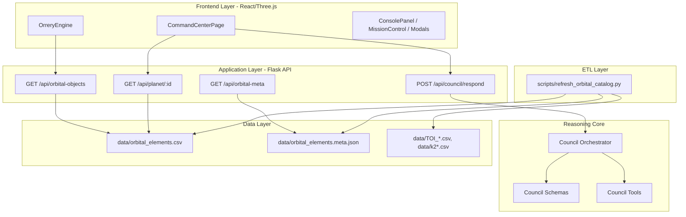
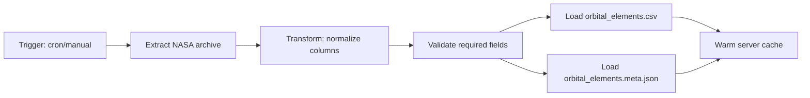
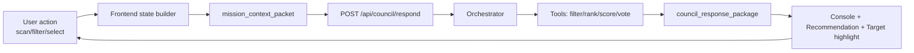
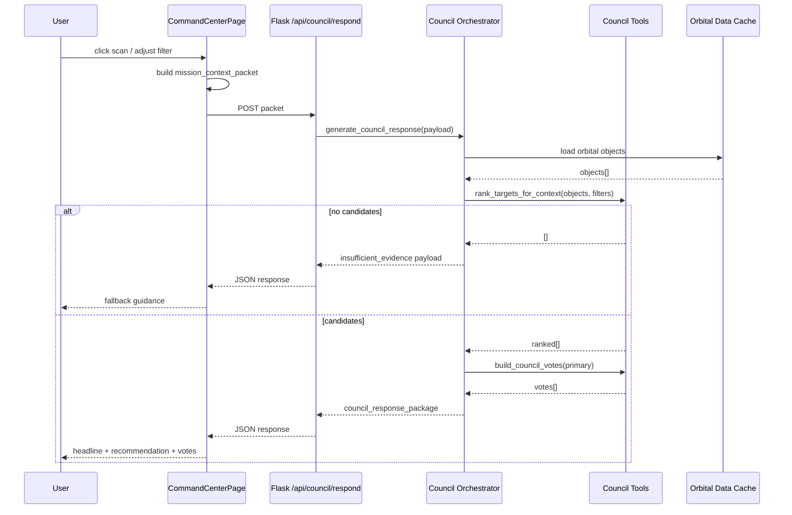

# Atlas Orrery — Pipeline & Kiến trúc hệ thống (Blueprint triển khai cực chi tiết)

> Mục tiêu: từ bản ý tưởng chuyển thành **kế hoạch code + vận hành** mà giám khảo kỹ thuật có thể kiểm chứng.

---

## 1) Kiến trúc tổng thể (System Architecture)



### 1.1 Vai trò theo lớp

- **Frontend Layer**: thu interaction và render decision.
- **Application Layer**: cung cấp transport/API boundary.
- **Reasoning Core**: xử lý logic council theo contract.
- **Data Layer**: nguồn sự thật khoa học.
- **ETL Layer**: làm mới dữ liệu định kỳ.

---

## 2) Pipeline thực thi (Execution Pipeline)

## 2.1 Pipeline A — Data refresh (offline)



### 2.1.1 Input
- NASA pscomppars rows.

### 2.1.2 Output
- `orbital_elements.csv` (catalog runtime).
- `orbital_elements.meta.json` (lineage + refreshed timestamp).

### 2.1.3 Failure policy
- ETL fail -> giữ dataset cũ.
- Không block runtime API.

---

## 2.2 Pipeline B — User decision loop (online)



### 2.2.1 Bước chi tiết

1. FE gom state hiện tại:
   - mode, filters, selected target, recent actions.
2. FE gửi packet lên endpoint council.
3. API parse payload + normalize schema.
4. Orchestrator gọi tools deterministic:
   - rank targets,
   - pick primary,
   - build votes.
5. Nếu không có candidate -> nhánh `insufficient_evidence`.
6. Trả payload có action để UI hành động ngay.
7. UI append logs + update mission flow.

---

## 2.3 Sequence diagram runtime



---

## 3) Contract thiết kế (API contracts)

## 3.1 Request contract

```json
{
  "mode": "discovery",
  "player_goal": "find potentially habitable worlds",
  "selected_planet_id": "Kepler-442 b",
  "selected_piz_id": "PIZ-00123",
  "filters": {
    "showConfirmed": true,
    "showHabitable": true,
    "radiusMin": 0.7,
    "radiusMax": 2.2,
    "periodMin": 1,
    "periodMax": 500
  },
  "challenge_state": {
    "active": false,
    "objective": "",
    "progress": 0
  },
  "recent_actions": ["spiral_scan", "filter_adjusted"]
}
```

## 3.2 Response contract

```json
{
  "mission_status": "candidate_with_risk",
  "headline": "Council ưu tiên Kepler-442 b cho bước kế tiếp",
  "primary_recommendation": {
    "action": "targeted_scan",
    "target_id": "Kepler-442 b",
    "reason": "Scored 0.78 on baseline habitability"
  },
  "council_votes": [
    {
      "agent": "Navigator",
      "stance": "support",
      "confidence": 0.83,
      "message": "Prioritize this target",
      "evidence_fields": ["pl_orbper", "pl_orbsmax", "sy_dist"]
    }
  ],
  "player_options": ["Run targeted scan", "Compare nearest analogs"],
  "discovery_log_entry": "Promoted after council triage",
  "evidence_summary": {
    "radius_earth": 1.34,
    "temp_k": 287,
    "insolation": 0.94,
    "eccentricity": 0.08,
    "period_days": 112.4
  }
}
```

---

## 4) Kế hoạch code chi tiết (implementation plan)

## 4.1 Backend decomposition

### `council_schemas.py`

Chứa dataclass:
- `MissionFilters`
- `ChallengeState`
- `MissionContext`
- `CouncilVote`
- `CouncilResponse`

Nhiệm vụ:
- parse payload thành object typed,
- cung cấp `to_dict()` nhất quán.

### `council_tools.py`

Chứa pure functions:
- `compute_habitability_score(planet)`
- `rank_targets_for_context(objects, filters)`
- `build_council_votes(primary, mode)`

Yêu cầu:
- không side-effect,
- deterministic,
- unit-testable độc lập.

### `council_orchestrator.py`

Entry point:
- `generate_council_response(objects, payload)`

Flow:
1. parse context,
2. rank candidates,
3. branch insufficient/candidate,
4. build final response payload.

### `server.py`

Boundary HTTP:
- `POST /api/council/respond`:
  - read JSON,
  - load orbital objects,
  - delegate orchestrator,
  - return JSON.

---

## 4.2 Frontend decomposition

### `CommandCenterPage.jsx`

Thêm:
- `requestCouncilBrief(reason, extra)`
- trigger points:
  - `handleScan(pattern)`
  - `handleFilterChange(patch)`

Nhiệm vụ:
- gửi `mission_context_packet`,
- append logs:
  - `COUNCIL: headline`
  - recommendation
  - top votes.

### `ConsolePanel.jsx`

Hiển thị line-by-line:
- command/info/warning.
- giữ history window để không tràn UI.

---

## 4.3 Test strategy chi tiết

### Unit tests

- `test_compute_habitability_score_range()`
- `test_rank_filters_exclude_out_of_range()`
- `test_orchestrator_returns_insufficient_evidence()`
- `test_orchestrator_returns_votes_and_evidence_summary()`

### API smoke tests

- POST `/api/council/respond` with valid payload -> 200.
- POST malformed payload -> normalized fallback (không crash).

### UI smoke tests

- trigger scan -> console có headline.
- chỉnh filter cực hẹp -> console có fallback cảnh báo.

---

## 5) NFR và SLO (để chứng minh feasibility)

## 5.1 Performance SLO

- p95 council latency < 800ms local.
- p99 < 1500ms với dataset hackathon scale.

## 5.2 Reliability SLO

- Không crash nếu payload thiếu key.
- Không crash nếu dataset tạm lỗi -> trả error JSON rõ.

## 5.3 Observability

- request_id cho mỗi council call.
- metrics:
  - latency_ms,
  - error_rate,
  - recommendation_accept_rate,
  - insufficient_evidence_rate.

## 5.4 Security

- sanitize input numeric range.
- giới hạn payload size.
- rate-limit endpoint khi public.

---

## 6) Risk register + mitigation

1. **Mermaid/docs khó render**
   - Giải pháp: dùng quoted labels cho node/subgraph.

2. **Filter đổi liên tục gây spam call**
   - Giải pháp: FE debounce + cancel request cũ.

3. **Decision không ổn định giữa các turn**
   - Giải pháp: deterministic scoring + fixed sorting.

4. **Giám khảo nghi ngờ tính thật của AI**
   - Giải pháp: show evidence fields cạnh recommendation.

---

## 7) Kế hoạch sprint thực thi (48 giờ hackathon)

## Sprint A (0–12h)
- chốt schema + endpoint council.
- unit test core tools.

## Sprint B (12–24h)
- nối frontend trigger + console output.
- hoàn thiện fallback states.

## Sprint C (24–36h)
- hardening performance.
- bổ sung metrics và log quan trọng.

## Sprint D (36–48h)
- freeze feature.
- rehearsal demo + backup video.
- tinh chỉnh script theo rubric.

---

## 8) Checklist “sẵn sàng cho ban giám khảo kỹ thuật”

- [ ] Có architecture diagram rõ lớp.
- [ ] Có runtime pipeline rõ bước.
- [ ] Có contract request/response cụ thể.
- [ ] Có code module tương ứng architecture.
- [ ] Có test tối thiểu cho success/fallback.
- [ ] Có NFR + SLO + risk mitigation.

---

## 9) Kết luận

Blueprint này đảm bảo 3 thứ cùng lúc:
1. **Có thể build được ngay** (module rõ, flow rõ, test rõ).
2. **Có thể demo thuyết phục** (agentic behavior nhìn thấy được).
3. **Có thể mở rộng sau hackathon** (contract-driven + layered architecture).

