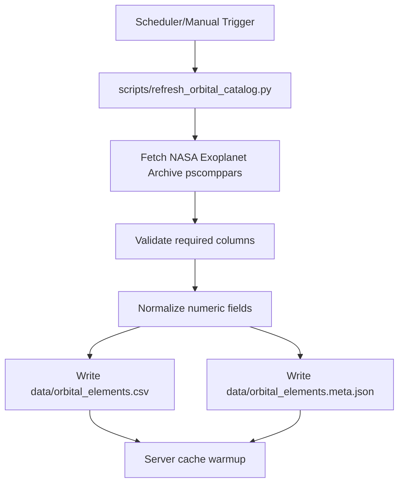
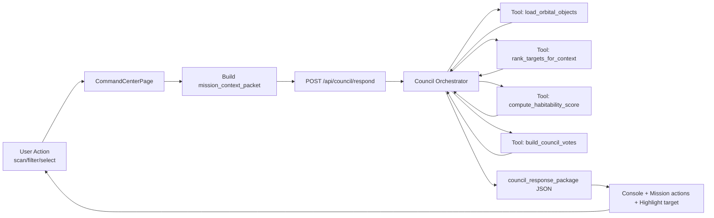
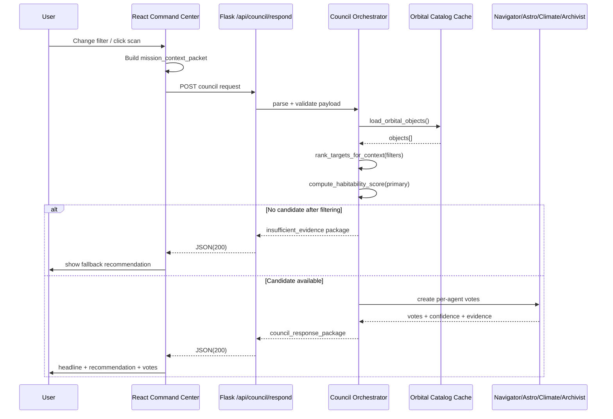

# Atlas Orrery — Pipeline & Kiến trúc kỹ thuật chi tiết (bản cho ban giám khảo)

> Mục tiêu tài liệu: chứng minh **tính khả thi công nghệ** của hệ Agentic AI bằng kiến trúc triển khai được ngay, có luồng dữ liệu rõ ràng, có ràng buộc an toàn và có roadmap vận hành thực tế.

---

## 1) Tổng quan hệ thống

Atlas Orrery được thiết kế thành 4 lớp chính:

1. **Experience Layer (Frontend)**
   - Giao diện Command Center (React + Three.js).
   - Nhận thao tác người dùng và hiển thị phản hồi của AI Council.

2. **Application Layer (Flask API)**
   - Endpoint dữ liệu quỹ đạo/chi tiết hành tinh.
   - Endpoint Council orchestration (`/api/council/respond`).

3. **Reasoning Layer (Council Orchestrator + Agents)**
   - Orchestrator + các agent vai trò (Navigator, Astrobiologist, Climate, Archivist).
   - Chỉ hoạt động trên dữ liệu đã chuẩn hóa từ tools.

4. **Science Data Layer**
   - Orbital catalog (`orbital_elements.csv`), TOI/K2.
   - Meta refresh + cache + deterministic scoring.

---

## 2) Pipeline end-to-end (siêu chi tiết)

## 2.1. Data refresh pipeline (offline / scheduled)



### Chi tiết kỹ thuật
- **Input source**: NASA Exoplanet Archive.
- **Validation gate**:
  - bắt buộc có `pl_name`, `pl_orbper`, `pl_orbsmax`.
- **Output ổn định**:
  - dataset chính + file meta (`refreshed_at_utc`, source).
- **Fail-safe**:
  - refresh lỗi thì giữ dataset cũ (không làm sập runtime).

---

## 2.2. Runtime interaction pipeline (online)



### Các bước xử lý cụ thể tại mỗi request council

1. Frontend tạo `mission_context_packet`:
   - mode, goal, selected target, filters, simulation state, recent actions.
2. Backend parse payload + sanity checks.
3. Load orbital catalog đã cache (`lru_cache`).
4. Áp filter từ UI và rank candidate.
5. Nếu rỗng candidate → trả `insufficient_evidence`.
6. Chọn primary candidate:
   - ưu tiên selected target nếu còn hợp lệ,
   - fallback top-ranked.
7. Tạo votes cho từng agent + confidence + evidence fields.
8. Tổng hợp `headline`, `primary_recommendation`, `player_options`, `evidence_summary`.
9. Trả JSON ổn định để frontend render không cần parse text tự do.

---

## 2.3. Sequence diagram chi tiết request-response



---

## 3) Kiến trúc module chi tiết

```mermaid
graph TD
    subgraph Frontend["Frontend (orrery_component/frontend)"]
      A1["CommandCenterPage.jsx"]
      A2["ConsolePanel.jsx"]
      A3["MissionControl.jsx"]
      A4["OrreryEngine.js"]
    end

    subgraph Backend["Backend (Flask server.py)"]
      B1["GET /api/orbital-objects"]
      B2["GET /api/planet/:id"]
      B3["POST /api/council/respond"]
      B4["Scoring + Ranking + Votes"]
      B5["Cache loaders"]
    end

    subgraph Data["Data (data/)"]
      C1["orbital_elements.csv"]
      C2["orbital_elements.meta.json"]
      C3["TOI/K2 CSV"]
    end

    subgraph Jobs["Jobs (scripts/)"]
      D1["refresh_orbital_catalog.py"]
    subgraph Frontend [orrery_component/frontend]
      A1[CommandCenterPage.jsx]
      A2[ConsolePanel.jsx]
      A3[MissionControl.jsx]
      A4[OrreryEngine.js]
    end

    subgraph Backend [Flask server.py]
      B1[/api/orbital-objects]
      B2[/api/planet/:id]
      B3[/api/council/respond]
      B4[Scoring + Ranking + Votes]
      B5[Cache loaders]
    end

    subgraph Data [data/]
      C1[orbital_elements.csv]
      C2[orbital_elements.meta.json]
      C3[TOI/K2 CSV]
    end

    subgraph Jobs [scripts/]
      D1[refresh_orbital_catalog.py]
    end

    A1 --> B3
    A4 --> B1
    A1 --> B2
    B3 --> B4
    B4 --> B5
    B5 --> C1
    B5 --> C2
    B5 --> C3
    D1 --> C1
    D1 --> C2
```

### Trách nhiệm từng khối

- `CommandCenterPage.jsx`
  - Trigger council request theo interaction.
  - Hiển thị output council thành logs/actions.

- `server.py`
  - Host toàn bộ API.
  - Load dữ liệu một lần, phục vụ từ cache.
  - Tính score/rank/votes deterministic.

- `data/`
  - Nguồn sự thật cho tính toán khoa học.

- `scripts/refresh_orbital_catalog.py`
  - Cập nhật dữ liệu định kỳ.

---

## 4) Contract kỹ thuật (input/output)

## 4.1 Input contract: `mission_context_packet`

```json
{
  "mode": "discovery",
  "player_goal": "find potentially habitable worlds",
  "selected_planet_id": "Kepler-442 b",
  "selected_piz_id": "PIZ-00123",
  "filters": {
    "showConfirmed": true,
    "showHabitable": true,
    "radiusMin": 0.7,
    "radiusMax": 2.2,
    "periodMin": 1,
    "periodMax": 500
  },
  "simulation": {
    "timeScale": 8,
    "trackingTarget": "Kepler-442 b",
    "simDate": "2026-03-28T10:00:00Z"
  },
  "challenge_state": {
    "active": true,
    "objective": "Find 3 promising worlds",
    "progress": 1
  },
  "recent_actions": ["filter_adjusted", "spiral_scan"]
}
```

## 4.2 Output contract: `council_response_package`

```json
{
  "mission_status": "candidate_with_risk",
  "headline": "Council ưu tiên Kepler-442 b cho bước kế tiếp",
  "primary_recommendation": {
    "action": "targeted_scan",
    "target_id": "Kepler-442 b",
    "reason": "Scored 0.78 on baseline habitability"
  },
  "council_votes": [
    {
      "agent": "Navigator",
      "stance": "support",
      "confidence": 0.83,
      "message": "Prioritize this target",
      "evidence_fields": ["pl_orbper", "pl_orbsmax", "sy_dist"]
    },
    {
      "agent": "Climate",
      "stance": "caution",
      "confidence": 0.71,
      "message": "Eccentricity uncertainty remains",
      "evidence_fields": ["pl_orbeccen", "pl_orbper"]
    }
  ],
  "player_options": [
    "Run targeted scan",
    "Compare nearest analogs",
    "Open full data dossier"
  ],
  "discovery_log_entry": "Kepler-442 b promoted after council triage",
  "evidence_summary": {
    "radius_earth": 1.34,
    "temp_k": 287,
    "insolation": 0.94,
    "eccentricity": 0.08,
    "period_days": 112.4
  }
}
```

---

## 5) Chứng minh tính khả thi kỹ thuật

## 5.1 Tính khả thi triển khai

- **Không cần infra phức tạp**: Flask + React hiện tại đã đủ chạy E2E.
- **Không cần phụ thuộc model cloud để có MVP**: bản deterministic chạy độc lập.
- **Mở rộng dần**: có thể thêm LLM layer sau mà không phá contract.

## 5.2 Tính ổn định runtime

- Caching dataframe (`lru_cache`) giảm latency I/O.
- Fallback `insufficient_evidence` thay vì crash.
- Output schema cố định giúp frontend ổn định.

## 5.3 Tính minh bạch khoa học

- `evidence_fields` bắt buộc ở votes.
- Tách fact và narrative.
- Không phát sinh thông số ngoài dataset.

---

## 6) NFRs (Non-Functional Requirements) cho demo và production-lite

### Performance
- p95 council response < 800ms local.
- Render update UI < 150ms sau response.

### Reliability
- API uptime mục tiêu demo: > 99% trong phiên chấm.
- Graceful degradation khi thiếu dữ liệu.

### Security
- Validate payload types và range cho filter.
- Rate-limit council endpoint (nếu public).
- Không expose key/secret ở frontend.

### Observability
- Structured logs theo request id.
- Metrics tối thiểu:
  - request_count,
  - error_rate,
  - avg_latency_ms,
  - recommendation_accept_rate.

---

## 7) Lộ trình triển khai kỹ thuật theo mốc thời gian

## T0–T1 (6 giờ): ổn định council core
- Hoàn thiện parse/validate payload.
- Chuẩn hóa response schema.
- Test với nhiều filter edge-case.

## T1–T2 (8 giờ): nâng chất lượng UX
- Hiển thị votes + confidence rõ trong console.
- 1-click action từ recommendation.
- Highlight target trong scene.

## T2–T3 (8 giờ): hardening để demo
- Load test nhẹ endpoint.
- Chuẩn hóa log + telemetry.
- Chuẩn bị fallback mode offline.

## T3–T4 (4 giờ): chốt bài thi
- Freeze feature.
- Quay video backup demo.
- Chuẩn bị script thuyết trình theo rubric.

---

## 8) Rủi ro kỹ thuật và phương án giảm thiểu

1. **Rủi ro latency khi filter đổi liên tục**
   - Mitigation: debounce frontend + cache + hạn chế top-N ranking.

2. **Rủi ro response nhiễu do context không đồng bộ**
   - Mitigation: gắn timestamp + request_id, chỉ render response mới nhất.

3. **Rủi ro hiểu nhầm “AI bịa dữ liệu”**
   - Mitigation: luôn hiển thị `evidence_fields` + trạng thái `insufficient_evidence`.

4. **Rủi ro demo mạng yếu**
   - Mitigation: local mode + video backup + deterministic fallback.

---

## 9) Checklist trình bày tính khả thi trước giám khảo

- [ ] Có architecture diagram rõ thành phần và dependency.
- [ ] Có sequence diagram runtime từ user action đến council response.
- [ ] Có contract input/output cụ thể.
- [ ] Có cơ chế fallback và guardrails.
- [ ] Có metric đo hiệu năng và chất lượng.
- [ ] Có roadmap triển khai theo giờ/ngày.

---

## 10) Kết luận kỹ thuật

Atlas Orrery có lợi thế lớn vì nền tảng dữ liệu và mô phỏng đã có sẵn. Phần AI Agents được thiết kế theo hướng modular, deterministic-first và contract-driven nên vừa phù hợp chủ đề Agentic AI, vừa chứng minh được tính khả thi thực thi trong thời gian hackathon.

Nói ngắn gọn cho ban giám khảo:

> Chúng tôi không chỉ có ý tưởng Agentic AI, chúng tôi có pipeline chạy được, kiến trúc kiểm chứng được, và đường triển khai rõ ràng để đưa vào thực tế.

