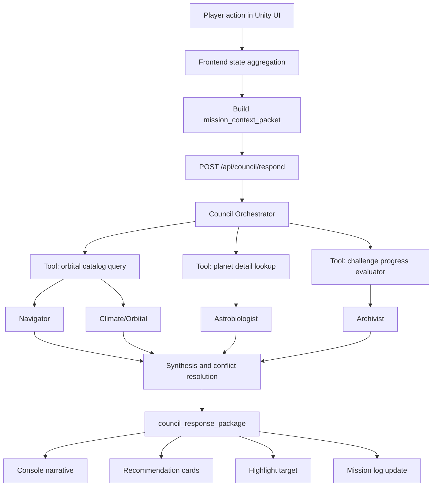
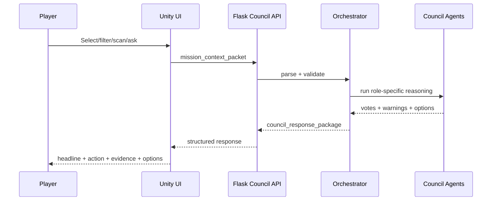
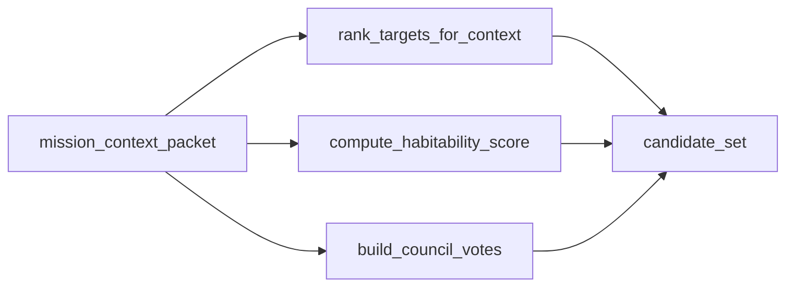
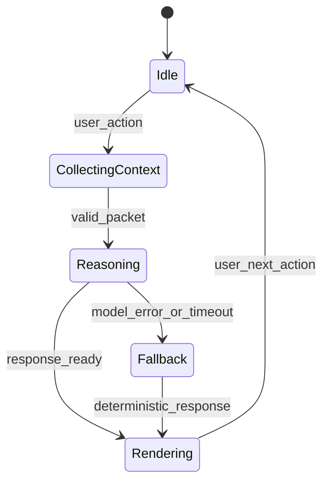

# AI Science Council Pipeline (Submission-ready)

## 1) Core concept

`Atlas Orrery` không chỉ là mô phỏng hệ sao. Ở phiên bản Agentic AI, hệ thống hoạt động như một **AI-driven exoplanet expedition**:
- Người chơi: `Mission Commander`
- Hệ thống AI: `Science Council`
- Dữ liệu nền: NASA Exoplanet Archive + orbital simulation

Mục tiêu không phải chatbot nói chuyện, mà là ra quyết định có thể hành động ngay: chọn mục tiêu, nêu bằng chứng, cảnh báo rủi ro và đề xuất bước tiếp theo.

---

## 2) Council roles

### `Council Orchestrator`
- Điều phối toàn bộ luồng.
- Tạo context packet, gọi tools, gom votes.
- Resolve mâu thuẫn và trả payload chuẩn.

### `Navigator Agent`
- Đề xuất target ưu tiên.
- Chọn scan pattern (`grid`, `spiral`, `targeted`).
- Tối ưu theo độ phủ dữ liệu + độ hiếm + khả năng quan sát.

### `Astrobiologist Agent`
- Đánh giá potential habitability.
- Tập trung vào: `radius`, `temp`, `insolation`, `host_star`.
- Trả `confidence + rationale`.

### `Climate/Orbital Agent`
- Phản biện rủi ro và bất định.
- Kiểm tra: `eccentricity`, `period`, stability assumptions.
- Đưa cảnh báo khi dữ liệu thiếu.

### `Archivist Agent`
- Chuyển kết quả thành narrative dễ hiểu.
- Ghi mission log/discovery card.
- Sinh next-step options theo mode.

---

## 3) End-to-end pipeline



---

## 4) Runtime loop



---

## 5) AI vs deterministic boundary

### AI nên làm
- Planning/recommendation.
- Explanation theo mode và mức độ người dùng.
- Trade-off reasoning (support vs caution).

### Deterministic code phải làm
- Lọc/rank catalog theo rules rõ ràng.
- Tính baseline habitability score.
- Validate challenge progress.
- Session state transitions.

### Hard rules
- AI không được bịa giá trị khoa học.
- Mọi kết luận phải map về field thật trong dataset.
- Nếu thiếu dữ liệu -> trả `insufficient_evidence`.

---

## 6) Input contract

```json
{
  "mode": "discovery",
  "player_goal": "find potentially habitable worlds",
  "selected_planet_id": "Kepler-442 b",
  "filters": {
    "showConfirmed": true,
    "showHabitable": true,
    "radiusMin": 0.7,
    "radiusMax": 2.2,
    "periodMin": 1,
    "periodMax": 500
  },
  "simulation": {
    "timeScale": 8,
    "trackingTarget": "Kepler-442 b",
    "simDate": "2026-03-29T08:00:00Z"
  },
  "challenge_state": {
    "active": true,
    "objective": "Find 2 candidate worlds",
    "progress": 1
  },
  "recent_discoveries": ["TOI-700 d"],
  "recent_actions": ["spiral_scan", "open_planet_modal"]
}
```

---

## 7) Output contract

```json
{
  "mission_status": "candidate_found",
  "headline": "Council flags Kepler-442 b for deep review",
  "primary_recommendation": {
    "action": "targeted_scan",
    "target_id": "Kepler-442 b",
    "reason": "Radius and insolation are near the baseline habitable band"
  },
  "council_votes": [
    {
      "agent": "Navigator",
      "stance": "support",
      "confidence": 0.82,
      "message": "This target should be prioritized next."
    },
    {
      "agent": "Climate",
      "stance": "caution",
      "confidence": 0.71,
      "message": "Data uncertainty remains on atmosphere assumptions."
    }
  ],
  "player_options": [
    "Run targeted scan",
    "Compare with similar planets",
    "Widen filters"
  ],
  "evidence_fields": ["pl_rade", "pl_eqt", "pl_insol", "pl_orbeccen"],
  "discovery_log_entry": "Kepler-442 b promoted to high-interest candidate"
}
```

---

## 8) Mode-by-mode behavior

### Sandbox
- Mục tiêu: khám phá tự do + học nhanh.
- Agent vai trò: copilot nhẹ, giải thích ngắn, gợi ý hành động tức thì.
- Tone: đơn giản, thân thiện.

### Challenge
- Mục tiêu: hoàn thành objective có thời gian.
- Agent vai trò: nhắc tiến độ, ưu tiên action hiệu quả nhất.
- Tone: rõ mục tiêu, ngắn gọn, không lan man.

### Discovery
- Mục tiêu: phân tích sâu và so sánh.
- Agent vai trò: nêu bằng chứng, phản biện rủi ro, đề xuất hướng nghiên cứu tiếp.
- Tone: học thuật vừa đủ, không overclaim.

---

## 9) Recommended implementation in this repo

### Reuse existing
- `server.py` (data loading + API layer)
- `data/orbital_elements.csv` + meta
- Existing simulation/filter logic

### Add new backend modules
- `council_schemas.py`
- `council_tools.py`
- `council_orchestrator.py`
- `model_router.py`

### API endpoints
- `POST /api/council/respond`
- `POST /api/agent/set-mode` (optional)

### Unity components
- `ModeController`
- `MissionPanelController`
- `ConsoleController`

---

## 10) Internal tool layer



Tool principles:
- Deterministic-first.
- Pure functions where possible.
- No hidden side effects.

---

## 11) Debate model (safe version for MVP)

- Không cho 4 agent gọi LLM tự do cùng lúc mỗi turn.
- MVP dùng 2 luồng rõ ràng:
  - `Support voice` (Navigator/Astro summary)
  - `Caution voice` (Climate risk)
- Archivist chỉ tổng hợp narrative, không tạo số liệu mới.

---

## 12) State machine (high-level)



---

## 13) MVP build order

### Phase 1
- Schema + deterministic tools.
- Council endpoint trả response chuẩn.

### Phase 2
- Model router + fallback chain (`Grok -> DeepSeek -> Qwen`).
- Unity render headline/votes/options.

### Phase 3
- Polish theo mode.
- Rehearsal demo + risk hardening.

---

## 14) Judge pitch (short)

Atlas Orrery không chỉ trực quan hóa dữ liệu vũ trụ. Đây là hệ AI Council có mục tiêu rõ, có phản biện, có bằng chứng, và đưa ra next action khả thi theo thời gian thực cho người học.

---

## 15) Final positioning

**"AI Mission Copilot for exoplanet discovery"**: kết hợp deterministic science logic + agentic reasoning để tạo trải nghiệm giáo dục STEM có chiều sâu và có thể hành động ngay.
