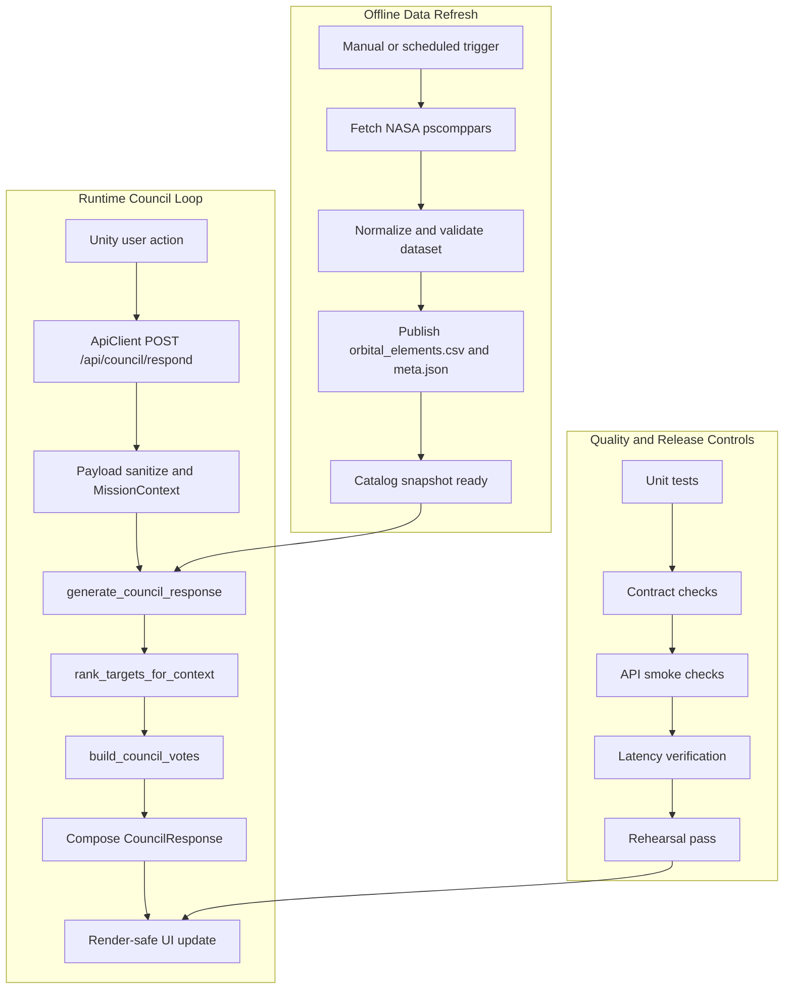

# Atlas Orrery - System Pipeline

> Execution paths, branch behavior, controls, rollback, and demo readiness.

**Project:** Atlas Orrery  
**Document Type:** System Pipeline  
**Version:** v1.0  
**Date:** 2026-03-30  
**Target Export:** PDF (A4 Landscape preferred)

## PDF Export Profile (A4 Landscape)

| Setting | Value |
|---|---|
| Page size | A4 Landscape (preferred) |
| Alternate | A4 Portrait with scaled diagrams |
| Margin | 20 mm |
| Header | Left: `Atlas Orrery` \| Right: `System Pipeline` |
| Footer | `Atlas Orrery - System Pipeline | <page>` |
| Title size | 24-28 pt, bold |
| Section heading | 15-17 pt, bold |
| Body | 10.5-11 pt |
| Table text | 9.5-10 pt |
| Code block | 9.5 pt, monospaced |
| Body font | Inter / Aptos / Calibri / IBM Plex Sans |
| Code font | JetBrains Mono / Consolas / Courier New |

### Diagram Export Rule
- Render Mermaid diagrams to SVG/PNG before final PDF export.
- Keep the end-to-end map full width on its own page.
- Keep branch logic and taxonomy in separate visual blocks for scan speed.

## What This Document Establishes
- Execution sequencing for offline refresh and online council response paths.
- Runtime branch outcomes and user-visible behavior guarantees.
- Operational controls for contract stability, observability, and readiness.
- Failure containment, fallback policy, and rollback model for demo-safe operation.
- Architecture ownership boundaries are defined in `ATLAS_ORRERY_TECHNICAL_ARCHITECTURE_PDF.md`.

## 1) End-to-End Pipeline Map

Pipeline stack has three execution layers: offline artifact production, online mission decisioning, and operational gates that block unsafe demo states.

### Source of Truth Boundaries
- Dataset source of truth: published orbital artifacts after refresh validation (`data/orbital_elements.csv`, `data/orbital_elements.meta.json`).
- Contract source of truth: normalization and dataclass contracts in `council_schemas.py`.
- Decision source of truth: deterministic orchestration in `generate_council_response` with tools layer ranking/voting.

## 2) Offline Data Refresh Pipeline

### Goal
- Publish a validated orbital catalog artifact for runtime usage without destabilizing live demo flow.

### Trigger
- Manual run: `python scripts/refresh_orbital_catalog.py`.
- Scheduled run (macOS): `scripts/install_nightly_refresh_launchd.py` configured launchd job.

### Inputs
- NASA Exoplanet Archive TAP (`pscomppars`).
- Query includes required orbital/science fields used by runtime object builder.

### Processing
1. Fetch CSV from NASA TAP sync endpoint.
2. Parse dataframe and deduplicate by `pl_name`.
3. Coerce numeric fields (`errors="coerce"`).
4. Validate schema and row sanity:
- non-empty dataset
- required columns present
- rows missing `pl_orbper` or `pl_orbsmax` dropped
5. Sort dataset and apply configured limit (`--limit`, default 1500).
6. Publish orbital CSV and metadata JSON.

### Outputs
- `data/orbital_elements.csv`
- `data/orbital_elements.meta.json`

### Failure Handling
- TAP/network/parse/validation failure stops publish path.
- Previous valid artifacts are preserved (no unsafe overwrite).
- Runtime continues on last stable artifact snapshot.

### Observability
- Script stdout/stderr.
- Job logs: `logs/orbital_refresh.out.log`, `logs/orbital_refresh.err.log`.
- Refresh telemetry fields: `job_status`, `input_rows`, `published_rows`, `duration_ms`, `failure_reason`.

## 3) Runtime Council Response Pipeline

### Goal
- Produce render-safe `council_response_package` from user interaction under deterministic runtime constraints.

### Trigger
- Unity action through `ApiClient` (filter change, target selection, mission action).

### Inputs
- `mission_context_packet` request payload.
- Runtime orbital object catalog from backend cache.

### Processing
1. Receive request at `POST /api/council/respond`.
2. Parse payload with `request.get_json(silent=True)`.
3. Normalize via `MissionContext.from_payload`.
4. Run `generate_council_response`.
5. Inside orchestration:
- `rank_targets_for_context`
- primary target selection
- `build_council_votes`
- response composition by branch
6. Return `CouncilResponse` JSON.

### Outputs
- Mission status: `candidate_found`, `candidate_with_risk`, or `insufficient_evidence`.
- Stable response keyset required for Unity render path.

### Failure Handling
- Invalid payload shape degrades to normalized defaults.
- Dataset load failure returns explicit API error.
- Empty candidate set returns `insufficient_evidence` (not runtime crash).

### Observability
- Runtime log fields: `request_id`, `mode`, `selected_planet_id`, `candidate_count`, `mission_status`, `latency_ms`.
- Stage-level timing checkpoints: parse, rank, compose, total endpoint.

## 4) Branch and Response Behavior

### `candidate_found`
- Condition: ranked candidates available and no caution vote.
- Response behavior:
- `mission_status=candidate_found`
- recommendation points to concrete `target_id`
- options emphasize follow-up action
- UI behavior: mission panel and console render positive path.

### `candidate_with_risk`
- Condition: ranked candidates available and at least one `stance=caution` vote.
- Response behavior:
- `mission_status=candidate_with_risk`
- recommendation kept, with explicit caution signal
- options bias toward deeper verification
- UI behavior: support + caution displayed concurrently.

### `insufficient_evidence`
- Condition: candidate set empty after filters.
- Response behavior:
- `mission_status=insufficient_evidence`
- `primary_recommendation.action=widen_filters`
- actionable player options returned
- UI behavior: no crash, clear exit from dead-end state.

## 5) Supporting Data Delivery Paths

Supporting endpoints are not part of the main council decision loop:

- `GET /api/orbital-objects`
- Delivers runtime orbital object catalog for visualization and selection.

- `GET /api/orbital-meta`
- Delivers lightweight catalog metadata for health/info surfaces.

- `GET /api/planet/<planet_id>`
- Delivers detailed record for focused planet inspection.

- `GET /api/piz-zones`
- Delivers PIZ exploration context from TOI dataset.
- Failure in this auxiliary path does not block council response endpoint.

## 6) Contract Checks and Stability Guarantees

### Request Validation
- JSON intake via safe parse path.
- `MissionContext.from_payload` enforces mode whitelist and filter normalization.
- Action history is type-normalized and capped.

### Response Validation
- Required response keys must exist for all mission statuses.
- Vote confidence values remain bounded by tool-layer guardrails.

### Required Keys (All Statuses)
- `mission_status`
- `headline`
- `primary_recommendation`
- `council_votes`
- `player_options`
- `discovery_log_entry`
- `evidence_summary` (object or `null`)

### Render-Safe Guarantees
- Unity relies on stable keyset, not branch-specific ad-hoc payloads.
- `mission_status` is the top-level render selector for state transitions.

## 7) Error Taxonomy and Fallback Policy

| Failure type | Where it happens | System behavior | User-facing behavior | Retry / fallback |
|---|---|---|---|---|
| Invalid payload shape | request parse/normalize | Normalize to safe `MissionContext` | Valid response still returned | No retry required |
| Dataset unavailable | catalog load path | Return explicit 500 with reason | Error state + retry CTA | Retry after dataset recovery |
| Empty candidate set | ranking path | Return `insufficient_evidence` | Actionable filter guidance | User-driven fallback action |
| Stale runtime cache | post-refresh/pre-warm window | Serve previous snapshot safely | Data may lag latest refresh | Warm/restart before demo |
| Refresh validation failure | refresh job | Abort publish and keep old artifact | Runtime remains available | Fix cause and rerun refresh |

### Failure Containment Model
- Refresh failures are contained in data update path.
- Runtime decision failure degrades to `insufficient_evidence` or explicit API error.
- Client rendering remains safe due to stable response keyset.
- Auxiliary endpoint failures do not block main council loop.

## 8) Observability and Operational Signals

### Runtime Signals
- Request-level: `request_id`, `mode`, `candidate_count`, `mission_status`, `latency_ms`.
- Endpoint-level: council success rate, insufficient rate by mode.
- Client-level: retry count and failed request count.

### Refresh Signals
- Job outcome (`success`/`failed`).
- Row movement (`input_rows`, `published_rows`).
- Artifact freshness (`refreshed_at_utc`).
- Duration and failure reason.

### Demo Health Indicators
- Artifact timestamp is within accepted demo freshness window.
- Smoke endpoints pass.
- Council loop contract remains stable in all modes.

## 9) Performance Targets and SLOs

- Parse + normalize budget: < 30 ms.
- Ranking budget (`<= 900` runtime objects): < 120 ms.
- Response compose budget: < 20 ms.
- Council endpoint p95 (`POST /api/council/respond`): < 1200 ms (local).

### Assumption Boundaries

| Boundary | Statement |
|---|---|
| Guaranteed | Stable council contract keys in all branches; deterministic runtime decision loop independent of external model/network providers. |
| Assumed | Runtime catalog remains within target size; refresh completes before demo; Unity only consumes stable contract keys. |
| Out of scope | Multi-instance scaling, distributed failover, streaming refresh topology. |

## 10) Quality Gates and Demo Readiness

### Required Checks
- `test_council_orchestrator.py` passes.
- Contract checks pass for all mission statuses.
- API smoke checks pass (`/api/orbital-objects`, `/api/orbital-meta`, `/api/planet/<planet_id>`, `/api/council/respond`).
- No-candidate fallback path verified in UI.
- Latency verification meets SLO targets.

### Definition of Ready
- Latest valid artifact published and timestamped.
- Runtime council loop stable across `sandbox`, `challenge`, `discovery`.
- Final rehearsal passes end-to-end without runtime crash.

### Verification Mapping

| Concern | Verified by |
|---|---|
| Branch correctness | `test_council_orchestrator.py` |
| Contract stability | request/response contract checks |
| Dataset validity | refresh validation before artifact publish |
| Runtime readiness | API smoke checks + rehearsal pass |
| Performance target | latency verification against demo SLO |

## 11) Rollback and Recovery

### Refresh Rollback
- If refresh job fails, do not publish new artifact.
- If new artifact destabilizes runtime, restore previous snapshot and restart backend.

### Stale Artifact Behavior
- Availability is prioritized over freshness during demo window.
- Runtime serves last valid artifact until refresh path is healthy.

### Safe Degraded Operation
- Candidate gaps and invalid contexts degrade to actionable `insufficient_evidence` states.
- Pipeline goal is controlled degradation, not hard failure in front of users.

## 12) Conclusion

This pipeline design is execution-first and demo-safe: validated artifact publishing, deterministic runtime decisioning, explicit branch behavior, bounded failure domains, and concrete readiness gates that can be verified before live judging.
