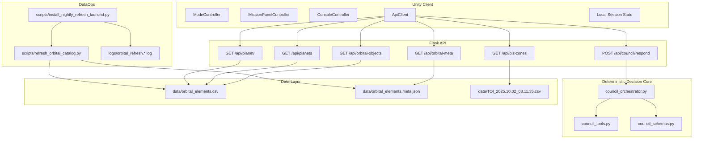
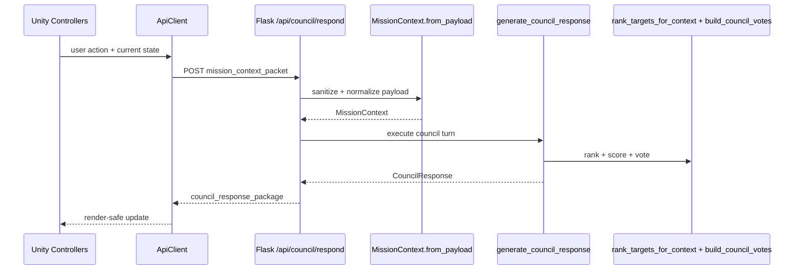

# Atlas Orrery - Technical Architecture

> Technical architecture, ownership boundaries, runtime structure, and contracts.

**Project:** Atlas Orrery  
**Document Type:** Technical Architecture  
**Version:** v1.0  
**Date:** 2026-03-30  
**Target Export:** PDF (A4 Portrait)

## PDF Export Profile (A4 Portrait)

| Setting | Value |
|---|---|
| Page size | A4 Portrait |
| Margin | 20 mm |
| Header | Left: `Atlas Orrery` \| Right: `Technical Architecture` |
| Footer | `Atlas Orrery - Technical Architecture | <page>` |
| Title size | 24-28 pt, bold |
| Section heading | 15-17 pt, bold |
| Subheading | 12-13 pt, semibold |
| Body | 10.5-11.5 pt |
| Code block | 9.5-10 pt, monospaced |
| Line spacing | 1.25-1.35 |
| Body font | Inter / Aptos / Calibri / IBM Plex Sans |
| Code font | JetBrains Mono / Consolas / Courier New |

### Diagram Export Rule
- Render Mermaid diagrams to SVG/PNG before final PDF export.
- Keep one diagram per concern (system topology vs runtime request flow).
- Use full-width diagrams, no raw Mermaid in final submission PDF.

## What This Document Establishes
- Runtime decision ownership: deterministic council core in backend.
- Contract ownership: canonical normalization and response schema in `council_schemas.py`.
- Dataset publication ownership: refresh scripts publish runtime artifacts.
- Module boundaries and dependency direction across Unity, Flask, core, data, and ops.
- Verification mapping from architecture concerns to test and operational gates.

## 1) System Architecture Overview



Atlas Orrery runs as a single runtime stack: Unity controls interaction, Flask exposes stable HTTP boundaries, and deterministic backend logic produces council decisions from a refreshed orbital catalog.

## 2) Runtime Architecture

### Client
- `ModeController` manages mode state (`sandbox`, `challenge`, `discovery`).
- `MissionPanelController` renders `headline`, recommendation, and player options.
- `ConsoleController` renders council vote timeline and caution context.
- `ApiClient` owns council/catalog API calls and request lifecycle handling.
- Local session state carries the active context between interactions.

### Backend API
- Flask route layer is the only transport boundary between Unity and decision core.
- `POST /api/council/respond` is the primary decision entrypoint.
- Catalog and detail endpoints provide supporting read paths for UI and context exploration.

### Decision Core
- `council_orchestrator.py` composes status branch + recommendation package.
- `council_tools.py` owns deterministic ranking, scoring, and vote building.
- `council_schemas.py` normalizes incoming payload and enforces contract shape.

### Data Layer
- `data/orbital_elements.csv`: runtime orbital catalog artifact.
- `data/orbital_elements.meta.json`: source/refresh metadata for runtime checks.
- `data/TOI_2025.10.02_08.11.35.csv`: supporting exploration dataset for PIZ endpoint.

### Auxiliary Endpoints / Supporting Data Services
- `GET /api/piz-zones` is an auxiliary exploration endpoint backed by TOI data.
- It is not part of the council decision loop and does not affect council branch status.

## 3) Runtime Request Flow



- Request boundary: `POST /api/council/respond`.
- Parsing boundary: JSON parse + `MissionContext.from_payload` normalization.
- Decision boundary: `generate_council_response` orchestration.
- Deterministic computation boundary: `rank_targets_for_context`, `build_council_votes`.
- Response boundary: stable contract keys for safe UI rendering.

## 4) Code Map and Dependency Direction

### Backend
- `server.py`
- Owns Flask routes, endpoint transport, data loading, and catalog object building.
- Depends on `generate_council_response` for mission response path.

- `council_orchestrator.py`
- Depends on schema types from `council_schemas.py`.
- Depends on deterministic primitives from `council_tools.py`.

- `council_tools.py`
- Deterministic compute layer only.
- No Flask dependency.
- No network dependency.

- `council_schemas.py`
- Canonical schema/normalization layer.
- Shared by request parsing and response assembly.

### Scripts
- `scripts/refresh_orbital_catalog.py`: refresh and publish orbital artifacts.
- `scripts/install_nightly_refresh_launchd.py`: local scheduling and job wiring.

### Tests
- `test_council_orchestrator.py`: validates branch behavior and response shape.

### Dependency Rules
- Unity does not own scientific scoring.
- Flask transport layer does not own decision logic.
- Decision core does not depend on network calls at runtime.
- Schema layer is the contract source for client-backend stability.

### Implementation Anchors
- `server.py` owns HTTP boundary and dispatch.
- `council_orchestrator.py` owns branch synthesis (`candidate_found`, `candidate_with_risk`, `insufficient_evidence`).
- `council_tools.py` owns deterministic score/rank/vote functions.
- `council_schemas.py` owns normalization and contract dataclasses.
- `test_council_orchestrator.py` verifies branch behavior in executable tests.

## 5) API Surface

### Council
- `POST /api/council/respond`

### Catalog
- `GET /api/orbital-objects`
- `GET /api/orbital-meta`
- `GET /api/planets` (legacy projection)
- `GET /api/planet/<planet_id>`

### Auxiliary
- `GET /api/piz-zones`

## 6) Technical Contracts

### Input Contract (`mission_context_packet`)

```json
{
  "mode": "challenge",
  "player_goal": "find high-potential habitable candidates in 5 minutes",
  "selected_planet_id": "Kepler-442 b",
  "selected_piz_id": null,
  "filters": {
    "showConfirmed": true,
    "showHabitable": true,
    "radiusMin": 0.7,
    "radiusMax": 2.2,
    "periodMin": 1,
    "periodMax": 500
  },
  "challenge_state": {
    "active": true,
    "objective": "Find 2 candidate worlds",
    "progress": 1
  },
  "recent_actions": ["spiral_scan", "open_planet_modal"]
}
```

### Output Contract (`council_response_package`)

```json
{
  "mission_status": "candidate_with_risk",
  "headline": "Council uu tien Kepler-442 b cho buoc ke tiep",
  "primary_recommendation": {
    "action": "targeted_scan",
    "target_id": "Kepler-442 b",
    "reason": "Scored 0.81 on baseline habitability under current goal"
  },
  "council_votes": [
    {
      "agent": "Navigator",
      "stance": "support",
      "confidence": 0.82,
      "message": "Recommend targeted follow-up based on ranking gain.",
      "evidence_fields": ["pl_orbper", "pl_orbsmax", "sy_dist"]
    },
    {
      "agent": "Astrobiologist",
      "stance": "support",
      "confidence": 0.8,
      "message": "Radius-temperature-insolation triad is within exploratory viability bounds.",
      "evidence_fields": ["pl_rade", "pl_eqt", "pl_insol"]
    },
    {
      "agent": "Climate",
      "stance": "caution",
      "confidence": 0.71,
      "message": "Orbital uncertainty needs deeper verification.",
      "evidence_fields": ["pl_orbeccen", "pl_orbper", "pl_orbincl"]
    }
  ],
  "player_options": [
    "Run targeted scan",
    "Compare nearest analogs",
    "Open full data dossier"
  ],
  "discovery_log_entry": "Kepler-442 b promoted after council triage.",
  "evidence_summary": {
    "radius_earth": 1.34,
    "temp_k": 285.0,
    "insolation": 0.95,
    "eccentricity": 0.08,
    "period_days": 112.4
  }
}
```

### Guardrails / Invariants
- `mode` accepted values: `sandbox`, `challenge`, `discovery`.
- Filter ranges are normalized; reversed min/max are corrected.
- `recent_actions` is normalized to capped `list[str]` (max 20 entries).
- Response keeps a stable keyset across all statuses for render safety.

### Source of Truth Boundaries
- Dataset source of truth: published `orbital_elements.csv` artifact after refresh validation.
- Contract source of truth: `council_schemas.py`.
- Runtime decision source of truth: deterministic orchestrator + tools layer.

## 7) Responsibility Boundaries

| Component | Owns | Out of scope |
|---|---|---|
| Unity controllers + ApiClient | Interaction state, API calls, rendering | Scientific scoring and dataset mutation |
| Flask route layer | HTTP boundary and transport response | Decision scoring logic |
| `council_orchestrator.py` | Branch synthesis and response composition | Dataset file lifecycle |
| `council_tools.py` | Ranking/scoring/voting compute | Network transport and persistence |
| `council_schemas.py` | Payload normalization and contract typing | Endpoint routing |
| Refresh scripts | Dataset publication and metadata update | Runtime council decision path |

## 8) Deployment and Runtime Assumptions

### Assumption Boundaries

| Boundary | Statement |
|---|---|
| Guaranteed | Runtime council path is deterministic and does not require external model/network calls; Unity receives stable response keys across statuses. |
| Assumed | Runtime catalog size remains within demo target bounds; refresh completes before demo window; backend runs as a local single-instance process. |
| Out of scope | Horizontal scaling, distributed orchestration, multi-region failover. |

### Non-goals
- No distributed architecture in MVP.
- No real-time stream processing for catalog ingestion.
- No scientific scoring logic in Unity.
- No LLM replacement of deterministic ranking core in MVP.

### Key Architectural Decisions

| Decision | Why | Trade-off |
|---|---|---|
| Deterministic council core | Stable, explainable, testable demo behavior | Less expressive than full LLM-first reasoning |
| Single-instance local Flask runtime | Lower setup cost and smaller failure domain | Not intended for production-scale traffic |
| Contract ownership in `council_schemas.py` | Reduces client-backend drift | Requires strict schema governance during iteration |
| Artifact snapshot before demo | Minimizes late refresh risk | Data may not be latest available at demo time |
| Separate architecture and pipeline docs | Clean separation of design vs execution control | Reviewers must read both docs for full system view |

## 9) NFR and SLO for Hackathon Demo

### Performance
- `POST /api/council/respond` p95 < 1200 ms (local).
- Ranking p95 < 120 ms for runtime catalog <= 900 objects.

### Reliability
- Invalid payload is normalized instead of crashing endpoint.
- Empty candidate set degrades to `insufficient_evidence` response.

### Security
- No hardcoded secrets in repository.
- Credentials (future model extensions) handled via `.env`.

### Observability
- Runtime logs include at least `request_id`, `mode`, `candidate_count`, `mission_status`, `latency_ms`.
- Refresh logs are isolated in `logs/orbital_refresh.*.log`.

## 10) Architectural Risks and Mitigations

1. Contract drift between Unity and backend.
- Mitigation: schema-centric contracts in `council_schemas.py` + contract checks.

2. Refresh failure close to demo time.
- Mitigation: pre-demo refresh window + artifact freeze.

3. Dead-end user flows due to narrow filters.
- Mitigation: explicit `insufficient_evidence` branch with actionable options.

4. Cold-start latency spike on first mission request.
- Mitigation: warm catalog cache before live demo flow.

### Verification Mapping

| Concern | Verified by |
|---|---|
| Branch correctness | `test_council_orchestrator.py` |
| Contract stability | schema guardrails + contract checks in pipeline gates |
| Dataset validity | refresh validation before artifact publish |
| Runtime readiness | API smoke checks + rehearsal pass |
| Performance target | latency verification against demo SLO |

## 11) Evolution Path

### MVP
- Deterministic council loop with stable contracts.

### Hybrid
- Model-assisted explanation layer after deterministic decision output.
- Deterministic ranking core remains canonical.

### Adaptive
- Recommendation tuning based on user behavior and acceptance patterns.

## 12) Conclusion

This architecture is intentionally demo-first: clear ownership boundaries, deterministic decisioning, stable contracts for Unity rendering, and controlled data publication to keep runtime behavior predictable under hackathon constraints.
