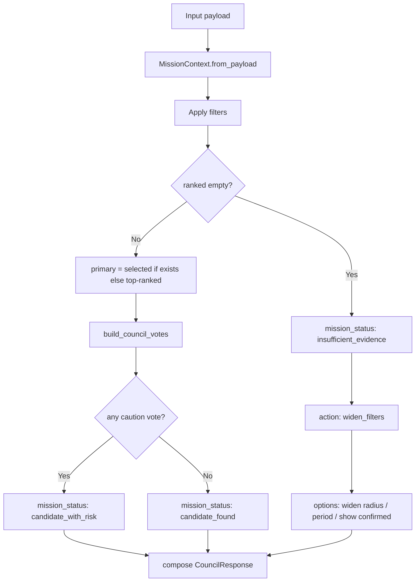

# Atlas Orrery — System Pipeline (Detailed v2)

> Mục tiêu: mô tả **end-to-end pipeline** ở mức có thể implement ngay, gồm runtime flow, data refresh, resilience, QA gate và release.

---

## 0) Pipeline map (toàn cục)

```mermaid
flowchart TB
    subgraph OFFLINE[Offline Pipelines]
      A1[Schedule Trigger] --> A2[Extract NASA pscomppars]
      A2 --> A3[Transform + Normalize]
      A3 --> A4[Schema Validation]
      A4 --> A5[Write CSV + meta.json]
      A5 --> A6[Warm API cache]
    end

    subgraph ONLINE[Online Runtime]
      B1[Unity user action] --> B2[mission_context_packet]
      B2 --> B3[POST /api/council/respond]
      B3 --> B4[Context parse + sanitize]
      B4 --> B5[rank_targets_for_context]
      B5 --> B6{Have candidates?}
      B6 -- No --> B7[insufficient_evidence response]
      B6 -- Yes --> B8[Build council votes + summary]
      B8 --> B9[council_response_package]
      B7 --> B9
      B9 --> B10[UI render + next actions]
    end

    subgraph OPS[Quality Gates]
      C1[Unit tests] --> C2[API smoke tests]
      C2 --> C3[Contract checks]
      C3 --> C4[Demo rehearsal]
    end
```



---

## 1) Offline data refresh pipeline (T-1 trước demo)

### 1.1 Trigger và lịch
- Trigger định kỳ: mỗi 12h hoặc theo tay trước buổi chấm.
- Manual trigger: cho phép chạy nóng khi cần cập nhật catalog.

### 1.2 Các stage chi tiết
1. **Extract**
   - Nguồn: NASA Exoplanet Archive (pscomppars).
   - Lấy các field bắt buộc: `pl_name`, `pl_orbper`, `pl_orbsmax`, `pl_orbeccen`, `pl_orbtper`, `pl_tranmid`, `pl_rade`, `pl_eqt`, `pl_insol`, `sy_dist`.
2. **Transform / Normalize**
   - Chuẩn hóa số (`float`) cho các cột orbit/science.
   - Chuẩn hóa epoch về Julian Day (`normalize_epoch_jd`).
   - Loại bỏ bản ghi không có `pl_orbper` hoặc `pl_orbsmax`.
3. **Validate**
   - Required columns phải đủ.
   - Dataset không rỗng.
   - Tỷ lệ epoch hợp lệ > ngưỡng tối thiểu (ví dụ 5%).
4. **Publish artifact**
   - Ghi `data/orbital_elements.csv`.
   - Ghi `data/orbital_elements.meta.json` (source, refreshed_at_utc, row_count, checksum).
5. **Warm cache**
   - Reload cache của Flask (`build_orbital_objects`) trước khi traffic thật.

### 1.3 Failure handling
- Nếu validation fail: **không overwrite** dataset hiện tại.
- Ghi log lỗi + giữ phiên bản cũ đang ổn định.
- Cảnh báo dashboard nhưng runtime vẫn hoạt động với cache/dataset trước đó.

---

## 2) Runtime decision pipeline (user action -> council response)

### 2.1 Event ingress
- User đổi filter, chọn planet, hoặc bấm action trong Unity.
- FE tạo `mission_context_packet` chứa mode, filters, selected id, recent actions.

### 2.2 API boundary
- Endpoint: `POST /api/council/respond`.
- Bắt buộc parse JSON an toàn (`silent=True`) + fallback payload rỗng.
- Sanitize input:
  - mode về lower-case và whitelist (`sandbox/challenge/discovery`).
  - numeric filter parse an toàn (không crash khi input bẩn).
  - giới hạn độ dài `recent_actions` để giữ payload nhỏ.

### 2.3 Orchestrator flow
1. `MissionContext.from_payload(payload)`
2. `rank_targets_for_context(objects, filters)`
3. Branch:
   - **No candidates** -> `mission_status=insufficient_evidence` + options nới filter.
   - **Has candidates** -> chọn `primary` theo selected id hoặc top-1 score.
4. `build_council_votes(primary, mode)`
5. Compose `CouncilResponse` có:
   - headline
   - primary_recommendation
   - council_votes
   - player_options
   - evidence_summary

### 2.4 Latency budget mục tiêu (local demo)
- Parse + validate context: < 30ms
- Rank targets (<=900 objects): < 120ms
- Compose response: < 20ms
- Tổng `p95 /api/council/respond`: < 1200ms

---

## 3) Detailed branch logic



---

## 4) API contract pipeline checks

### 4.1 Request checks
- `mode`: chỉ chấp nhận `sandbox`, `challenge`, `discovery`.
- `filters`: auto-clamp nếu min > max.
- `challenge_state.progress`: ép kiểu int an toàn.
- `recent_actions`: list[str], tối đa 20 events gần nhất.

### 4.2 Response checks
- Luôn có key ổn định:
  - `mission_status`, `headline`, `primary_recommendation`, `council_votes`, `player_options`, `discovery_log_entry`.
- Branch `insufficient_evidence` vẫn trả đầy đủ contract.
- `confidence` trong vote được clamp về [0.1, 0.99].

---

## 5) UI rendering pipeline

### 5.1 Mapping policy
- `headline` -> mission panel title.
- `primary_recommendation.action` -> action button chính.
- `council_votes` -> console timeline.

### 5.2 State consistency
- FE dùng `request_id`/timestamp để bỏ response cũ đến muộn.
- Debounce input filter 200-300ms để tránh spam API.

### 5.3 Error UX
- API fail -> hiển thị fallback card + nút retry.
- `insufficient_evidence` -> gợi ý thao tác cụ thể để user thoát dead-end.

---

## 6) Observability pipeline

Mỗi request log tối thiểu:
- `request_id`
- `mode`
- `selected_planet_id`
- `candidate_count`
- `latency_ms`
- `mission_status`

Gợi ý log format (JSON line):
```json
{
  "request_id": "a2f4...",
  "mode": "challenge",
  "candidate_count": 18,
  "mission_status": "candidate_with_risk",
  "latency_ms": 143
}
```

---

## 7) Quality gate pipeline

1. **Unit test**
   - Orchestrator branch test (`candidate_found`, `insufficient_evidence`).
   - Schema parse test với input bẩn.
2. **API smoke**
   - `/api/orbital-objects`, `/api/orbital-meta`, `/api/council/respond`.
3. **Contract test**
   - Assert key bắt buộc không bị thiếu.
4. **Demo rehearsal**
   - 1 flow đầy đủ: scan -> select -> council -> follow-up.

---

## 8) Release/rollback pipeline

- Trước release: tag build + snapshot dataset meta.
- Nếu lỗi runtime sau deploy:
  1. rollback frontend bundle,
  2. rollback backend commit,
  3. restore dataset snapshot gần nhất.

---

## 9) Definition of done (expanded)

- [ ] Hoàn thành end-to-end flow ổn định trong cả 3 mode.
- [ ] Không crash khi payload thiếu/sai kiểu.
- [ ] Có nhánh xử lý no-candidate rõ ràng cho UX.
- [ ] Contract response ổn định để frontend render an toàn.
- [ ] Unit test cho cả happy path + failure path đều pass.
