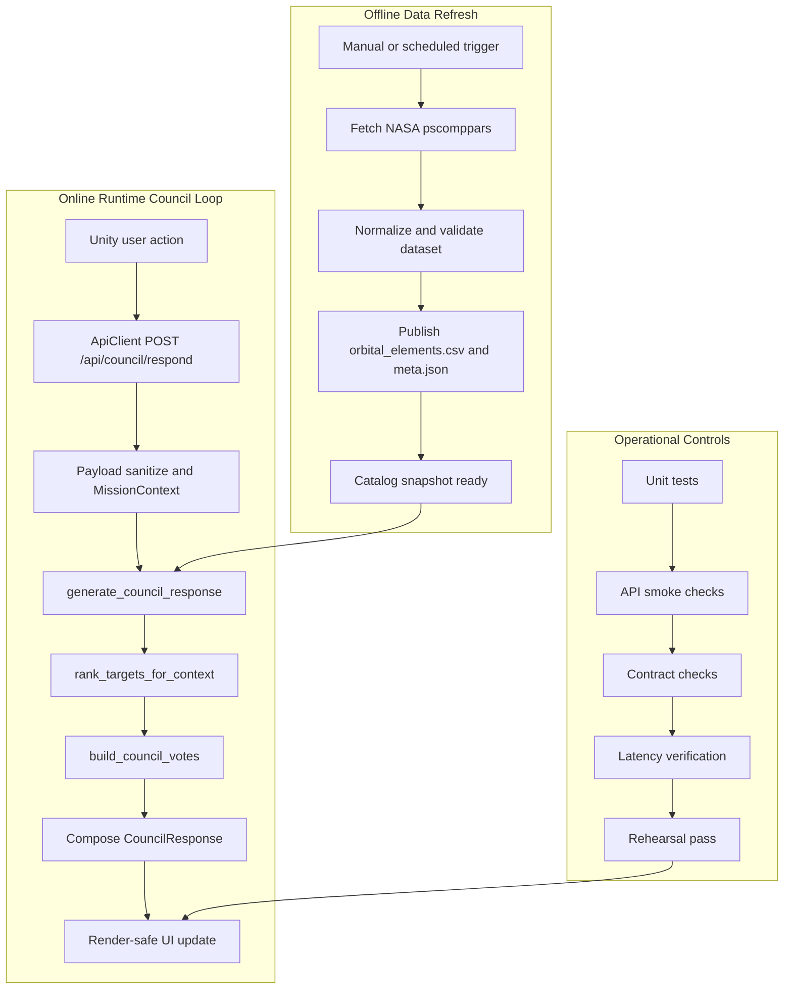

# Atlas Orrery — System Pipeline

> Tài liệu này mô tả execution pipelines của Atlas Orrery: data refresh, runtime council loop, branch behavior, operational controls, và điều kiện demo-ready. Ownership module và dependency boundaries được định nghĩa trong `filemoi.md` (Technical Architecture).

### What this document establishes
- Luồng thực thi offline và online của hệ thống, theo đúng request/data path đang chạy.
- Điều kiện branching của council response và UI-safe output behavior.
- Guardrails vận hành: contract checks, error handling, observability, quality gates.
- Mức an toàn demo: readiness criteria, fallback, rollback, recovery.

## 1) End-to-end pipeline map

> PDF note: render Mermaid diagram to SVG trước khi đóng gói submission.

Hệ thống có ba lớp pipeline rõ ràng: offline refresh để tạo artifact ổn định, online council loop để xử lý request thời gian thực, và ops controls để chặn rủi ro trước khi demo.

### Source of truth boundaries
- Dataset source of truth: published orbital artifact sau refresh validation (`data/orbital_elements.csv` + `data/orbital_elements.meta.json`).
- Contract source of truth: schema contracts và normalization rules trong `council_schemas.py`.
- Runtime decision source of truth: deterministic orchestration trong `generate_council_response` kết hợp `rank_targets_for_context` và `build_council_votes`.

## 2) Offline data refresh pipeline

### Goal
- Cập nhật catalog quỹ đạo từ NASA thành artifact runtime ổn định cho backend.

### Trigger
- Manual: `python scripts/refresh_orbital_catalog.py`.
- Scheduled (macOS): `scripts/install_nightly_refresh_launchd.py` cài launchd job.

### Inputs
- NASA Exoplanet Archive TAP (`pscomppars`).
- SQL query lấy các trường orbital/science cần cho runtime (`pl_name`, `hostname`, `pl_orbper`, `pl_orbsmax`, `pl_orbeccen`, `pl_orbtper`, `pl_tranmid`, `pl_rade`, `pl_eqt`, `pl_insol`, `sy_dist`, `ra`, `dec`, ...).

### Processing
1. Fetch CSV từ TAP endpoint.
2. Parse dataframe, dedupe theo `pl_name`.
3. Coerce numeric fields (`errors="coerce"`).
4. Validate schema và row sanity:
- Dataset không rỗng.
- Có đầy đủ cột bắt buộc từ query.
- Loại record thiếu `pl_orbper` hoặc `pl_orbsmax`.
- Áp dụng range sanity cơ bản; giá trị bất thường được giữ dưới kiểm soát bằng clamp/drop ở runtime object builder.
5. Sort và apply row limit (`--limit`, mặc định 1500).
6. Publish artifact.

### Outputs
- `data/orbital_elements.csv`
- `data/orbital_elements.meta.json` với `refreshed_at_utc`, `source`, `query`, `rows`, `columns`.

### Failure handling
- TAP lỗi, parse lỗi, hoặc validation fail: job fail trước publish hoàn chỉnh.
- Không overwrite artifact cũ khi validation không đạt.
- Runtime tiếp tục dùng catalog snapshot đang ổn định.

### Observability
- Script stdout/stderr.
- Launchd logs: `logs/orbital_refresh.out.log`, `logs/orbital_refresh.err.log`.
- Refresh signals cần theo dõi: `job_start`, `job_end`, `status`, `row_count`, `duration_ms`, `failure_reason`.

## 3) Runtime council response pipeline

### Goal
- Chuyển user interaction thành `council_response_package` ổn định để Unity render an toàn.

### Trigger
- User action trong Unity: đổi filter, chọn target, thao tác mission.

### Inputs
- Request payload từ `ApiClient`.
- Catalog runtime từ `build_orbital_objects()`.

### Processing
1. Boundary nhận request tại `POST /api/council/respond`.
2. Parse JSON với `request.get_json(silent=True)`.
3. Normalize payload bằng `MissionContext.from_payload`.
4. Gọi `generate_council_response`.
5. Trong orchestrator:
- `rank_targets_for_context` để lọc/rank.
- Chọn primary target.
- `build_council_votes` để tạo vote set.
- Compose `CouncilResponse` theo branch.
6. Return JSON cho Unity.

### Outputs
- `mission_status` một trong: `candidate_found`, `candidate_with_risk`, `insufficient_evidence`.
- Response contract ổn định gồm `headline`, `primary_recommendation`, `council_votes`, `player_options`, `discovery_log_entry`, `evidence_summary`.

### Failure handling
- Payload lỗi kiểu: normalize về default safe values.
- Dataset unavailable: trả API error có message nguyên nhân.
- Candidate rỗng: trả `insufficient_evidence` thay vì lỗi runtime.

### Observability
- Runtime log fields tối thiểu: `request_id`, `mode`, `selected_planet_id`, `candidate_count`, `mission_status`, `latency_ms`.
- Latency checkpoints: parse, ranking, compose, total endpoint time.

## 4) Branch and response behavior

### `candidate_found`
- Condition: candidate set không rỗng và không có caution vote.
- Response characteristics:
- `mission_status=candidate_found`
- `primary_recommendation.target_id` có giá trị
- `player_options` ưu tiên next action theo mode
- UI behavior:
- Mission panel render recommendation chính.
- Console render support votes và evidence.

### `candidate_with_risk`
- Condition: candidate set không rỗng, có ít nhất một vote `stance=caution`.
- Response characteristics:
- `mission_status=candidate_with_risk`
- Headline có cảnh báo rủi ro
- Vote set chứa both support và caution
- UI behavior:
- Hiển thị recommendation + cảnh báo đồng thời.
- Không chặn user action, nhưng ưu tiên options xác minh sâu hơn.

### `insufficient_evidence`
- Condition: candidate set rỗng sau khi áp filters.
- Response characteristics:
- `mission_status=insufficient_evidence`
- `primary_recommendation.action=widen_filters`
- `council_votes` có thể rỗng
- UI behavior:
- Không crash render.
- Hiển thị options thoát dead-end (nới radius, tăng period max, bật confirmed planets).

## 5) Supporting data delivery paths

Các path này hỗ trợ data delivery cho UI, không thuộc main council decision loop:

- `GET /api/orbital-objects`
- Trả catalog object + meta cho visualization/runtime state.

- `GET /api/orbital-meta`
- Trả metadata nhẹ để health/info panel.

- `GET /api/planet/<planet_id>`
- Trả planet detail khi user mở chi tiết mục tiêu.

- `GET /api/piz-zones`
- Trả PIZ exploration data từ TOI dataset.
- Đây là auxiliary discovery endpoint, không tham gia branch logic của council response.

## 6) Contract checks and stability guarantees

### Request validation
- Parse JSON theo mode an toàn (`silent=True`).
- `MissionContext.from_payload` enforce:
- mode whitelist (`sandbox/challenge/discovery`)
- normalize/swap filter ranges
- `recent_actions` capped list

### Response validation
- Council response phải giữ stable keyset ở mọi status.
- Numeric confidence trong votes được clamp theo guardrails tool layer.

### Required keys (all statuses)
- `mission_status`
- `headline`
- `primary_recommendation`
- `council_votes`
- `player_options`
- `discovery_log_entry`
- `evidence_summary` (object hoặc `null`)

### Render-safe guarantees for client
- Insufficient branch vẫn trả đủ keys để UI không cần branch-specific parsing đặc biệt.
- `mission_status` là selector chính cho state rendering ở Unity.

## 7) Error taxonomy and fallback policy

| Failure type | Where it happens | System behavior | User-facing behavior | Retry / fallback |
|---|---|---|---|---|
| Invalid payload shape | `/api/council/respond` parse/normalize | Normalize về default MissionContext | Vẫn nhận response hợp lệ | No retry cần thiết |
| Dataset unavailable | Catalog load (`build_orbital_objects`) | Trả 500 với error reason | UI hiển thị backend error + retry CTA | Retry sau khi khôi phục dataset |
| Empty candidate set | `rank_targets_for_context` | Trả `insufficient_evidence` | Gợi ý nới filter, không dead-end | User-driven fallback action |
| Stale runtime cache | Sau refresh, trước cache reload | Tiếp tục phục vụ snapshot cũ | Dữ liệu có thể chưa phản ánh refresh mới nhất | Warm/restart backend trước demo |
| Refresh validation failure | `refresh_orbital_catalog.py` | Dừng publish, giữ artifact cũ | Runtime vẫn chạy trên snapshot cũ | Sửa nguồn/lỗi rồi rerun job |

### Failure containment model
- Refresh failure được cô lập trong data update path; runtime loop tiếp tục phục vụ artifact cũ hợp lệ.
- Runtime decision failure degrade về `insufficient_evidence` hoặc explicit API error có nguyên nhân.
- Client rendering được bảo vệ bởi stable response keyset cho mọi mission status.
- Auxiliary endpoint failure không chặn main council loop (`POST /api/council/respond`).

## 8) Observability and operational signals

### Runtime signals
- Structured fields: `request_id`, `mode`, `candidate_count`, `mission_status`, `latency_ms`.
- Endpoint health: success rate của `/api/council/respond`, tỷ lệ `insufficient_evidence` theo mode.
- Render health: số request fail ở client và retry count.

### Refresh job signals
- `job_status` (`success`/`failed`)
- `input_rows`, `published_rows`
- `artifact_timestamp` (`refreshed_at_utc`)
- `duration_ms`
- `failure_reason`

### Demo health indicators
- Catalog artifact age trong ngưỡng chấp nhận trước live run.
- Smoke endpoints đều pass.
- Council loop trả contract ổn định qua các mode.

## 9) Performance targets and SLOs

- Parse + normalize budget: < 30ms.
- Ranking budget (`<= 900` runtime objects): < 120ms.
- Response compose budget: < 20ms.
- `POST /api/council/respond` p95: < 1200ms (local demo).
- Catalog assumption: runtime object set được giới hạn để giữ latency ổn định.

### Assumption boundaries

| Boundary | Statement |
|---|---|
| Guaranteed | Council endpoint giữ stable contract keys ở mọi branch; runtime council loop không phụ thuộc network/model provider. |
| Assumed | Catalog size duy trì trong giới hạn mục tiêu demo; refresh hoàn tất trước phiên demo; Unity chỉ phụ thuộc vào stable keys. |
| Out of scope | Multi-instance scaling, distributed failover, continuous streaming refresh. |

## 10) Quality gates and demo readiness

### Required checks
- Unit tests: `test_council_orchestrator.py` pass.
- API smoke checks pass:
- `GET /api/orbital-objects`
- `GET /api/orbital-meta`
- `GET /api/planet/<planet_id>`
- `POST /api/council/respond`
- Contract checks pass cho cả 3 statuses.
- Fallback path verified (`insufficient_evidence`).
- No-candidate path verified trên UI.
- Latency trong target rehearsal.

### Definition of ready
- Dataset artifact hợp lệ và timestamp mới.
- Main council loop stable qua `sandbox/challenge/discovery`.
- Rehearsal cuối cùng pass end-to-end không crash.

### Verification mapping

| Concern | Verified by |
|---|---|
| Branch correctness | `test_council_orchestrator.py` |
| Contract stability | request/response contract checks |
| Dataset validity | refresh validation trước publish artifact |
| Runtime readiness | API smoke checks + rehearsal pass |
| Performance target | latency verification theo demo SLO |

## 11) Rollback and recovery

### Refresh rollback
- Nếu refresh job fail: không publish artifact mới, giữ snapshot cũ.
- Nếu artifact mới gây lỗi runtime: restore snapshot trước đó và restart service.

### Stale artifact behavior
- Hệ thống ưu tiên availability: tiếp tục phục vụ artifact gần nhất còn hợp lệ.
- Ghi cảnh báo để đội vận hành quyết định rerun refresh.

### Safe degraded operation
- Khi candidate rỗng hoặc context xấu, system degrade sang `insufficient_evidence` có hướng dẫn hành động.
- Mục tiêu: không để user gặp hard failure trong demo path.

## 12) Conclusion

Pipeline hiện tại được tối ưu cho demo-first execution: data refresh có guardrails, runtime council loop deterministic và có fallback rõ, observability đủ để phát hiện lỗi sớm, và quality gates đủ chặt để vào phiên chấm với rủi ro kiểm soát được.
