# Atlas Orrery - System Pipeline (Single Source of Truth)

> Tài liệu này chỉ mô tả pipeline vận hành hệ thống (offline + online), không mô tả kiến trúc module. Phần kiến trúc được tách riêng trong `filemoi.md`.

---

## 1) Scope và mục tiêu

Atlas Orrery có 2 pipeline chính:

1. Offline Data Refresh Pipeline
- Đồng bộ catalog exoplanet từ NASA TAP.
- Xuất artifact runtime cho backend.

2. Online Runtime Decision Pipeline
- Nhận context từ Unity.
- Trả `council_response_package` ổn định để UI render an toàn.

Mục tiêu tài liệu:
- Pipeline rõ trigger/input/output/failure.
- Contract runtime nhất quán với code hiện tại.
- Có quality gate đủ dùng cho hackathon demo.

---

## 2) End-to-end pipeline map

```mermaid
flowchart TB
    subgraph OFFLINE[Offline Data Refresh Pipeline]
      OF1[Manual or scheduled trigger] --> OF2[Fetch NASA pscomppars via TAP]
      OF2 --> OF3[Normalize and coerce numeric fields]
      OF3 --> OF4[Drop invalid rows and dedupe by pl_name]
      OF4 --> OF5[Sort and limit rows]
      OF5 --> OF6[Write data/orbital_elements.csv]
      OF5 --> OF7[Write data/orbital_elements.meta.json]
      OF6 --> OF8[Runtime cache rebuild on next API call]
      OF7 --> OF8
    end

    subgraph ONLINE[Online Runtime Decision Pipeline]
      ON1[Unity action filter select] --> ON2[Build mission_context_packet]
      ON2 --> ON3[POST /api/council/respond]
      ON3 --> ON4[Parse and sanitize payload]
      ON4 --> ON5[Load cached orbital objects]
      ON5 --> ON6[Rank candidates by deterministic score]
      ON6 --> ON7{Any candidates?}
      ON7 -->|No| ON8[Return insufficient_evidence]
      ON7 -->|Yes| ON9[Select primary and build council votes]
      ON8 --> ON10[Compose council_response_package]
      ON9 --> ON10
      ON10 --> ON11[Unity render headline votes options]
    end
```

---

## 3) Offline Data Refresh Pipeline

### 3.1 Goal
- Tạo dataset runtime mới từ NASA mà không phá flow demo.
- Giữ metadata đủ để trace nguồn và thời điểm refresh.

### 3.2 Trigger
- Manual: chạy `python scripts/refresh_orbital_catalog.py` trước demo.
- Scheduled (macOS): `scripts/install_nightly_refresh_launchd.py` để cài lịch chạy hằng ngày.

### 3.3 Input
- Source: NASA Exoplanet Archive TAP (`pscomppars`).
- Query fields chính: `pl_name`, `hostname`, `pl_orbper`, `pl_orbsmax`, `pl_orbeccen`, `pl_orbtper`, `pl_tranmid`, `pl_rade`, `pl_eqt`, `pl_insol`, `sy_dist`, `ra`, `dec`.

### 3.4 Processing stages
1. Fetch CSV từ TAP endpoint.
2. Parse DataFrame và dedupe theo `pl_name`.
3. Coerce các cột numeric (`errors="coerce"`).
4. Lọc bỏ record thiếu `pl_orbper` hoặc `pl_orbsmax`.
5. Sort theo `pl_orbper`, `pl_orbsmax`.
6. Apply row limit (mặc định 1500 trong refresh script).
7. Ghi output CSV và metadata JSON.

### 3.5 Output artifacts
- `data/orbital_elements.csv`
- `data/orbital_elements.meta.json`

Metadata hiện có:
- `refreshed_at_utc`
- `source`
- `query`
- `rows`
- `columns`

### 3.6 Failure handling
- TAP trả lỗi hoặc empty dataset: script fail, artifact cũ vẫn được giữ nguyên.
- Lỗi parse/write: dừng job và ghi stderr log (nếu chạy qua launchd).

### 3.7 Observability
- Script stdout/stderr.
- Nếu dùng launchd: `logs/orbital_refresh.out.log` và `logs/orbital_refresh.err.log`.

---

## 4) Online Runtime Decision Pipeline

### 4.1 Goal
- Trả response theo contract ổn định, không crash khi payload bẩn.

### 4.2 Trigger
- User đổi filter/chọn target/thao tác mission trong Unity.

### 4.3 API boundary
- Endpoint chính: `POST /api/council/respond`.
- Parse payload bằng `request.get_json(silent=True)`.
- Nếu payload `None` -> fallback `{}`.

### 4.4 Runtime flow
1. Parse payload sang `MissionContext.from_payload(payload)`.
2. Lấy catalog từ `build_orbital_objects()` (cache bằng `lru_cache`).
3. `rank_targets_for_context(objects, context.filters)`.
4. Branch:
- Không có candidate -> trả `mission_status=insufficient_evidence`.
- Có candidate -> chọn `selected_planet_id` nếu tồn tại, không thì lấy top-1.
5. `build_council_votes(primary, context.mode)`.
6. Compose `CouncilResponse`.
7. Trả JSON cho UI render.

### 4.5 Output contract (`council_response_package`)

Keys bắt buộc:
- `mission_status`
- `headline`
- `primary_recommendation`
- `council_votes`
- `player_options`
- `discovery_log_entry`

Key bổ sung theo nhánh:
- `evidence_summary` (object hoặc `null`)

Trong `council_votes`, mỗi vote có:
- `agent`
- `stance`
- `confidence`
- `message`
- `evidence_fields`

### 4.6 Failure handling
- Catalog load fail -> API 500 với message rõ lỗi.
- Payload sai schema -> normalize về default an toàn trong `MissionContext`.
- Filter quá hẹp -> `insufficient_evidence` + gợi ý nới filter.

### 4.7 Latency targets (demo scope)
- `POST /api/council/respond` p95 < 1200ms (local).
- Ranking step (<= 900 objects runtime) p95 < 120ms.

### 4.8 Runtime observability
Mỗi request nên log tối thiểu:
- `request_id`
- `mode`
- `selected_planet_id`
- `candidate_count`
- `mission_status`
- `latency_ms`

---

## 5) API smoke pipeline

Các endpoint cần check trước demo:
- `GET /api/orbital-objects`
- `GET /api/orbital-meta`
- `GET /api/planets`
- `GET /api/planet/<planet_id>`
- `POST /api/council/respond`

Kỳ vọng:
- Endpoint trả JSON parse được.
- Contract key không thiếu ở nhánh success và insufficient.

---

## 6) Error taxonomy

| Error code | Meaning | User-facing behavior | Retry |
|---|---|---|---|
| `INSUFFICIENT_EVIDENCE` | Filter loại hết candidate | Gợi ý nới filter | No |
| `INVALID_PAYLOAD_NORMALIZED` | Payload sai kiểu, đã normalize | Vẫn hiển thị response bình thường | No |
| `DATASET_UNAVAILABLE` | Không load được orbital dataset | Hiển thị lỗi backend + retry | Yes |
| `FRONTEND_BUILD_MISSING` | Thiếu static build frontend | Trả hint build command | Yes |

---

## 7) Quality gates

### 7.1 Unit tests
- `test_council_orchestrator.py`:
- Nhánh candidate_found/candidate_with_risk.
- Nhánh insufficient_evidence.

### 7.2 Contract checks
- Verify key bắt buộc ở mọi branch response.
- Verify `confidence` được clamp trong [0.1, 0.99].

### 7.3 Demo rehearsal
- Chạy đủ 3 mode: `sandbox`, `challenge`, `discovery`.
- Có ít nhất 1 case no-candidate và fallback action.

---

## 8) Release và rollback (demo)

1. Trước release:
- Chạy refresh dữ liệu thủ công.
- Verify API smoke test.

2. Nếu lỗi runtime:
- Rollback code về commit ổn định gần nhất.
- Khởi động lại backend với artifact dữ liệu hiện có.

---

## 9) Definition of done

- [ ] `orbital_elements.csv` và `orbital_elements.meta.json` được tạo hợp lệ.
- [ ] `POST /api/council/respond` ổn định với payload thiếu/sai kiểu.
- [ ] Response contract đủ key ở cả success và insufficient.
- [ ] API smoke pass cho endpoint chính.
- [ ] Rehearsal hoàn chỉnh cho 3 mode.
