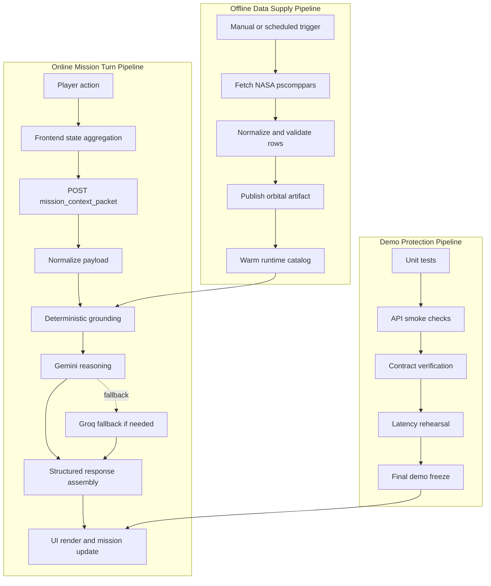
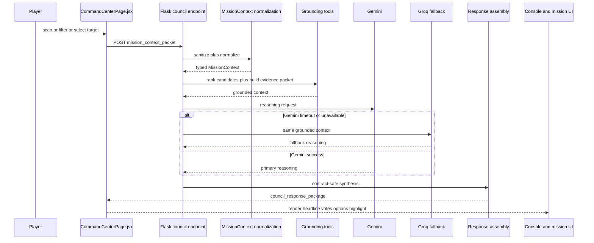

# Atlas Orrery - System Pipeline

> Đây là execution playbook của Atlas Orrery. Nếu `filemoi.md` trả lời câu hỏi "hệ thống được dựng như thế nào", thì file này trả lời câu hỏi quan trọng hơn với một đội đi thi hackathon: "hệ thống sẽ sống, phản ứng, chịu lỗi, và thắng buổi demo như thế nào".

## What this document proves

- Dữ liệu đi từ NASA-derived artifact tới UI theo một đường ống rõ ràng, có checkpoint, có rollback.
- Runtime council loop không phải một đống lời hứa; nó là một chuỗi bước có budget, có guardrails, có fallback.
- `Gemini` xuất hiện ở đúng bước tạo intelligence, còn `Groq` đứng sẵn để giữ nhịp nếu primary path có vấn đề.
- Mọi branch quan trọng đều có user-safe outcome: `candidate_found`, `candidate_with_risk`, `insufficient_evidence`, hoặc API error có thể giải thích.
- Đội thi có thể rehearsal, đo latency, kiểm tra contract, và khóa trạng thái demo trước giờ chấm.

## 1) Pipeline philosophy

Atlas Orrery theo 4 nguyên tắc vận hành:

1. `No fake science`
   - Không bịa dữ liệu.
   - Không để model nói vượt evidence packet.

2. `No dead-end UX`
   - Candidate rỗng không được biến thành crash.
   - Council phải luôn trả về next action có ích.

3. `No single-provider fragility`
   - `Gemini` là primary path.
   - `Groq` là fallback path.

4. `No free-form render debt`
   - UI chỉ render structured payload.
   - Mọi branch đều giữ stable response contract.

## 2) End-to-end system pipeline

Pipeline này được thiết kế để answer một câu hỏi rất thực tế: nếu giám khảo chạm vào app trong đúng 90 giây quan trọng nhất, system có đủ lực để phản hồi như một sản phẩm hoàn chỉnh hay không.

## 3) Pipeline A - Offline data supply chain

### Objective

Biến raw NASA-derived data thành runtime artifact sạch, ổn định, có lineage, đủ nhẹ để phục vụ local demo environment.

### Trigger modes

- Manual trigger:
  - `python scripts/refresh_orbital_catalog.py`

- Scheduled trigger:
  - `python scripts/install_nightly_refresh_launchd.py --hour 2 --minute 15`

### Inputs

- NASA Exoplanet Archive TAP query result.
- Required orbital and science fields:
  - `pl_name`
  - `hostname`
  - `pl_orbper`
  - `pl_orbsmax`
  - `pl_orbeccen`
  - `pl_orbtper`
  - `pl_tranmid`
  - `pl_rade`
  - `pl_eqt`
  - `pl_insol`
  - `sy_dist`
  - `ra`
  - `dec`

### Step-by-step execution

1. Start refresh job.
2. Fetch raw dataset from TAP endpoint.
3. Parse CSV into dataframe.
4. Coerce numeric columns with safe conversion.
5. Dedupe rows by planet identity.
6. Validate required columns.
7. Drop rows missing orbital minimums như `pl_orbper` hoặc `pl_orbsmax`.
8. Apply sanity trimming để loại các record không thể hỗ trợ runtime demo.
9. Sort and cap to runtime-friendly size.
10. Publish:
   - `data/orbital_elements.csv`
   - `data/orbital_elements.meta.json`
11. Mark artifact ready for runtime load.

### Output artifacts

- `data/orbital_elements.csv`
- `data/orbital_elements.meta.json`

### Meta payload should include

- `source`
- `refreshed_at_utc`
- `rows`
- `columns`
- `solver`
- `epoch_policy`
- optional `query_fingerprint`

### Failure policy

- Fetch fail: abort refresh, giữ artifact cũ.
- Validation fail: không publish bản mới.
- Publish fail: không làm bẩn snapshot đang chạy.
- Runtime vẫn tiếp tục phục vụ bản catalog gần nhất còn hợp lệ.

### Why this matters in hackathon terms

Đội thi không thắng bằng câu "lúc nãy data hơi lỗi". Chúng tôi cần một artifact pipeline đủ cứng để dữ liệu không trở thành thứ phá hỏng demo.

## 4) Pipeline B - Runtime mission turn

### Objective

Chuyển một thao tác của người chơi thành một council response có trọng lượng khoa học, có AI reasoning, có next action, và render được ngay trên UI.

### Trigger examples

- đổi filter radius,
- đổi period band,
- bắt đầu `grid scan`,
- bắt đầu `spiral scan`,
- chọn một target cụ thể,
- mở dossier để hỏi "why this one?".

### Runtime sequence

### Step-by-step execution

1. Player performs an action.
2. Frontend captures local mission state.
3. Frontend builds `mission_context_packet`.
4. Frontend sends `POST /api/council/respond`.
5. Backend parses JSON bằng safe mode.
6. `MissionContext.from_payload` normalizes:
   - mode,
   - filters,
   - challenge state,
   - recent actions.
7. Grounding layer runs:
   - rank targets,
   - compute baseline score,
   - select primary candidate,
   - build evidence summary,
   - identify caution flags.
8. Orchestrator creates a model-ready grounded council brief.
9. `Gemini` receives the grounded brief and performs reasoning.
10. Nếu `Gemini` không đạt timeout budget hoặc provider path lỗi, orchestrator chuyển sang `Groq`.
11. Response assembly merges:
   - deterministic evidence,
   - reasoning output,
   - branch status,
   - player options,
   - discovery log line.
12. Frontend renders:
   - headline,
   - support and caution votes,
   - primary action,
   - highlight target in scene.

### Runtime budgets

- FE state aggregation: `< 20ms`
- request parse and normalization: `< 30ms`
- deterministic grounding: `< 120ms`
- primary reasoning target: `< 1100ms`
- fallback reasoning target: `< 700ms`
- response assembly: `< 20ms`
- FE render after response: `< 150ms`

## 5) Pipeline C - Deterministic grounding before AI

Đây là bước khiến AI layer trở nên đáng tin.

### Inputs

- normalized mission context,
- current orbital catalog,
- selected target if any,
- current filter band,
- recent actions.

### Grounding outputs

- ranked candidate list,
- primary candidate,
- baseline score,
- evidence summary,
- caution flags,
- branch hint (`candidate possible` hay `insufficient_evidence`).

### Deterministic tasks that must happen before any model call

1. Validate filter ranges.
2. Apply candidate filter.
3. Compute baseline habitability score.
4. Sort and truncate candidate list.
5. Resolve selected target nếu user đã click trước đó.
6. Produce evidence packet.
7. Mark explicit caution nếu dữ liệu thiếu hoặc orbital risk cao.

### Why this ordering is non-negotiable

Nếu model reason trước khi grounding xong, toàn bộ system sẽ trượt về kiểu chatbot "nói hay nhưng không khóa được khoa học". Chúng tôi không chấp nhận điều đó.

## 6) Pipeline D - AI council reasoning

### Objective

Biến grounded scientific packet thành một hội đồng có tiếng nói, có disagreement, và có recommendation đủ mạnh để tạo wow factor.

### Council roles

- `Navigator`
  - ưu tiên candidate tiếp theo,
  - chọn action phù hợp cho mission.

- `Astrobiologist`
  - nhìn vào viability và habitability.

- `Climate/Orbital Agent`
  - đóng vai phản biện,
  - nêu risk và uncertainty.

- `Archivist`
  - biến kết quả thành log line đủ sáng sủa để người chơi hiểu ngay.

### Model request composition

Model request không phải raw user text. Nó là một packet đã được kiểm soát, thường gồm:

- mode,
- player goal,
- selected target,
- top candidates,
- evidence summary,
- risk flags,
- response schema instruction,
- tone directive cho Science Council.

### Gemini primary path

`Gemini` được dùng để:

- reason đa bước trên evidence,
- tạo council debate,
- tổng hợp recommendation có cấu trúc,
- viết narrative đủ mạnh cho hackathon demo.

### Groq fallback path

`Groq` được gọi khi:

- `Gemini` timeout,
- provider unavailable,
- quota issue,
- latency vượt demo budget.

### Fallback invariants

- cùng grounded packet,
- cùng output schema,
- cùng branch semantics,
- không cho phép fallback trả về response shape khác.

### Safe degraded outcome

Nếu cả 2 provider path đều không usable:

- không được crash endpoint,
- system phải trả deterministic-safe branch,
- headline và options vẫn phải đủ để người dùng tiếp tục thao tác.

## 7) Pipeline E - Branch behavior

### Branch 1: `candidate_found`

Condition:

- candidate list không rỗng,
- risk không đủ mạnh để nâng thành caution-heavy branch.

Expected response:

- headline mạnh, rõ target,
- `primary_recommendation.target_id` có giá trị,
- council votes nghiêng support,
- player options hướng tới hành động tiếp theo.

UI effect:

- mission panel đẩy target nổi bật,
- console log thể hiện sự đồng thuận.

### Branch 2: `candidate_with_risk`

Condition:

- candidate list không rỗng,
- có risk signals hoặc caution vote đáng kể.

Expected response:

- headline vẫn thúc đẩy action,
- nhưng phải kéo theo warning rõ ràng,
- votes gồm cả support và caution.

UI effect:

- tạo cảm giác debate thật,
- không làm system lưỡng lự kiểu "không biết nói gì",
- khuyến khích user đào sâu thay vì bỏ cuộc.

### Branch 3: `insufficient_evidence`

Condition:

- filter band quá chặt,
- selected target không còn hợp lệ,
- candidate list rỗng sau grounding.

Expected response:

- `mission_status=insufficient_evidence`,
- `primary_recommendation.action=widen_filters`,
- `player_options` là đường thoát cụ thể.

UI effect:

- tuyệt đối không dead-end,
- user vẫn cảm thấy council có hướng dẫn chứ không chỉ báo lỗi.

## 8) Pipeline F - UI rendering and mission update

### What frontend must do

1. Append headline vào console.
2. Append support and caution votes.
3. Update recommendation panel.
4. Highlight target in orrery nếu có target.
5. Preserve newest valid response only.

### Render rules

- `headline` -> command line
- support vote -> info line
- caution vote -> warning line
- no model-specific render branch

### UI protection rules

- response cũ đến muộn không được overwrite response mới hơn,
- branch `insufficient_evidence` vẫn phải render đầy đủ,
- FE không parse free-form essay để suy đoán UI behavior.

## 9) Pipeline G - Challenge mode specifics

Atlas Orrery không chỉ có discovery mode. Trong hackathon framing, challenge mode là nơi AI bắt đầu giống một mission director thay vì chỉ là advisor.

### Challenge mode loop

1. Generate objective.
2. Track player actions.
3. Evaluate progress deterministically.
4. Feed progress plus scientific state vào council turn.
5. Council trả hint, escalation, hoặc confirmation.

### Deterministic core must own

- objective validity,
- progress calculation,
- win/loss state,
- scoring.

### AI layer should own

- hint phrasing,
- urgency,
- scientific narrative,
- next-step recommendation.

## 10) Error taxonomy and containment

| Failure type | Where it appears | System behavior | User-facing outcome | Containment strategy |
|---|---|---|---|---|
| Invalid payload | request parse or normalize | normalize về safe defaults | user vẫn nhận response hợp lệ | schema guardrails |
| Empty candidate set | grounding layer | return `insufficient_evidence` | UI gợi ý nới filter | branch-safe response |
| Dataset missing | catalog load | explicit API error | UI báo backend unavailable | artifact restore plus restart |
| Gemini timeout | primary reasoning | route to `Groq` | user vẫn thấy council result | provider fallback |
| Groq fail sau Gemini fail | fallback reasoning | deterministic-safe response | user thấy degraded but usable result | emergency safe branch |
| Refresh failure | offline data job | giữ snapshot cũ | runtime vẫn sống | publish guard |

## 11) Observability signals

### Runtime fields to log

- `request_id`
- `mode`
- `selected_planet_id`
- `candidate_count`
- `mission_status`
- `provider_path`
- `latency_ms`
- `grounding_ms`
- `reasoning_ms`

### Refresh fields to log

- `job_start`
- `job_end`
- `published_rows`
- `artifact_timestamp`
- `status`
- `failure_reason`

### Demo dashboard signals worth watching

- council endpoint success rate,
- fallback activation rate,
- percentage of `insufficient_evidence`,
- median response time in rehearsal,
- artifact age before live demo.

## 12) SLO and performance targets

### Runtime targets

- `POST /api/council/respond` p95 on primary path: `< 1500ms`
- fallback path p95: `< 900ms`
- deterministic grounding p95: `< 120ms`
- FE update after response: `< 150ms`

### Reliability targets

- council endpoint error rate: `< 1%` trong demo session
- branch-safe response coverage: `100%` cho no-candidate path
- contract keyset drift: `0`

### Data targets

- catalog artifact loaded successfully before live demo
- artifact timestamp nằm trong demo window chấp nhận được

## 13) Quality gates before judges touch the build

### Required checks

1. `test_council_orchestrator.py` pass.
2. `GET /api/orbital-objects` smoke pass.
3. `GET /api/orbital-meta` smoke pass.
4. `GET /api/planet/<planet_id>` smoke pass.
5. `POST /api/council/respond` smoke pass.
6. `candidate_found` branch verified.
7. `candidate_with_risk` branch verified.
8. `insufficient_evidence` branch verified.
9. Primary path rehearsal with `Gemini`.
10. Fallback rehearsal with forced `Groq`.

### Definition of demo-ready

- artifact mới đã publish,
- council loop ổn định,
- fallback path hoạt động,
- console render sạch,
- latency trong target,
- final walkthrough không crash.

## 14) Rollback and recovery

### Data rollback

- refresh fail -> không publish artifact mới
- artifact mới lỗi -> restore snapshot trước đó
- runtime reload bằng artifact cũ

### Runtime recovery

- primary provider lỗi -> fallback provider
- cả hai provider path không usable -> deterministic-safe response
- FE không reload toàn trang nếu council path thất bại một lần; cho user retry từ chính interaction hiện tại

### Demo-day recovery playbook

1. Check artifact age.
2. Check council endpoint.
3. Force one fallback rehearsal.
4. Clear only stale UI state nếu cần.
5. Không rerun full refresh sát giờ chấm nếu artifact hiện tại đang ổn định.

## 15) Final execution claim

Pipeline của Atlas Orrery không được viết để "đủ dùng". Nó được viết để vào phòng chấm với tâm thế tấn công: dữ liệu đã khóa, council loop đã có đường primary và đường sống sót, mọi branch đều có user-safe outcome, và AI nằm đúng chỗ phải nằm là trung tâm của runtime intelligence. Đó là pipeline của một đội thi đi để thắng, không phải pipeline của một prototype xin thông cảm.
