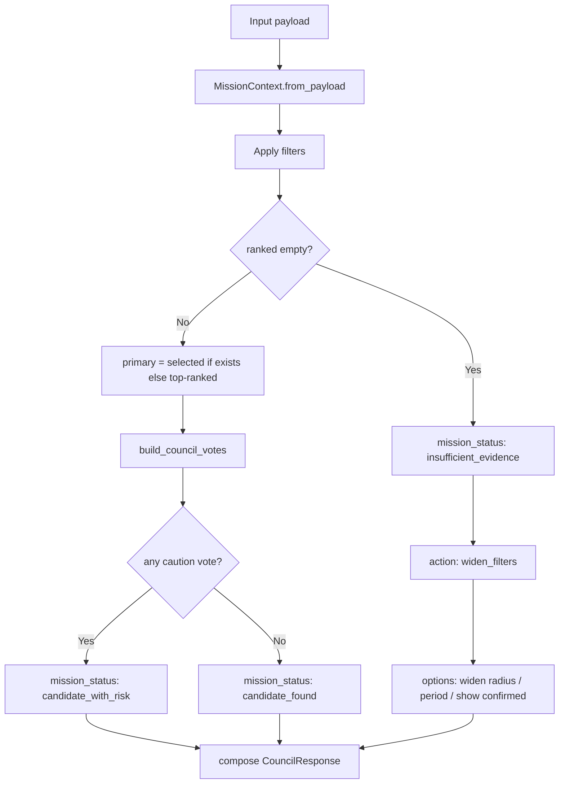
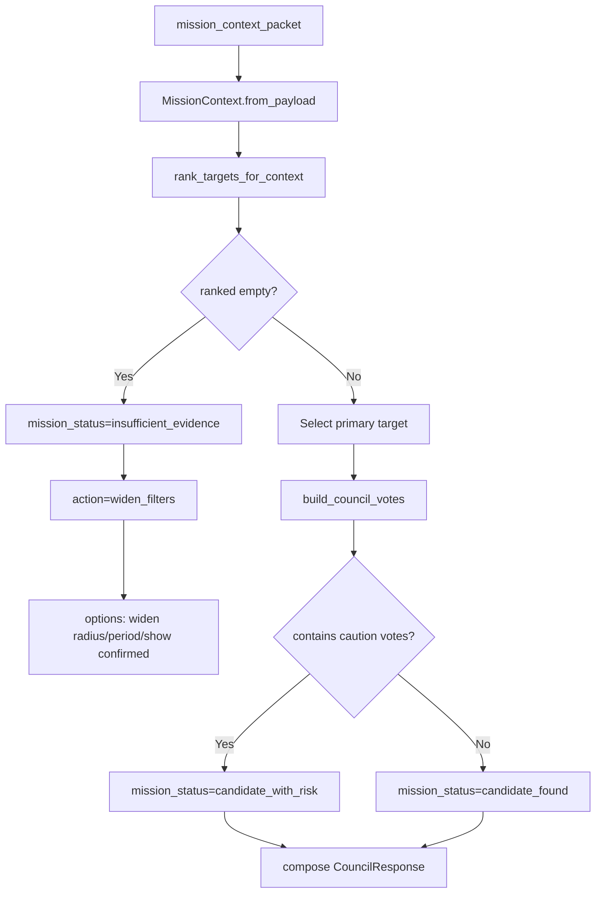

# Atlas Orrery — System Pipeline (Production-ready Spec)

> Tài liệu này mô tả **pipeline vận hành thật** cho Atlas Orrery theo dạng engineering spec: có mục tiêu, trigger, input/output, bước xử lý, failure mode, observability và tiêu chí nghiệm thu đo được.

---

## 1) Overview

Atlas Orrery có 2 pipeline chính:

1. **Offline Data Refresh Pipeline**
   - Đồng bộ dữ liệu exoplanet từ NASA, validate, xuất artifact runtime.
2. **Online Runtime Decision Pipeline**
   - Nhận tương tác user từ Unity, suy luận council response và trả về UI theo contract ổn định.

Cả hai pipeline đều có quality gate, fallback và metric theo dõi để đảm bảo demo ổn định.

---

## 2) End-to-end pipeline map

```mermaid
flowchart TB
    subgraph OFFLINE[Offline Data Refresh]
      OF1[Schedule/manual trigger] --> OF2[Extract NASA pscomppars]
      OF2 --> OF3[Normalize + type coercion]
      OF3 --> OF4[Schema/Data validation]
      OF4 -->|pass| OF5[Write orbital_elements.csv]
      OF4 -->|pass| OF6[Write orbital_elements.meta.json]
      OF4 -->|fail| OFX[Keep previous stable dataset]
      OF5 --> OF7[Warm API cache]
      OF6 --> OF7
    end

    subgraph ONLINE[Online Runtime Decision]
      ON1[Unity action/filter/select] --> ON2[Build mission_context_packet]
      ON2 --> ON3[POST /api/council/respond]
      ON3 --> ON4[Parse + sanitize payload]
      ON4 --> ON5[Rank candidates]
      ON5 --> ON6{Candidates available?}
      ON6 -->|No| ON7[insufficient_evidence]
      ON6 -->|Yes| ON8[Select primary + build votes]
      ON8 --> ON9[Compose council_response_package]
      ON7 --> ON9
      ON9 --> ON10[Unity render headline/votes/options]
    end

    subgraph QA[Quality and Release Gates]
      Q1[Unit tests] --> Q2[Contract tests]
      Q2 --> Q3[API smoke tests]
      Q3 --> Q4[Demo rehearsal]
    end
```



> Gợi ý xuất PDF: render Mermaid sang SVG/PNG trước khi đóng gói submission để tránh hiển thị code thô.

---

## 3) Offline data refresh pipeline

### 3.1 Goal
- Tạo dataset runtime ổn định, hợp lệ, có metadata, sẵn sàng cho API.
# Atlas Orrery — System Pipeline (Detailed v2)

> Mục tiêu: mô tả **end-to-end pipeline** ở mức có thể implement ngay, gồm runtime flow, data refresh, resilience, QA gate và release.

---

## 0) Pipeline map (toàn cục)

```mermaid
flowchart TB
    subgraph OFFLINE[Offline Pipelines]
      A1[Schedule Trigger] --> A2[Extract NASA pscomppars]
      A2 --> A3[Transform + Normalize]
      A3 --> A4[Schema Validation]
      A4 --> A5[Write CSV + meta.json]
      A5 --> A6[Warm API cache]
    end

    subgraph ONLINE[Online Runtime]
      B1[Unity user action] --> B2[mission_context_packet]
      B2 --> B3[POST /api/council/respond]
      B3 --> B4[Context parse + sanitize]
      B4 --> B5[rank_targets_for_context]
      B5 --> B6{Have candidates?}
      B6 -- No --> B7[insufficient_evidence response]
      B6 -- Yes --> B8[Build council votes + summary]
      B8 --> B9[council_response_package]
      B7 --> B9
      B9 --> B10[UI render + next actions]
    end

    subgraph OPS[Quality Gates]
      C1[Unit tests] --> C2[API smoke tests]
      C2 --> C3[Contract checks]
      C3 --> C4[Demo rehearsal]
    end
```



---

## 1) Offline data refresh pipeline (T-1 trước demo)

### 1.1 Trigger và lịch
- Trigger định kỳ: mỗi 12h hoặc theo tay trước buổi chấm.
- Manual trigger: cho phép chạy nóng khi cần cập nhật catalog.

### 1.2 Các stage chi tiết
1. **Extract**
   - Nguồn: NASA Exoplanet Archive (pscomppars).
   - Lấy các field bắt buộc: `pl_name`, `pl_orbper`, `pl_orbsmax`, `pl_orbeccen`, `pl_orbtper`, `pl_tranmid`, `pl_rade`, `pl_eqt`, `pl_insol`, `sy_dist`.
2. **Transform / Normalize**
   - Chuẩn hóa số (`float`) cho các cột orbit/science.
   - Chuẩn hóa epoch về Julian Day (`normalize_epoch_jd`).
   - Loại bỏ bản ghi không có `pl_orbper` hoặc `pl_orbsmax`.
3. **Validate**
   - Required columns phải đủ.
   - Dataset không rỗng.
   - Tỷ lệ epoch hợp lệ > ngưỡng tối thiểu (ví dụ 5%).
4. **Publish artifact**
   - Ghi `data/orbital_elements.csv`.
   - Ghi `data/orbital_elements.meta.json` (source, refreshed_at_utc, row_count, checksum).
5. **Warm cache**
   - Reload cache của Flask (`build_orbital_objects`) trước khi traffic thật.

### 1.3 Failure handling
- Nếu validation fail: **không overwrite** dataset hiện tại.
- Ghi log lỗi + giữ phiên bản cũ đang ổn định.
- Cảnh báo dashboard nhưng runtime vẫn hoạt động với cache/dataset trước đó.

---

## 2) Runtime decision pipeline (user action -> council response)

### 2.1 Event ingress
- User đổi filter, chọn planet, hoặc bấm action trong Unity.
- FE tạo `mission_context_packet` chứa mode, filters, selected id, recent actions.

### 2.2 API boundary
- Endpoint: `POST /api/council/respond`.
- Bắt buộc parse JSON an toàn (`silent=True`) + fallback payload rỗng.
- Sanitize input:
  - mode về lower-case và whitelist (`sandbox/challenge/discovery`).
  - numeric filter parse an toàn (không crash khi input bẩn).
  - giới hạn độ dài `recent_actions` để giữ payload nhỏ.

### 2.3 Orchestrator flow
1. `MissionContext.from_payload(payload)`
2. `rank_targets_for_context(objects, filters)`
3. Branch:
   - **No candidates** -> `mission_status=insufficient_evidence` + options nới filter.
   - **Has candidates** -> chọn `primary` theo selected id hoặc top-1 score.
4. `build_council_votes(primary, mode)`
5. Compose `CouncilResponse` có:
   - headline
   - primary_recommendation
   - council_votes
   - player_options
   - evidence_summary

### 2.4 Latency budget mục tiêu (local demo)
- Parse + validate context: < 30ms
- Rank targets (<=900 objects): < 120ms
- Compose response: < 20ms
- Tổng `p95 /api/council/respond`: < 1200ms

---

## 3) Detailed branch logic



### 3.2 Trigger
- Cron định kỳ (đề xuất: 12h/lần).
- Manual trigger trước buổi demo.

### 3.3 Inputs
- NASA Exoplanet Archive (pscomppars).
- Required columns:
  - `pl_name`, `hostname`
  - `pl_orbper`, `pl_orbsmax`, `pl_orbeccen`, `pl_orbincl`, `pl_orblper`
  - `pl_orbtper`, `pl_tranmid`
  - `pl_rade`, `pl_bmasse`, `pl_eqt`, `pl_insol`, `sy_dist`, `ra`, `dec`

### 3.4 Processing steps
1. **Extract** dữ liệu nguồn.
2. **Normalize** kiểu numeric + chuẩn hóa epoch.
3. **Validate** schema và chất lượng dữ liệu.
4. **Publish** artifact runtime.
5. **Warm cache** backend để tránh cold-start trong demo.

### 3.5 Outputs
- `data/orbital_elements.csv`
- `data/orbital_elements.meta.json` (source, refreshed_at_utc, row_count, checksum)

### 3.6 Failure mode
- Nếu validation fail: **không overwrite** artifact cũ.
- Log lỗi + giữ dataset snapshot ổn định gần nhất.

### 3.7 Observability
- `refresh_job_id`
- `input_row_count`
- `valid_row_count`
- `validation_failed_reason`
- `artifact_checksum`
- `refresh_duration_ms`

---

## 4) Online runtime decision pipeline

### 4.1 Goal
- Trả về `council_response_package` ổn định và render-safe cho mọi user action.

### 4.2 Trigger
- User đổi filter, chọn planet, hoặc bấm action trong Unity.

### 4.3 Inputs
- `mission_context_packet` từ client.
- Orbital object catalog đã cache ở backend.

### 4.4 Processing steps
1. API nhận request tại `POST /api/council/respond`.
2. Parse JSON an toàn + sanitize payload.
3. Chuyển payload sang `MissionContext`.
4. `rank_targets_for_context` theo filters.
5. Branch:
   - No candidates -> trả `insufficient_evidence`.
   - Có candidates -> chọn primary target.
6. `build_council_votes` + compose recommendation.
7. Trả `council_response_package`.
8. Unity render headline / votes / player options.

### 4.5 Outputs
- Response JSON theo contract ổn định:
  - `mission_status`
  - `headline`
  - `primary_recommendation`
  - `council_votes`
  - `player_options`
  - `discovery_log_entry`
  - `evidence_summary`

### 4.6 Failure mode
- Payload bẩn -> sanitize về default an toàn, không crash API.
- Candidate rỗng -> `insufficient_evidence` + gợi ý nới filter.
- Dataset load lỗi -> trả lỗi backend có message rõ nguyên nhân.

### 4.7 Observability
- `request_id`
- `mode`
- `selected_planet_id`
- `candidate_count`
- `mission_status`
- `latency_ms`

---

## 5) Branch and fallback logic



---

## 6) Data contract appendix

### 6.1 Request contract — `mission_context_packet`

| Field | Type | Required | Description | Example |
|---|---|---:|---|---|
| `mode` | string | no | `sandbox/challenge/discovery` | `"challenge"` |
| `player_goal` | string | no | Mục tiêu ngắn của user | `"find 2 candidates"` |
| `selected_planet_id` | string\|null | no | Planet user đang focus | `"Kepler-442 b"` |
| `filters.showConfirmed` | bool | no | Có hiển thị confirmed planets | `true` |
| `filters.showHabitable` | bool | no | Có hiển thị habitable candidates | `true` |
| `filters.radiusMin/radiusMax` | number | no | Dải bán kính | `0.7 / 2.2` |
| `filters.periodMin/periodMax` | number | no | Dải chu kỳ quỹ đạo | `1 / 500` |
| `challenge_state.active` | bool | no | Trạng thái challenge mode | `true` |
| `challenge_state.objective` | string | no | Mục tiêu challenge | `"Find 2 worlds"` |
| `challenge_state.progress` | int | no | Tiến độ challenge | `1` |
| `recent_actions` | string[] | no | Hành động gần nhất (capped) | `["scan", "select"]` |

### 6.2 Success response contract — `council_response_package`

| Field | Type | Required | Description |
|---|---|---:|---|
| `mission_status` | string | yes | `candidate_found` hoặc `candidate_with_risk` |
| `headline` | string | yes | Dòng headline cho mission panel |
| `primary_recommendation` | object | yes | Action + target + reason |
| `council_votes` | object[] | yes | Vote từ các agent |
| `player_options` | string[] | yes | Danh sách lựa chọn tiếp theo |
| `discovery_log_entry` | string | yes | Log entry hiển thị lịch sử |
| `evidence_summary` | object | yes | Numeric summary để hiển thị |

### 6.3 Insufficient evidence response contract

| Field | Type | Required | Description |
|---|---|---:|---|
| `mission_status` | string | yes | `insufficient_evidence` |
| `headline` | string | yes | Lý do không thể rank candidate |
| `primary_recommendation.action` | string | yes | `widen_filters` |
| `player_options` | string[] | yes | Các thao tác để thoát dead-end |
| `council_votes` | object[] | yes | Có thể rỗng |
## 4) API contract pipeline checks

### 4.1 Request checks
- `mode`: chỉ chấp nhận `sandbox`, `challenge`, `discovery`.
- `filters`: auto-clamp nếu min > max.
- `challenge_state.progress`: ép kiểu int an toàn.
- `recent_actions`: list[str], tối đa 20 events gần nhất.

### 4.2 Response checks
- Luôn có key ổn định:
  - `mission_status`, `headline`, `primary_recommendation`, `council_votes`, `player_options`, `discovery_log_entry`.
- Branch `insufficient_evidence` vẫn trả đầy đủ contract.
- `confidence` trong vote được clamp về [0.1, 0.99].

---

## 5) UI rendering pipeline

### 5.1 Mapping policy
- `headline` -> mission panel title.
- `primary_recommendation.action` -> action button chính.
- `council_votes` -> console timeline.

### 5.2 State consistency
- FE dùng `request_id`/timestamp để bỏ response cũ đến muộn.
- Debounce input filter 200-300ms để tránh spam API.

### 5.3 Error UX
- API fail -> hiển thị fallback card + nút retry.
- `insufficient_evidence` -> gợi ý thao tác cụ thể để user thoát dead-end.

## 7) Error taxonomy

| Error code | Meaning | User-facing behavior | Retry |
|---|---|---|---|
| `INSUFFICIENT_EVIDENCE` | Filter hiện tại loại hết candidate | Hiện gợi ý nới filter | No |
| `INVALID_PAYLOAD` | Payload sai kiểu/thiếu field | Parse về default an toàn | No |
| `DATASET_UNAVAILABLE` | Không load được orbital dataset | Hiện thông báo backend error | Yes |
| `FRONTEND_BUILD_MISSING` | Thiếu static build | Trả hint build command | Yes |

---

## 8) Quality gates

### 8.1 Unit tests
- Orchestrator: candidate path + insufficient path.
- Schema parsing: invalid mode, dirty numeric values, min/max đảo ngược.

### 8.2 Contract tests
- Assert đầy đủ key bắt buộc ở mọi branch.
- Assert value ranges (`confidence`, numeric fields) hợp lệ.

### 8.3 API smoke tests
- `GET /api/orbital-objects`
- `GET /api/orbital-meta`
- `POST /api/council/respond`

### 8.4 Demo rehearsal
- 3 luồng demo: Sandbox / Challenge / Discovery.
- Có tình huống no-candidate và fallback được xử lý đúng.

---

## 9) Performance targets (demo scope)

- `/api/council/respond` p95 < **1200ms** (local).
- Ranking step (<=900 objects) p95 < **120ms**.
- Error rate endpoint council < **1%** trong session demo.
- UI render sau khi nhận response < **200ms**.

---

## 10) Definition of done (measurable)

- [ ] Refresh job tạo thành công cả `csv` và `meta.json`.
- [ ] Validation fail không ghi đè dataset ổn định.
- [ ] Contract test pass cho cả success và insufficient branches.
- [ ] API smoke test pass tất cả endpoint chính.
- [ ] p95 latency đạt target trong rehearsal.
- [ ] 3 demo path (Sandbox/Challenge/Discovery) chạy end-to-end.
- [ ] Fallback/no-candidate UX hiển thị rõ và actionable.

---

## 6) Observability pipeline

Mỗi request log tối thiểu:
- `request_id`
- `mode`
- `selected_planet_id`
- `candidate_count`
- `latency_ms`
- `mission_status`

Gợi ý log format (JSON line):
```json
{
  "request_id": "a2f4...",
  "mode": "challenge",
  "candidate_count": 18,
  "mission_status": "candidate_with_risk",
  "latency_ms": 143
}
```

---

## 7) Quality gate pipeline

1. **Unit test**
   - Orchestrator branch test (`candidate_found`, `insufficient_evidence`).
   - Schema parse test với input bẩn.
2. **API smoke**
   - `/api/orbital-objects`, `/api/orbital-meta`, `/api/council/respond`.
3. **Contract test**
   - Assert key bắt buộc không bị thiếu.
4. **Demo rehearsal**
   - 1 flow đầy đủ: scan -> select -> council -> follow-up.

---

## 8) Release/rollback pipeline

- Trước release: tag build + snapshot dataset meta.
- Nếu lỗi runtime sau deploy:
  1. rollback frontend bundle,
  2. rollback backend commit,
  3. restore dataset snapshot gần nhất.

---

## 9) Definition of done (expanded)

- [ ] Hoàn thành end-to-end flow ổn định trong cả 3 mode.
- [ ] Không crash khi payload thiếu/sai kiểu.
- [ ] Có nhánh xử lý no-candidate rõ ràng cho UX.
- [ ] Contract response ổn định để frontend render an toàn.
- [ ] Unit test cho cả happy path + failure path đều pass.
