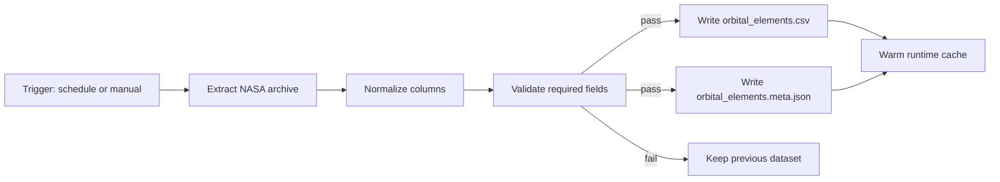
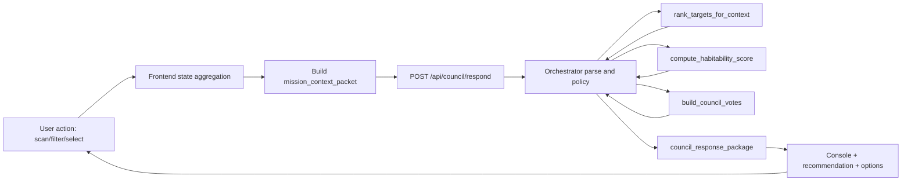
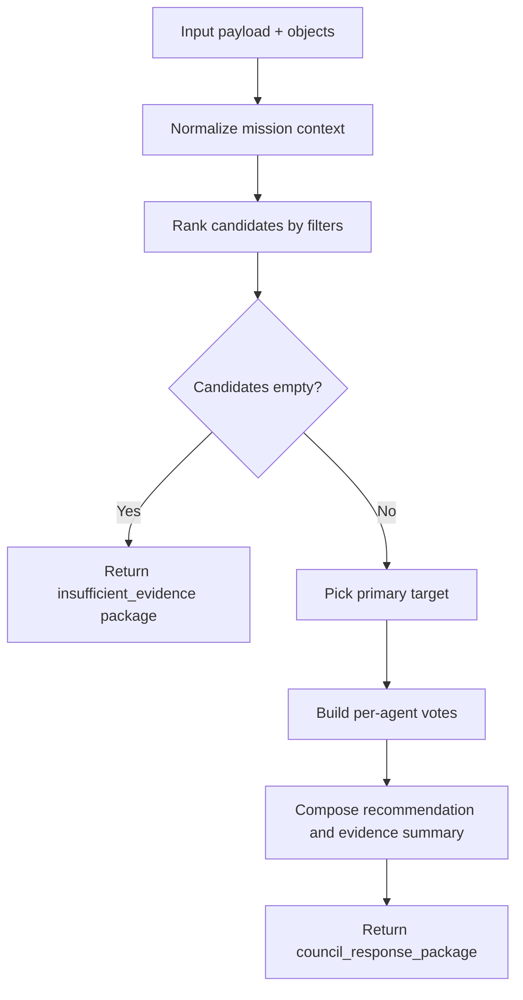
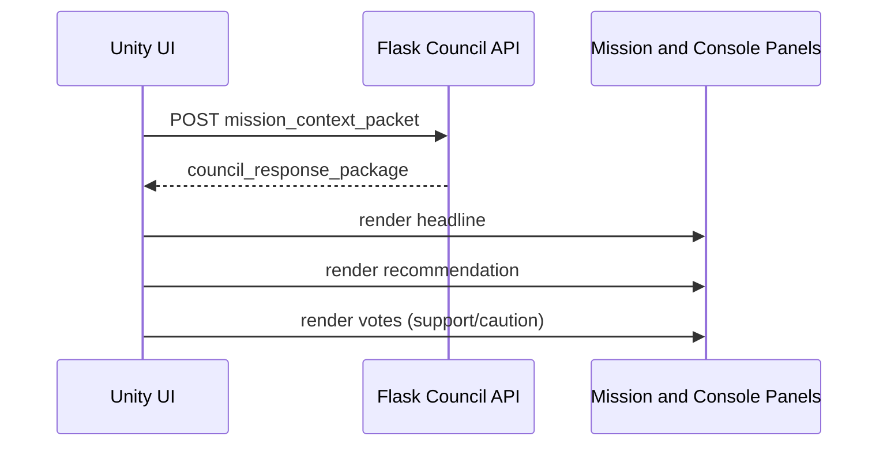
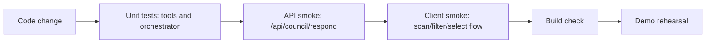

# Atlas Orrery — System Pipeline (Submission-ready)

> File này chỉ tập trung vào pipeline thực thi: data refresh, runtime decision loop, UI update, test/release.

---

## 1) Pipeline A — Data refresh (offline)

### Input
- Raw rows từ NASA Exoplanet Archive.

### Output
- `data/orbital_elements.csv`
- `data/orbital_elements.meta.json`

### Failure behavior
- Validation fail -> không overwrite dataset cũ.
- Runtime API vẫn dùng dataset/cached version trước.

---

## 2) Pipeline B — User interaction to council response (online)

### Step-by-step execution
1. FE bắt event từ scan/filter/selection.
2. FE gom state thành `mission_context_packet`.
3. API validate payload.
4. Orchestrator gọi tools deterministic.
5. Nếu không có candidate -> trả `insufficient_evidence`.
6. Nếu có candidate -> build votes + recommendation.
7. Trả response có cấu trúc ổn định.
8. FE render headline, votes, options cho vòng tiếp theo.

---

## 3) Pipeline C — Council branching logic

---

## 4) Pipeline D — UI update

UI policy:
- `command` cho headline chính.
- `info` cho support votes.
- `warning` cho caution votes.

---

## 5) Pipeline E — Quality and release gate

Minimum gates:
- Unit tests pass.
- Response contract keys luôn đủ.
- `insufficient_evidence` branch không lỗi.
- Client render được support + caution logs.

---

## 6) Pipeline SLO targets (demo)

- Council response p95 < 1200ms (local env).
- UI update after response < 200ms.
- Council endpoint error rate < 1% trong demo session.

---

## 7) Pipeline risk controls

1. Spam request khi đổi filter liên tục
- FE debounce + loading guard.

2. Response đến muộn làm lệch state
- Chỉ apply response mới nhất theo `request_id`/timestamp.

3. Candidate rỗng gây dead-end UX
- Trả gợi ý tự động: widen filters hoặc compare analogs.

4. Model provider lỗi trong lúc demo
- Fallback chain: `Grok -> DeepSeek -> Qwen`.
- Nếu lỗi toàn bộ -> deterministic fallback response.

---

## 8) Definition of done (MVP)

- [ ] Hoàn thành 1 vòng user-action -> council-response -> UI-update ổn định.
- [ ] Có nhánh xử lý lỗi và thiếu dữ liệu.
- [ ] Có log đủ để debug realtime demo.
- [ ] Chạy được đầy đủ trong 3 mode: Sandbox, Challenge, Discovery.
