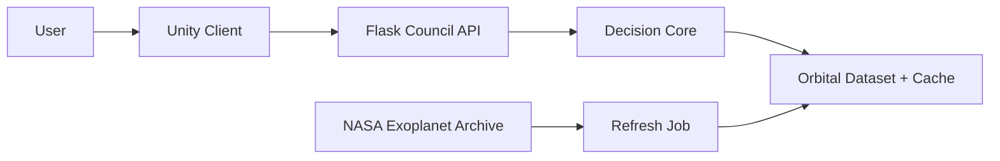
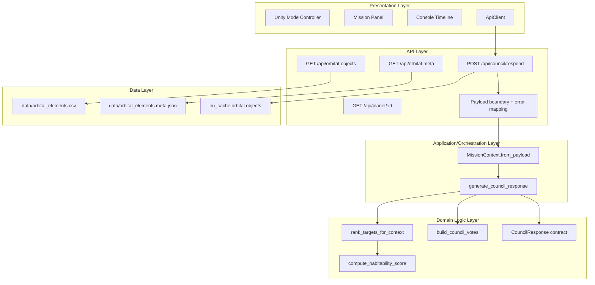
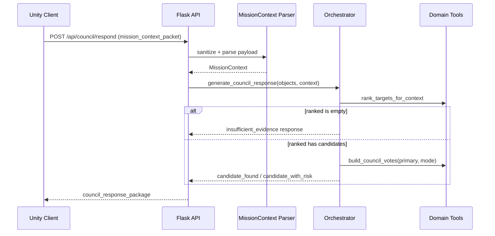
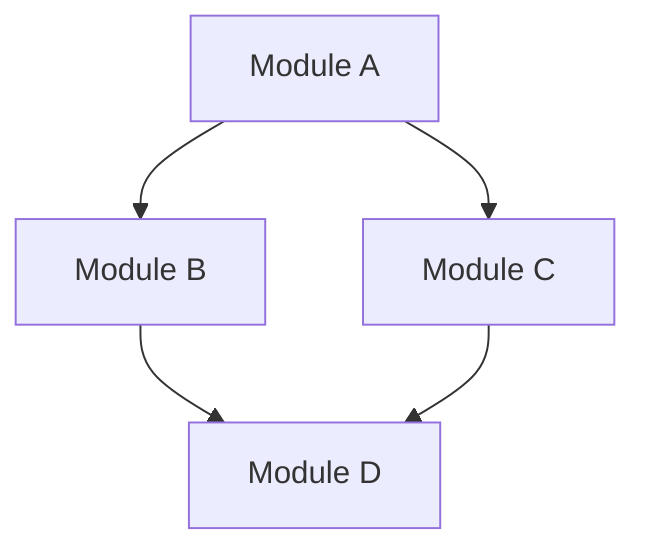
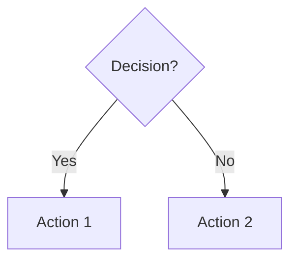
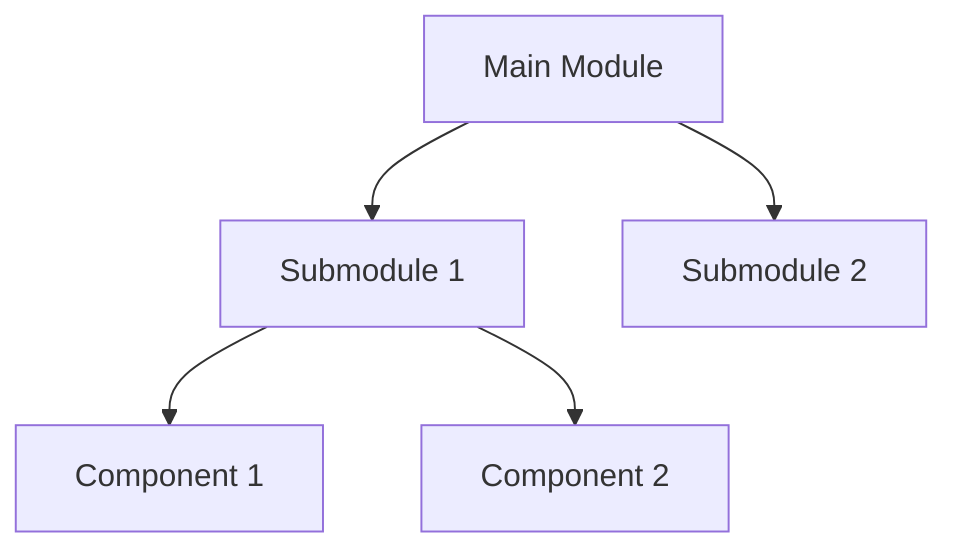
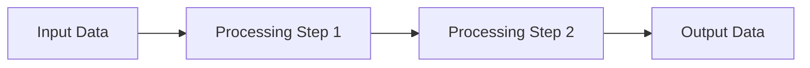

# Atlas Orrery — Technical Feasibility & System Architecture

> Tài liệu này mô tả **kiến trúc hệ thống thật** của dự án Atlas Orrery: thành phần cụ thể, ranh giới trách nhiệm, contract dữ liệu, luồng domain, giả định runtime và rủi ro thực tế trong bối cảnh hackathon.

---

## 1) System purpose

Atlas Orrery là hệ thống khám phá exoplanet tương tác, trong đó:
- Unity client cung cấp trải nghiệm scan/filter/select.
- Flask backend cung cấp dữ liệu quỹ đạo và council recommendation.
- Decision core dùng logic deterministic để rank candidate, tạo votes, trả response có cấu trúc ổn định cho UI.

Mục tiêu demo:
- Từ user action đến recommendation có thể explain được.
- Không crash khi payload bẩn hoặc thiếu dữ liệu.
- Có branch fallback rõ ràng khi không đủ candidate.

---

## 2) Context diagram



### External actors & systems
- **Primary actor**: User (người chơi/giám khảo demo).
- **External data source**: NASA Exoplanet Archive.
- **Internal runtime systems**: Unity app, Flask API, deterministic core, cached dataset artifacts.

---

## 3) Container / module architecture



### Responsibility boundaries

| Layer | Responsibility | Out of scope |
|---|---|---|
| Unity (Presentation) | Thu tương tác user, hiển thị UI | Không tính scientific score |
| Flask API | HTTP boundary, parse request, map errors | Không chứa business logic duplicate |
| Orchestrator | Điều phối turn quyết định | Không truy cập network trực tiếp |
| Domain Tools | Ranking/scoring/voting deterministic | Không render UI |
| Data Refresh Job | Sync + validate + publish dataset | Không xử lý runtime request |

---

## 4) Core domain flow



### Domain decisions
1. Chọn `primary` theo selected id nếu còn trong ranked list.
2. Nếu không có selected hợp lệ -> fallback top-ranked.
3. `mission_status` phụ thuộc việc có vote `caution` hay không.
4. Luôn trả contract đầy đủ để UI render-safe.

---

## 5) Data contracts (real contracts)

### 5.1 Request — `mission_context_packet`

```json
{
  "mode": "challenge",
  "player_goal": "find high-potential habitable candidates",
  "selected_planet_id": "Kepler-442 b",
  "filters": {
    "showConfirmed": true,
    "showHabitable": true,
    "radiusMin": 0.7,
    "radiusMax": 2.2,
    "periodMin": 1,
    "periodMax": 500
  },
  "challenge_state": {
    "active": true,
    "objective": "Find 2 candidate worlds",
    "progress": 1
  },
  "recent_actions": ["spiral_scan", "open_planet_modal"]
}
```

### 5.2 Success response — `council_response_package`

```json
{
  "mission_status": "candidate_found",
  "headline": "Council ưu tiên Kepler-442 b cho bước kế tiếp",
  "primary_recommendation": {
    "action": "targeted_scan",
    "target_id": "Kepler-442 b",
    "reason": "Scored 0.81 on baseline habitability"
  },
  "council_votes": [
    {
      "agent": "Navigator",
      "stance": "support",
      "confidence": 0.88,
      "message": "Recommend targeted follow-up.",
      "evidence_fields": ["pl_orbper", "pl_orbsmax", "sy_dist"]
    }
  ],
  "player_options": ["Run targeted scan", "Compare nearest analogs"],
  "discovery_log_entry": "Kepler-442 b promoted after council triage.",
  "evidence_summary": {
    "radius_earth": 1.31,
    "temp_k": 286.2,
    "insolation": 0.94,
    "eccentricity": 0.07,
    "period_days": 112.4
  }
}
```

### 5.3 Insufficient evidence response

```json
{
  "mission_status": "insufficient_evidence",
  "headline": "Council cannot rank targets under current filters",
  "primary_recommendation": {
    "action": "widen_filters",
    "target_id": null,
    "reason": "Current constraints removed all candidates"
  },
  "council_votes": [],
  "player_options": [
    "Widen radius band",
    "Increase period max",
    "Enable confirmed planets"
  ],
  "discovery_log_entry": "No candidates available under active constraints.",
  "evidence_summary": null
}
```

---

## 6) Deployment and runtime assumptions

### Runtime assumptions (hackathon scope)
- Local/single-instance backend là mục tiêu chính.
- Ưu tiên ổn định demo hơn scale lớn.
- Orbital dataset được snapshot trước buổi chấm.
- Data read-heavy, dùng cache (`lru_cache`) giảm I/O.

### Operational assumptions
- Không phụ thuộc gọi model network cho path core deterministic.
- Nếu refresh job fail vẫn giữ artifact ổn định cũ.
- Unity client xử lý response theo contract stable key set.

---

## 7) Feasibility analysis (project-reality based)

### 7.1 What is already deterministic and feasible
- Ranking/scoring/voting đều deterministic, testable.
- API route chính đã tách boundary rõ và ủy quyền orchestrator.
- Contract có branch rõ: success vs insufficient evidence.

### 7.2 Demo-focused performance feasibility
- Dataset runtime giới hạn object count để giữ latency.
- Ranking complexity tuyến tính theo số object đã lọc.
- Latency target nội bộ có thể đạt với local backend và cache nóng.

### 7.3 Why this is feasible in 48h hackathon
- Không cần infra phức tạp (message queue, distributed cache).
- Tách module rõ giúp parallel work:
  - một người làm data refresh,
  - một người làm orchestrator/tools,
  - một người làm Unity integration.

---

## 8) Risks and mitigations

| Risk | Impact | Mitigation |
|---|---|---|
| Payload sai kiểu / thiếu field | API lỗi hoặc hành vi khó đoán | Parse an toàn + defaults + normalize ranges |
| Không có candidate theo filter | Dead-end UX | Trả `insufficient_evidence` + action gợi ý |
| Dataset refresh fail trước demo | Dữ liệu không cập nhật | Giữ snapshot cũ + không overwrite khi validation fail |
| Response đến trễ khi user đổi filter nhanh | UI hiển thị lệch state | FE debounce + apply latest request only |
| Frontend build thiếu | Không mở được UI demo | API trả hint build rõ ràng |

---

## 9) Verification strategy

### 9.1 Unit tests
- Orchestrator:
  - candidate branch,
  - insufficient branch.
- Schema parsing:
  - invalid mode,
  - dirty numeric,
  - min/max đảo ngược,
  - malformed recent actions.

### 9.2 Contract tests
- Validate đầy đủ key bắt buộc ở mọi status.
- Validate value range cho confidence và numeric summary.

### 9.3 API smoke
- `GET /api/orbital-objects`
- `GET /api/orbital-meta`
- `POST /api/council/respond`

### 9.4 Demo rehearsal checklist
- 3 mode path chạy xuyên suốt.
- No-candidate path có UX rõ.
- Latency và error rate trong ngưỡng mục tiêu.
# Clean Architecture Overview

This section provides an overview of clean architecture, ensuring that all components are independently testable and can be changed without affecting others. 

## Module Dependencies Graph



## Decision Flow Sequence Diagram



## Code-Level Module Decomposition



## Input/Output Contracts in JSON

```json
{
    "input": {
        "param1": "value1",
        "param2": "value2"
    },
    "output": {
        "result": "outputValue"
    }
}
```

## Data Flow Pipelines



## Responsibility Matrix

| Role         | Responsibility          |
|--------------|-------------------------|
| Developer    | Code Implementation      |
| Tester       | Ensure Quality           |
| Architect    | Design Architecture      |

## NFR Requirements
- Performance: Must handle 1000 requests per second.
- Security: Must comply with OWASP standards.

## 10) Appendix

### 10.1 Glossary
- **MissionContext**: dữ liệu ngữ cảnh mission gửi từ client.
- **CouncilResponse**: payload quyết định trả về UI.
- **Habitable candidate**: object thoả ngưỡng baseline về radius/temp/insolation.
- **Insufficient evidence**: trạng thái không đủ candidate để khuyến nghị.

### 10.2 Architecture quality self-check (must-pass)
- [ ] Người mới đọc hiểu rõ thành phần hệ thống thật.
- [ ] Ranh giới client/API/domain/data rõ ràng.
- [ ] Request/response contract là field thật, không placeholder.
- [ ] Luồng dữ liệu và decision branch là luồng thật đang chạy.
- [ ] Ràng buộc hackathon/runtime được nêu rõ.
- [ ] Risk + mitigation có thể thực thi.

## 48-Hour Roadmap
1. **Hour 1-12**: Requirement Analysis
2. **Hour 13-24**: Design Phase
3. **Hour 25-36**: Implementation
4. **Hour 37-48**: Testing and Deployment

## Risk Register
- **Risk 1**: High complexity in integration.
- **Mitigation**: Prototyping before full-scale implementation.

## Verification Strategy
- Unit testing for component validation.
- Integration testing for module interactions.

## Conclusion

The rewritten architecture section ensures all mermaid diagrams adhere to proper syntax, includes necessary elements, and maintains the integrity of the original content while improving readability and rendering capability.
