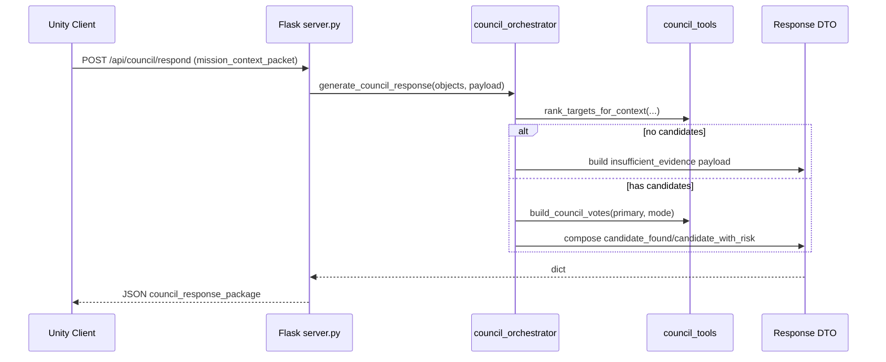

# Atlas Orrery — Technical Feasibility & Architecture (Detailed v2)

> Mục tiêu: trình bày kiến trúc đủ chi tiết để đội dev triển khai, test, và demo ổn định trong giới hạn hackathon.

---

## 1) Architecture overview

```mermaid
flowchart TB
    subgraph CLIENT[Client Layer (Unity)]
      C1[Mode Controller]
      C2[Mission Panel]
      C3[Console Timeline]
      C4[ApiClient]
      C5[Session State]
    end

    subgraph API[Backend Layer (Flask)]
      A1[GET /api/orbital-objects]
      A2[GET /api/orbital-meta]
      A3[GET /api/planet/:id]
      A4[POST /api/council/respond]
      A5[Schema/Sanitization Boundary]
    end

    subgraph CORE[Decision Core]
      D1[council_orchestrator.generate_council_response]
      D2[council_tools.rank_targets_for_context]
      D3[council_tools.compute_habitability_score]
      D4[council_tools.build_council_votes]
      D5[council_schemas dataclasses]
    end

    subgraph DATA[Data Layer]
      E1[data/orbital_elements.csv]
      E2[data/orbital_elements.meta.json]
      E3[In-memory cache via lru_cache]
    end

    C4 --> A1
    C4 --> A2
    C4 --> A3
    C4 --> A4

    A4 --> A5 --> D1
    D1 --> D2
    D1 --> D4
    D1 --> D5
    D2 --> D3

    A1 --> E1
    A2 --> E2
    A3 --> E1
    A4 --> E3
```

---

## 2) Code-level module decomposition

### 2.1 `server.py`
**Vai trò:** HTTP boundary, data loading/cache, orbit propagation helper, route exposure.

**Trách nhiệm chính:**
- Load datasets (`load_orbital_dataframe`, `load_orbital_meta`, `build_orbital_objects`).
- Expose REST endpoints cho Unity client.
- Ủy quyền council decision sang `generate_council_response`.

**Nguyên tắc:**
- Không viết business decision trùng lặp trong route.
- Route chỉ parse request + gọi orchestrator + trả JSON.

### 2.2 `council_orchestrator.py`
**Vai trò:** decision coordinator cho 1 turn.

**Trách nhiệm chính:**
- Parse context bằng `MissionContext`.
- Rank candidate theo filter.
- Chọn primary target.
- Build votes + compose response contract.

### 2.3 `council_tools.py`
**Vai trò:** deterministic science logic có thể kiểm thử.

**Trách nhiệm chính:**
- Safe numeric helpers (`safe_float`, `clamp`).
- Baseline habitability scoring.
- Filtering + ranking theo context.
- Rule-based vote generation.

### 2.4 `council_schemas.py`
**Vai trò:** input/output contract ở lớp Python dataclass.

**Trách nhiệm chính:**
- Parse payload an toàn (không crash khi dữ liệu bẩn).
- Chuẩn hóa mode/filter/challenge state.
- Bảo đảm response shape ổn định.

---

## 3) Runtime sequence detail



---

## 4) Data model and contract constraints

### 4.1 Mission context (input)
- `mode`: enum-like (`sandbox`, `challenge`, `discovery`), invalid -> fallback `discovery`.
- `filters`:
  - `radiusMin <= radiusMax`
  - `periodMin <= periodMax`
  - giá trị parse an toàn từ string/number.
- `recent_actions`: list[str], cắt tối đa 20 bản ghi gần nhất.

### 4.2 Council response (output)
- Status branch:
  - `insufficient_evidence`
  - `candidate_found`
  - `candidate_with_risk`
- Bảo đảm luôn có `player_options` và `primary_recommendation`.
- `evidence_summary` chứa các trường numeric đã làm tròn để hiển thị UI.

---

## 5) Missing-logic fixes required (đã áp dụng)

1. **Loại bỏ business logic unreachable trong `server.py`**
   - Trước đó route `/api/council/respond` trả về sớm rồi còn block logic duplicate phía sau.
   - Hiện tại route chỉ còn 1 luồng chuẩn: parse -> load objects -> orchestrator -> response.

2. **Tăng độ bền khi parse payload trong schema**
   - Bổ sung parse bool/float/int an toàn.
   - Clamp và normalize filter boundaries khi input ngược (`min > max`).
   - Giới hạn mode hợp lệ và cắt `recent_actions` tránh payload quá lớn.

---

## 6) NFR feasibility

### 6.1 Performance
- Data load dùng `lru_cache(maxsize=1)` giảm I/O lặp.
- Ranking tối đa trên tập object đã giới hạn (`head(900)`) để giữ thời gian phản hồi.

### 6.2 Reliability
- Input xấu không được làm API crash.
- No-candidate path luôn trả response có cấu trúc hoàn chỉnh.

### 6.3 Maintainability
- Logic quyết định tập trung tại orchestrator/tools.
- HTTP layer mỏng, dễ test độc lập.

### 6.4 Observability
- Khuyến nghị thêm request logging theo `request_id` và latency để debug demo realtime.

---

## 7) Verification strategy

- Unit test orchestrator:
  - candidate path
  - insufficient evidence path
- Unit test schema parse:
  - mode invalid
  - filter kiểu string bẩn
  - min/max đảo ngược
- API smoke:
  - `/api/council/respond` với payload tối thiểu.

---

## 8) 48h implementation roadmap (refined)

### 0-8h
- Khóa contract input/output.
- Hoàn thiện schema parse + test.

### 8-20h
- Hoàn thiện ranking/voting deterministic.
- Hook endpoint council vào orchestrator.

### 20-32h
- Unity integration + state sync.
- Edge-case UX cho insufficient_evidence.

### 32-48h
- Hardening: logs, retry policy nhẹ, test + rehearsal.

---

## 9) Final note

Kiến trúc này khả thi cho hackathon vì giữ core science ở deterministic layer (minh bạch, testable) và tách bạch rõ boundary giữa UI, API và decision core, giúp giảm rủi ro demo-time.
