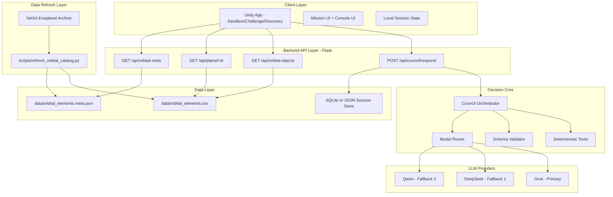

# Atlas Orrery — Technical Feasibility & Architecture (Submission-ready)

> Mục tiêu file: mô tả kiến trúc hệ thống rõ ràng, có thể triển khai trong hackathon với phạm vi MVP.

---

## 1) Kiến trúc tổng thể



---

## 2) Thiết kế module (code map)

### Backend
- `server.py`
  - HTTP boundary.
  - Load/cache dataset.
  - Route request sang orchestrator.
- `council_orchestrator.py`
  - Điều phối 1 vòng quyết định (1 turn).
  - Gọi deterministic tools và model router.
- `council_tools.py`
  - Tính toán deterministic: lọc/rank/chấm điểm baseline.
- `council_schemas.py`
  - Validate input/output contract.
- `model_router.py`
  - Fallback chain: `Grok -> DeepSeek -> Qwen`.

### Client (Unity)
- `ModeController`
  - Quản lý mode: Sandbox/Challenge/Discovery.
- `MissionPanelController`
  - Hiển thị headline, recommendation, options.
- `ConsoleController`
  - Render council votes + warnings.
- `ApiClient`
  - Gọi API Flask + retry nhẹ.

### Data
- `data/orbital_elements.csv`
- `data/orbital_elements.meta.json`
- `local/session.db` hoặc `local/session.json`

---

## 3) Ranh giới trách nhiệm

| Thành phần | Trách nhiệm chính | Không làm |
|---|---|---|
| Unity Client | Thu thao tác người dùng, render phản hồi | Không tự tính score khoa học |
| Flask API | Validate request, route, error handling | Không nhúng logic UI |
| Orchestrator | Quyết định action cuối | Không đọc file trực tiếp |
| Deterministic Tools | Chấm điểm/lọc/rank minh bạch | Không gọi network |
| Model Router | Sinh reasoning text + fallback model | Không sửa dữ liệu gốc |
| Data Refresh Script | Đồng bộ dữ liệu NASA | Không phục vụ request runtime |

---

## 4) Contract kỹ thuật

### 4.1 Input contract (`mission_context_packet`)

```json
{
  "mode": "challenge",
  "player_goal": "find high-potential habitable candidates in 5 minutes",
  "selected_planet_id": "Kepler-442 b",
  "filters": {
    "showConfirmed": true,
    "showHabitable": true,
    "radiusMin": 0.7,
    "radiusMax": 2.2,
    "periodMin": 1,
    "periodMax": 500
  },
  "simulation": {
    "timeScale": 8,
    "trackingTarget": "Kepler-442 b",
    "simDate": "2026-03-29T03:20:00Z"
  },
  "challenge_state": {
    "active": true,
    "objective": "Find 2 candidate worlds",
    "progress": 1
  },
  "recent_actions": ["spiral_scan", "open_planet_modal"]
}
```

### 4.2 Output contract (`council_response_package`)

```json
{
  "mission_status": "candidate_found",
  "headline": "Council flags Kepler-442 b for deep review",
  "primary_recommendation": {
    "action": "targeted_scan",
    "target_id": "Kepler-442 b",
    "reason": "Radius and insolation are close to baseline habitable band"
  },
  "council_votes": [
    {
      "agent": "Navigator",
      "stance": "support",
      "confidence": 0.82,
      "message": "This target should be prioritized next."
    },
    {
      "agent": "Climate",
      "stance": "caution",
      "confidence": 0.71,
      "message": "Data uncertainty remains on atmosphere assumptions."
    }
  ],
  "player_options": [
    "Run targeted scan",
    "Compare with similar planets",
    "Widen filters"
  ],
  "evidence_fields": ["pl_rade", "pl_eqt", "pl_insol", "pl_orbeccen"],
  "discovery_log_entry": "Kepler-442 b promoted to high-interest candidate"
}
```

---

## 5) NFR và SLO cho hackathon demo

### Performance
- `/api/council/respond` p95 < 1200ms (local demo).
- API error rate < 1% trong 1 phiên demo.

### Reliability
- Nếu model primary lỗi/timeout, fallback tự động sang model kế.
- Nếu cả 3 model lỗi, trả deterministic fallback response (không crash UI).

### Security
- Không hardcode API key trong repo.
- Dùng `.env` cho model credentials.

### Observability
- Log mỗi request gồm: `request_id`, `mode`, `latency_ms`, `model_used`, `fallback_count`.

---

## 6) Rủi ro kỹ thuật và giảm thiểu

1. Model timeout khi demo
- Giảm thiểu: timeout ngắn + fallback chain + cached response.

2. Payload sai schema
- Giảm thiểu: validate input/output bằng schema trước khi trả UI.

3. Không có candidate phù hợp theo filter
- Giảm thiểu: nhánh `insufficient_evidence` + gợi ý nới filter.

4. Data refresh lỗi trước giờ demo
- Giảm thiểu: khóa dataset ổn định trước phiên chấm.

---

## 7) Kế hoạch triển khai 48 giờ

### Sprint 1 (0-12h)
- Chuẩn hóa schema input/output.
- Xây `council_orchestrator` deterministic trước.

### Sprint 2 (12-24h)
- Kết nối model router + fallback chain.
- Thêm endpoint `/api/council/respond`.

### Sprint 3 (24-36h)
- Unity UI: mode selector, mission panel, console votes.
- Tích hợp end-to-end với backend.

### Sprint 4 (36-48h)
- Hardening: timeout/retry/logging.
- Rehearsal demo và khóa scope.

---

## 8) Checklist sẵn sàng nộp

- [ ] Diagram render đúng, không duplicate block.
- [ ] Contract request/response ổn định.
- [ ] Fallback chain hoạt động thực tế.
- [ ] Có deterministic fallback khi model lỗi.
- [ ] Demo hoàn chỉnh 1 mission end-to-end trong 5-7 phút.

---

## 9) Kết luận

Kiến trúc này cân bằng giữa tính agentic và tính khả thi hackathon: phần khoa học giữ deterministic, phần AI tập trung vào planning/explanation, và toàn hệ thống có fallback rõ ràng để demo ổn định.
