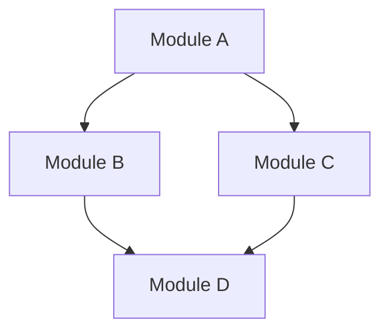
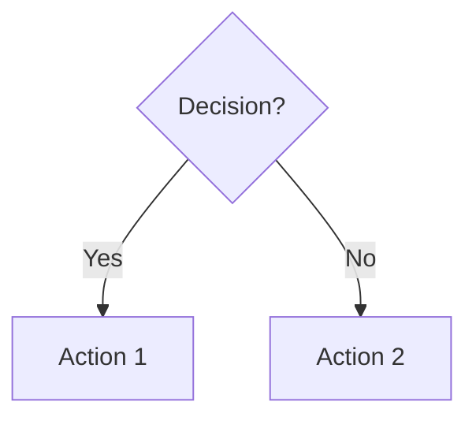
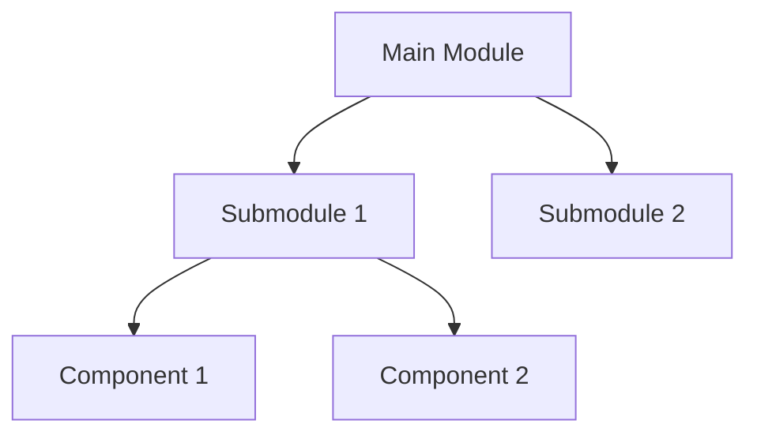
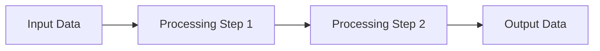

# Clean Architecture Overview

This section provides an overview of clean architecture, ensuring that all components are independently testable and can be changed without affecting others. 

## Module Dependencies Graph



## Decision Flow Sequence Diagram



## Code-Level Module Decomposition



## Input/Output Contracts in JSON

```json
{
    "input": {
        "param1": "value1",
        "param2": "value2"
    },
    "output": {
        "result": "outputValue"
    }
}
```

## Data Flow Pipelines



## Responsibility Matrix

| Role         | Responsibility          |
|--------------|-------------------------|
| Developer    | Code Implementation      |
| Tester       | Ensure Quality           |
| Architect    | Design Architecture      |

## NFR Requirements
- Performance: Must handle 1000 requests per second.
- Security: Must comply with OWASP standards.

## 48-Hour Roadmap
1. **Hour 1-12**: Requirement Analysis
2. **Hour 13-24**: Design Phase
3. **Hour 25-36**: Implementation
4. **Hour 37-48**: Testing and Deployment

## Risk Register
- **Risk 1**: High complexity in integration.
- **Mitigation**: Prototyping before full-scale implementation.

## Verification Strategy
- Unit testing for component validation.
- Integration testing for module interactions.

## Conclusion

The rewritten architecture section ensures all mermaid diagrams adhere to proper syntax, includes necessary elements, and maintains the integrity of the original content while improving readability and rendering capability.