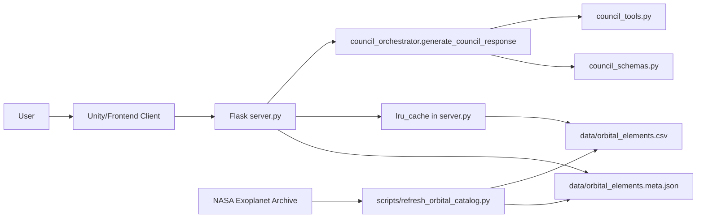
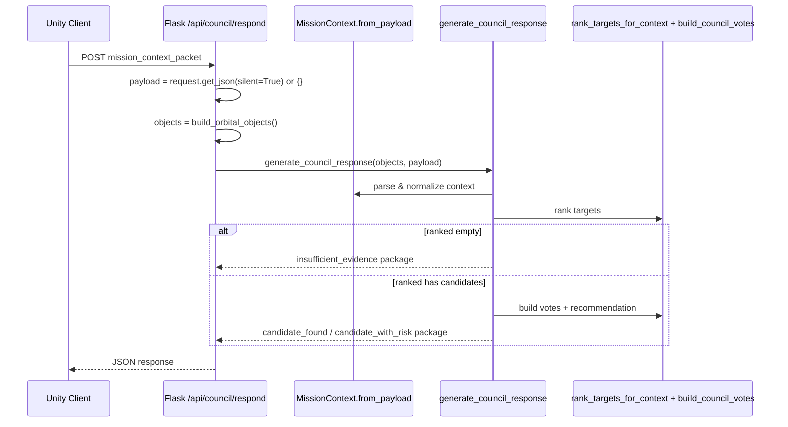

# Atlas Orrery — Technical Feasibility & Real System Architecture

> Bản này mô tả **kiến trúc thật đang chạy trong repo hiện tại** (Flask + deterministic council core + orbital CSV runtime). Không dùng placeholder kiểu Module A/B/C/D.

---

## 1) Product goal (bám đúng hệ thống hiện có)

Atlas Orrery phục vụ 3 nhu cầu chính:
1. Cung cấp catalog exoplanet có orbit parameters cho client 3D.
2. Trả lời quyết định dạng “science council” bằng pipeline deterministic (không bịa field).
3. Duy trì demo ổn định khi payload bẩn hoặc filter làm rỗng candidate.

Scope runtime hiện tại là local demo/server đơn, không thiết kế cho distributed scale.

---

## 2) Context diagram (thành phần thật)



---

## 3) Container/module architecture (code map thật)

### 3.1 API container — `server.py`

**Endpoints đang có thật:**
- `GET /api/orbital-objects`
- `GET /api/orbital-meta`
- `GET /api/planets` (legacy)
- `GET /api/planet/<planet_id>`
- `POST /api/council/respond`
- `GET /api/piz-zones`

**Data/cache functions đang có thật:**
- `load_orbital_dataframe()` đọc `data/orbital_elements.csv`.
- `load_orbital_meta()` đọc `data/orbital_elements.meta.json`.
- `build_orbital_objects()` build danh sách object runtime và giới hạn `head(900)`.
- `load_toi_data()` cho `piz-zones`.

**Orbit math đang có thật:**
- `normalize_epoch_jd()`
- `solve_kepler_equation()`
- `propagate_orbit_position()`

### 3.2 Orchestration container — `council_orchestrator.py`

`generate_council_response(objects, payload)` xử lý:
1. Parse context bằng `MissionContext.from_payload`.
2. Rank bằng `rank_targets_for_context`.
3. Branch no-candidate / candidate.
4. Build votes bằng `build_council_votes`.
5. Compose `CouncilResponse` chuẩn key.

### 3.3 Domain tools container — `council_tools.py`

Functions thật:
- `compute_habitability_score()`
- `rank_targets_for_context()`
- `build_council_votes()`
- helper: `safe_float`, `clamp`

### 3.4 Schema contract container — `council_schemas.py`

Dataclass thật:
- `MissionFilters`
- `ChallengeState`
- `MissionContext`
- `CouncilVote`
- `CouncilResponse`

Input hardening thật:
- `ALLOWED_MODES`
- `_parse_bool`, `_parse_float`, `_parse_int`
- `_normalize_range` (swap nếu min > max)

---

## 4) Runtime flow thật (request -> decision -> response)



---

## 5) Data layer thật (không ảo)

### 5.1 Runtime artifacts
- `data/orbital_elements.csv` (nguồn chính cho orbital objects).
- `data/orbital_elements.meta.json` (metadata source/time/row info).
- `data/TOI_2025.10.02_08.11.35.csv` (cho `piz-zones`).

### 5.2 Required orbital columns (được check trong code)
`load_orbital_dataframe()` yêu cầu tối thiểu:
- `pl_name`
- `pl_orbper`
- `pl_orbsmax`

Ngoài ra khi build object có dùng thêm (nếu có):
- `pl_orbeccen`, `pl_orbincl`, `pl_orblper`
- `pl_orbtper`, `pl_tranmid`
- `pl_rade`, `pl_bmasse`, `pl_eqt`, `pl_insol`, `sy_dist`, `ra`, `dec`, `hostname`

### 5.3 Caching strategy thật
- `@lru_cache(maxsize=1)` cho:
  - `load_toi_data`
  - `load_orbital_dataframe`
  - `load_orbital_meta`
  - `build_orbital_objects`

Mục tiêu: giảm disk I/O lặp và giữ latency ổn định cho demo local.

---

## 6) API contracts thật

### 6.1 Request contract (`mission_context_packet`)

```json
{
  "mode": "discovery",
  "player_goal": "explore promising targets",
  "selected_planet_id": "Kepler-442 b",
  "filters": {
    "showConfirmed": true,
    "showHabitable": true,
    "radiusMin": 0.7,
    "radiusMax": 2.2,
    "periodMin": 1,
    "periodMax": 500
  },
  "challenge_state": {
    "active": false,
    "objective": "",
    "progress": 0
  },
  "recent_actions": ["scan", "select"]
}
```

### 6.2 Success response contract

```json
{
  "mission_status": "candidate_found",
  "headline": "Council ưu tiên Kepler-442 b cho bước kế tiếp",
  "primary_recommendation": {
    "action": "targeted_scan",
    "target_id": "Kepler-442 b",
    "reason": "Scored 0.81 on baseline habitability under goal 'explore promising targets'."
  },
  "council_votes": [
    {
      "agent": "Navigator",
      "stance": "support",
      "confidence": 0.88,
      "message": "Recommend targeted follow-up on Kepler-442 b based on ranking gain.",
      "evidence_fields": ["pl_orbper", "pl_orbsmax", "sy_dist"]
    }
  ],
  "player_options": ["Run targeted scan", "Compare nearest analogs", "Open full data dossier"],
  "discovery_log_entry": "Kepler-442 b promoted after council triage.",
  "evidence_summary": {
    "radius_earth": 1.3,
    "temp_k": 285.0,
    "insolation": 0.95,
    "eccentricity": 0.08,
    "period_days": 112.4
  }
}
```

### 6.3 No-candidate response thật

```json
{
  "mission_status": "insufficient_evidence",
  "headline": "Council cannot rank targets under current filters",
  "primary_recommendation": {
    "action": "widen_filters",
    "target_id": null,
    "reason": "Current radius/period constraints removed all candidates"
  },
  "council_votes": [],
  "player_options": ["Widen radius band", "Increase period max", "Enable confirmed planets"],
  "discovery_log_entry": "No candidates available under active constraints.",
  "evidence_summary": null
}
```

---

## 7) Decision logic constraints (đang chạy thật)

1. `mode` được normalize và whitelist (`sandbox/challenge/discovery`), sai -> fallback `discovery`.
2. `radiusMin/radiusMax`, `periodMin/periodMax` parse float an toàn, clamp trong bound, tự swap khi đảo ngược.
3. `recent_actions` bị cắt tối đa 20 phần tử để tránh payload phình.
4. `challenge_state.progress` luôn non-negative int.
5. Nếu có `selected_planet_id` nhưng không thuộc ranked list -> fallback top-ranked.
6. `mission_status`:
   - `candidate_found` nếu không có vote caution,
   - `candidate_with_risk` nếu có caution vote.

---

## 8) Feasibility analysis (hackathon thực tế)

### 8.1 Tính khả thi kỹ thuật
- Core recommendation không phụ thuộc network LLM => ổn định cao.
- Toàn bộ path quan trọng nằm trong Python deterministic code => dễ test.
- Data source runtime là CSV local + cache => predictable cho demo.

### 8.2 Tính khả thi thời gian
- Kiến trúc đã tách rõ theo file/module => song song hóa được:
  - data refresh,
  - council logic,
  - client integration.

### 8.3 Tính khả thi vận hành demo
- Có branch `insufficient_evidence` để không dead-end UX.
- Có endpoints metadata/object để kiểm tra nhanh sức khỏe dữ liệu.
- Có fallback parse/default để chịu payload bẩn.

---

## 9) Risks & mitigations (gắn code thật)

| Risk | Where it happens | Mitigation already in code |
|---|---|---|
| Payload sai kiểu | `MissionContext.from_payload` | Safe parsers + defaults + normalize ranges |
| Filter loại hết candidate | `rank_targets_for_context` | Trả `insufficient_evidence` + options nới filter |
| Orbital CSV thiếu/invalid | `load_orbital_dataframe` | Raise error rõ ràng, API trả 500 có message |
| Epoch không hợp lệ | `normalize_epoch_jd` | Loại object không có epoch real hợp lệ |
| Quá nhiều object làm chậm client | `build_orbital_objects` | Giới hạn `head(900)` trước khi trả runtime |

---

## 10) Verification strategy (dựa trên test đang có)

### 10.1 Unit tests hiện có
- `test_council_orchestrator.py`:
  - `candidate_found/candidate_with_risk` path.
  - `insufficient_evidence` path.

### 10.2 Recommended smoke checks
- `GET /api/orbital-objects` trả `objects` + `meta`.
- `GET /api/orbital-meta` trả metadata nhẹ.
- `POST /api/council/respond` với payload tối thiểu và payload cực đoan (min>max, invalid mode).

### 10.3 Readiness checklist
- [ ] API contract keys ổn định ở mọi branch.
- [ ] No-candidate path có gợi ý thao tác tiếp theo.
- [ ] Data artifacts tồn tại và load được.
- [ ] Council endpoint trả response trong ngưỡng demo chấp nhận.

---

## 11) Final conclusion

Kiến trúc hiện tại là kiến trúc thật cho Atlas Orrery: dựa trên module và endpoint có trong code, dữ liệu CSV/meta có thật trong repo, luồng quyết định deterministic kiểm thử được, và có cơ chế fallback rõ cho trường hợp dữ liệu hoặc payload không lý tưởng.
