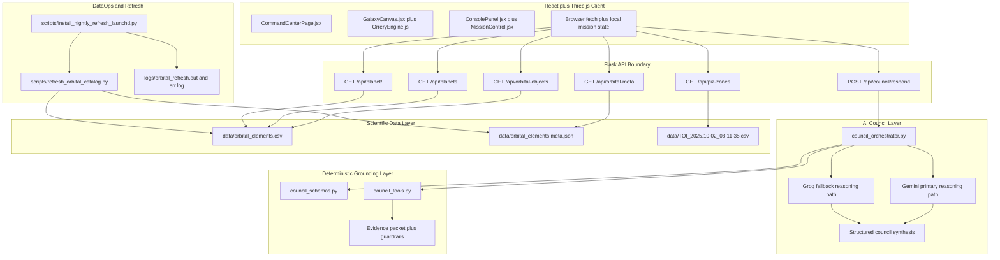
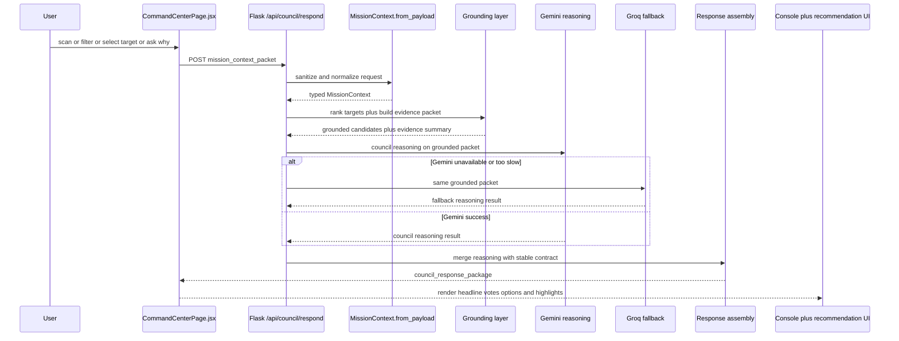

# Atlas Orrery - Technical Architecture

> Đây không phải là một doc "backend có gì". Đây là technical case cho thấy Atlas Orrery là một sản phẩm AI hackathon có chủ đích: dữ liệu thật, reasoning thật, fallback thật, và một demo path đủ chắc để bước vào phòng chấm mà không run tay.

## What this document proves

- Atlas Orrery không chỉ là một orrery 3D đẹp mắt; nó là một `AI Science Council system` được đóng khung bằng architecture rõ ràng.
- `Gemini` nằm ở đúng trung tâm của intelligence layer, không bị giấu sau một đống từ ngữ chung chung.
- `Groq` không phải tên phụ họa trong slide; nó là fallback path có chủ đích để giữ demo continuity.
- Deterministic layer không cạnh tranh với AI; nó làm nhiệm vụ grounding, guardrails, scoring baseline, và contract stability.
- Frontend, Flask API, AI council layer, grounding layer, data layer, và DataOps tách trách nhiệm đủ rõ để đội thi có thể defend từng quyết định trước giám khảo kỹ thuật.

## 1) Architecture stance

Chúng tôi cố ý thiết kế Atlas Orrery theo hướng `AI-first but not AI-loose`.

Điều đó có nghĩa là:

1. Người xem phải nhìn thấy AI tạo ra giá trị ở vòng runtime chính, không phải chỉ nằm trong phần "future work".
2. Mọi reasoning của AI phải bám vào evidence thật từ catalog thiên văn, không được phép bịa.
3. Demo không được phép chết chỉ vì provider chính chậm hoặc lỗi.
4. UI không parse văn bản tự do; UI chỉ render trên một contract có cấu trúc ổn định.

Đây là architecture để thắng một buổi chấm hackathon: AI phải nổi bật, nhưng hệ thống phải đứng vững.

## 2) System architecture overview



Atlas Orrery dùng kiến trúc hybrid có chủ đích:

- Deterministic layer giữ phần nền: lọc candidate, chấm baseline, lấy evidence, khóa contract.
- `Gemini` là reasoning engine chính cho Science Council: tranh luận, lập luận, ưu tiên mục tiêu, diễn giải cho người chơi.
- `Groq` là fallback path để demo không bị phụ thuộc một provider duy nhất.
- Flask giữ vai trò transport boundary, không ôm prompt logic và không lẫn với scoring logic.

## 3) What the judges should understand in 30 seconds

Nếu giám khảo chỉ đọc đúng một phần của file này, họ phải nhìn ra ngay 4 ý:

1. Đây là một hệ thống dữ liệu thật chạy trên NASA-derived catalog, không phải data giả để minh họa.
2. AI không chỉ "nói chuyện"; AI thực sự ngồi ở runtime decision loop.
3. `Gemini` là primary intelligence path, còn `Groq` là fallback path để bảo vệ demo.
4. Toàn bộ reasoning của AI bị neo vào deterministic evidence package để tránh hallucination và giữ tính kiểm chứng.

## 4) Runtime architecture

### Client layer

- `CommandCenterPage.jsx`
  - Thu user action: filter, scan pattern, chọn target, mở dossier.
  - Gom state hiện tại thành `mission_context_packet`.
  - Gọi `POST /api/council/respond`.
  - Đẩy council result vào `ConsolePanel`, recommendation card, highlight logic.

- `GalaxyCanvas.jsx` + `OrreryEngine.js`
  - Render orbital scene.
  - Chạy orbit propagation phía client.
  - Quản lý tracking, scan effects, discovered targets, camera state.

- `ConsolePanel.jsx`
  - Render headline, support votes, caution votes.
  - Không diễn giải lại response; chỉ trình bày contract đã được backend bảo đảm.

- `MissionControl.jsx`
  - Kích hoạt `grid`, `spiral`, `targeted`.
  - Đóng vai trò interaction surface, không dính scientific policy.

### Flask API boundary

- `server.py` là HTTP boundary duy nhất giữa UI và council system.
- Flask route layer có 2 nhiệm vụ:
  - load và phân phối catalog/object data,
  - nhận `mission_context_packet` và chuyển vào council path.
- Route layer không được tự ý quyết định candidate hay rewrite scientific reasoning.

### AI Council Layer

- `council_orchestrator.py` là nơi một council turn thực sự diễn ra.
- Orchestrator làm 5 việc:
  - nhận context đã normalize,
  - gọi grounding tools để lấy candidate + evidence package,
  - route sang `Gemini`,
  - fallback sang `Groq` nếu cần,
  - đóng gói thành `council_response_package`.

### Deterministic Grounding Layer

- `council_schemas.py`
  - normalize payload,
  - clamp numeric ranges,
  - ép mode về whitelist,
  - khóa response schema.

- `council_tools.py`
  - baseline score,
  - rank candidates,
  - build evidence summary,
  - scaffold council votes,
  - quyết định khi nào cần `insufficient_evidence`.

### Data layer

- `data/orbital_elements.csv`
  - runtime source of truth cho orbital catalog.

- `data/orbital_elements.meta.json`
  - lineage, refreshed timestamp, rows, solver, epoch policy.

- `data/TOI_2025.10.02_08.11.35.csv`
  - auxiliary source cho PIZ discovery context.

### DataOps layer

- `refresh_orbital_catalog.py`
  - lấy dữ liệu mới từ NASA TAP,
  - validate,
  - publish artifact.

- `install_nightly_refresh_launchd.py`
  - cài nightly refresh cho local demo environment.

## 5) AI Council Layer

### Why this layer exists

Atlas Orrery sẽ không thắng hackathon nếu AI chỉ nằm ở caption hoặc ở phần roadmap. AI phải là trái tim của trải nghiệm. Vì vậy `AI Council Layer` không phải phần trang trí; nó là nơi dữ liệu thiên văn được biến thành một hội đồng khoa học có chính kiến.

### Primary reasoning path

`Gemini` là reasoning engine chính vì chúng tôi cần:

- multi-step reasoning trên grounded scientific evidence,
- khả năng giữ được debate tone giữa nhiều role,
- chuyển dữ liệu khô thành recommendation và explanation mà vẫn có cấu trúc,
- tạo cảm giác "Science Council" thật sự đang tranh luận trước mắt giám khảo.

### Fallback path

`Groq` tồn tại vì hackathon demo cần một thứ còn quan trọng hơn sự lý tưởng: khả năng sống sót trên sân khấu.

Fallback policy:

1. Orchestrator luôn chuẩn bị một grounded evidence package trước.
2. Package đó được đưa vào `Gemini` như primary path.
3. Nếu timeout, latency spike, quota issue, hoặc provider unavailable xảy ra, orchestrator route sang `Groq`.
4. Kết quả từ cả hai path đều bị ép về cùng một output contract.

Điều này biến fallback thành một chiến lược kỹ thuật rõ ràng, không phải một cái cớ sau khi hệ thống lỗi.

### Hard line between AI and deterministic code

AI được phép:

- tranh luận,
- ưu tiên candidate,
- diễn giải rủi ro,
- đề xuất next action,
- tạo mission log mang tính thuyết phục.

AI không được phép:

- bịa giá trị khoa học,
- vượt khỏi evidence package,
- tạo key mới ngoài contract,
- thay scoring baseline,
- phá branch safety của runtime.

### Why hybrid wins

Deterministic evidence selection tạo một lớp nền mà giám khảo kỹ thuật có thể tin. `Gemini` tạo lớp intelligence mà giám khảo AI muốn thấy. `Groq` giữ demo continuity mà đội thi cần có để không sụp ở phút thứ 89. Cả ba lớp đó kết hợp mới tạo ra một submission có sức nặng thực chiến.

## 6) Runtime request flow



Runtime flow này có một điểm mấu chốt: `AI value` không nằm ở bước parse request hay ở bước trả JSON. AI value nằm ở bước reasoning trên grounded packet. Đó là phần phải bật lên khi giám khảo đọc sơ đồ.

## 7) Code map and dependency direction

### Frontend anchors

- `orrery_component/frontend/src/pages/CommandCenterPage.jsx`
  - owns council request trigger,
  - owns FE state aggregation,
  - owns log append and mission action wiring.

- `orrery_component/frontend/src/lib/orreryEngine.js`
  - owns orbit propagation,
  - owns scene state,
  - owns visual tracking and discovery interactions.

- `orrery_component/frontend/src/components/ConsolePanel.jsx`
  - owns council output presentation.

- `orrery_component/frontend/src/components/MissionControl.jsx`
  - owns scan command surface.

### Backend anchors

- `server.py`
  - owns HTTP boundary,
  - owns data loading,
  - owns endpoint dispatch.

- `council_orchestrator.py`
  - owns council turn orchestration,
  - owns provider routing,
  - owns disagreement resolution,
  - owns final response assembly.

- `council_schemas.py`
  - owns input normalization,
  - owns stable schema contract.

- `council_tools.py`
  - owns deterministic score/rank/evidence functions.

### Dependency rules

- Frontend không sở hữu scientific scoring.
- Flask route layer không nhúng prompt engineering hoặc ranking policy.
- AI council layer không tự đọc raw CSV.
- Deterministic layer không gọi model provider.
- Schema layer là contract authority duy nhất giữa UI và backend.

## 8) Prompt and response boundary

Để architecture này thật sự sắc, prompt path cũng phải có boundary rõ.

### What goes into the model

Model không nhận raw request mơ hồ. Model nhận:

- `mission mode`,
- `player goal`,
- selected target,
- top ranked candidates,
- evidence summary,
- caution signals,
- recent actions,
- output schema instruction.

### What never goes into the model

- raw unrestricted dataset dump,
- authority để tự thêm field ngoài contract,
- quyền thay baseline score,
- quyền tự quyết khi evidence không đủ.

### What comes out of the model

Model phải trả về reasoning payload có thể map vào:

- `headline`,
- `primary_recommendation`,
- `council_votes`,
- `player_options`,
- `discovery_log_entry`.

## 9) Short input/output example

Ví dụ này ngắn nhưng đủ để người đọc hiểu đây là một hệ thống thật, không phải slideware.

### Input snapshot

```json
{
  "mode": "discovery",
  "player_goal": "find potentially habitable worlds",
  "selected_planet_id": "Kepler-442 b",
  "filters": {
    "showConfirmed": true,
    "showHabitable": true,
    "radiusMin": 0.7,
    "radiusMax": 2.2,
    "periodMin": 1,
    "periodMax": 500
  },
  "recent_actions": ["spiral_scan", "open_planet_modal"]
}
```

### Grounded evidence snapshot

```json
{
  "primary_candidate": "Kepler-442 b",
  "baseline_score": 0.81,
  "radius_earth": 1.34,
  "temp_k": 285.0,
  "insolation": 0.95,
  "eccentricity": 0.08,
  "period_days": 112.4,
  "risk_flags": ["atmosphere_unknown"]
}
```

### Output snapshot

```json
{
  "mission_status": "candidate_with_risk",
  "headline": "Council flags Kepler-442 b for deep review",
  "primary_recommendation": {
    "action": "targeted_scan",
    "target_id": "Kepler-442 b",
    "reason": "Grounded evidence places the target near the habitable heuristic band."
  },
  "council_votes": [
    {
      "agent": "Navigator",
      "stance": "support",
      "confidence": 0.82,
      "message": "This target should be prioritized next."
    },
    {
      "agent": "Climate",
      "stance": "caution",
      "confidence": 0.71,
      "message": "Orbital uncertainty and missing atmosphere data limit certainty."
    }
  ]
}
```

## 10) Technical contracts

### Input contract (`mission_context_packet`)

```json
{
  "mode": "challenge",
  "player_goal": "find high-potential habitable candidates in 5 minutes",
  "selected_planet_id": "Kepler-442 b",
  "selected_piz_id": null,
  "filters": {
    "showConfirmed": true,
    "showHabitable": true,
    "radiusMin": 0.7,
    "radiusMax": 2.2,
    "periodMin": 1,
    "periodMax": 500
  },
  "challenge_state": {
    "active": true,
    "objective": "Find 2 candidate worlds",
    "progress": 1
  },
  "recent_actions": ["spiral_scan", "open_planet_modal"]
}
```

### Output contract (`council_response_package`)

```json
{
  "mission_status": "candidate_with_risk",
  "headline": "Council ưu tiên Kepler-442 b cho bước kế tiếp",
  "primary_recommendation": {
    "action": "targeted_scan",
    "target_id": "Kepler-442 b",
    "reason": "Scored 0.81 on baseline habitability under current goal"
  },
  "council_votes": [
    {
      "agent": "Navigator",
      "stance": "support",
      "confidence": 0.82,
      "message": "Recommend targeted follow-up based on ranking gain.",
      "evidence_fields": ["pl_orbper", "pl_orbsmax", "sy_dist"]
    },
    {
      "agent": "Astrobiologist",
      "stance": "support",
      "confidence": 0.8,
      "message": "Radius-temperature-insolation triad is within exploratory viability bounds.",
      "evidence_fields": ["pl_rade", "pl_eqt", "pl_insol"]
    },
    {
      "agent": "Climate",
      "stance": "caution",
      "confidence": 0.71,
      "message": "Orbital uncertainty needs deeper verification.",
      "evidence_fields": ["pl_orbeccen", "pl_orbper", "pl_orbincl"]
    }
  ],
  "player_options": [
    "Run targeted scan",
    "Compare nearest analogs",
    "Open full data dossier"
  ],
  "discovery_log_entry": "Kepler-442 b promoted after council triage.",
  "evidence_summary": {
    "radius_earth": 1.34,
    "temp_k": 285.0,
    "insolation": 0.95,
    "eccentricity": 0.08,
    "period_days": 112.4
  }
}
```

### Guardrails

- `mode` chỉ nhận `sandbox`, `challenge`, `discovery`.
- Numeric ranges được normalize và swap nếu đảo ngược.
- `recent_actions` luôn là `list[str]` và bị cap.
- Provider path không được phép làm đổi keyset response.
- Nếu evidence không đủ, system phải nói rõ `insufficient_evidence`.
- AI output chỉ hợp lệ khi map được về evidence thật trong dataset.

### Source of truth boundaries

- Dataset source of truth: `data/orbital_elements.csv`.
- Metadata source of truth: `data/orbital_elements.meta.json`.
- Contract source of truth: `council_schemas.py`.
- Grounding source of truth: deterministic functions trong `council_tools.py`.
- Runtime reasoning source of truth: hybrid orchestration trong `council_orchestrator.py`.

## 11) Responsibility boundaries

| Component | Owns | Out of scope |
|---|---|---|
| React client | Interaction, state aggregation, API calls, rendering | Scientific scoring, dataset mutation |
| Flask API | HTTP boundary, payload intake, response transport | Free-form science reasoning inside routes |
| `council_orchestrator.py` | Provider routing, council synthesis, response assembly | Raw dataset IO, orbit propagation |
| `council_tools.py` | Deterministic ranking, scoring, evidence packet generation | Network calls, provider control |
| `council_schemas.py` | Input normalization and stable contracts | Endpoint transport |
| Refresh scripts | Catalog refresh and metadata publish | Runtime council decision handling |

## 12) Assumptions, non-goals, and design bets

### Assumption boundaries

| Boundary | Statement |
|---|---|
| Guaranteed | Frontend luôn nhận stable response keyset; fallback không làm vỡ UI contract; deterministic grounding chạy độc lập với provider state. |
| Assumed | API keys sẵn sàng cho phiên demo; catalog refresh hoàn tất trước giờ chấm; backend chạy local single-instance. |
| Out of scope | Horizontal scaling, multi-region deployment, long-lived production telemetry stack. |

### Non-goals

- Không biến toàn bộ system thành một LLM blob.
- Không để model thay scoring baseline.
- Không bọc prompt engineering vào UI layer.
- Không đánh đổi demo reliability chỉ để theo đuổi một kiến trúc "đẹp trên giấy".

### Key architectural bets

| Decision | Why this is the right bet for hackathon | Trade-off |
|---|---|---|
| `Gemini` primary reasoning | Làm AI trở thành phần trung tâm của product experience | Phụ thuộc provider health |
| `Groq` fallback | Bảo vệ demo continuity | Tăng orchestration complexity |
| Deterministic grounding layer | Chặn hallucination và tăng khả năng defend trước judge kỹ thuật | Cần giữ discipline khi mở rộng |
| Stable structured contract | FE render chắc, ít bug, dễ demo | Ít tự do hơn response thuần text |
| Data artifact freeze trước demo | Giảm failure ngay trước giờ chấm | Có thể không là snapshot mới nhất |

## 13) Risks and mitigations

1. AI mạnh nhưng không đáng tin.
- Mitigation: mọi reasoning phải bám grounded evidence packet.

2. Provider chính lỗi ngay lúc demo.
- Mitigation: `Groq` fallback path với cùng contract và cùng evidence packet.

3. FE phải branch riêng cho từng model path.
- Mitigation: response assembly luôn hợp nhất về một schema duy nhất.

4. Judge hỏi "Gemini ở đâu".
- Mitigation: `Gemini` được chỉ ra trực tiếp trong sơ đồ hệ thống, request flow, fallback strategy, và runtime reasoning path.

5. Judge hỏi "nếu AI bịa thì sao".
- Mitigation: deterministic grounding, evidence fields, `insufficient_evidence`, hard line giữa AI layer và scoring layer.

## 14) Conclusion

Atlas Orrery được thiết kế như một submission đang lao thẳng vào sân khấu hackathon: đủ dữ liệu thật để thuyết phục, đủ AI để tạo wow factor, đủ deterministic guardrails để không tự bắn vào chân, và đủ fallback strategy để sống sót qua áp lực demo. `Gemini` là trung tâm của intelligence layer. `Groq` là chiếc dù an toàn. Phần còn lại của hệ thống tồn tại để hai điều đó phát huy tác dụng mà không làm mất kiểm soát.
