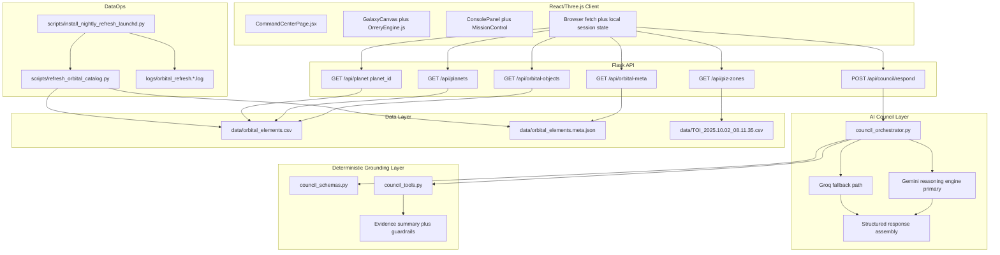
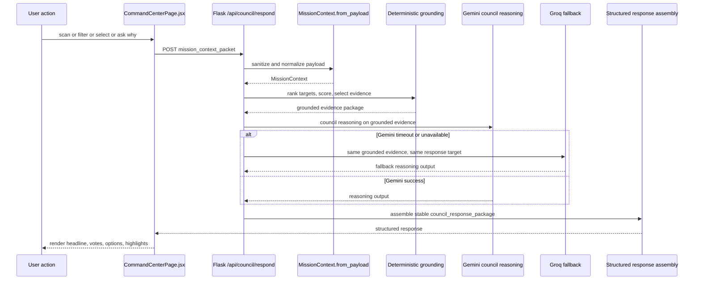

# Atlas Orrery - Technical Architecture

> Tài liệu này mô tả kiến trúc kỹ thuật, ranh giới module, và intelligence layer của Atlas Orrery. Pipeline vận hành theo thời gian (data refresh, runtime loop, quality gates, rollback) được tách riêng trong `SYSTEM_PIPELINE.md`.

### What this document establishes
- Thành phần sở hữu HTTP boundary và catalog delivery (`server.py`).
- Thành phần sở hữu council turn orchestration, model routing, và response synthesis (`council_orchestrator.py`).
- Thành phần sở hữu grounding, scoring, ranking, và evidence selection (`council_tools.py`).
- Thành phần sở hữu input normalization và stable response contract (`council_schemas.py`).
- Vị trí của `Gemini` trong hệ thống, vai trò `Groq` fallback, và cách hybrid architecture giữ được cả AI value lẫn demo stability.

## 1) System architecture overview



> PDF note: render Mermaid diagram to SVG before export để giữ chất lượng trình bày.

Atlas Orrery sử dụng kiến trúc hybrid: deterministic scoring và evidence selection tạo lớp nền ổn định, kiểm chứng được; `Gemini` đảm nhiệm reasoning layer cho AI Science Council; `Groq` đóng vai trò fallback nhằm duy trì trải nghiệm demo liên tục khi latency hoặc provider state không phù hợp.

## 2) Runtime architecture

### Client
- `CommandCenterPage.jsx`: thu user interaction, build `mission_context_packet`, gọi council endpoint, và gắn council result vào UI.
- `GalaxyCanvas.jsx` + `OrreryEngine.js`: render orbital scene, tracking, scan patterns, filters, discovery highlights.
- `ConsolePanel.jsx`: render headline, support votes, caution votes.
- `MissionControl.jsx`: phát lệnh scan pattern (`grid`, `spiral`, `targeted`).
- Browser local state: giữ filter state, selected target, recent actions cho lần request kế tiếp.

### Backend API
- Flask routes là request boundary duy nhất giữa frontend và council loop.
- `POST /api/council/respond` là main decision entrypoint.
- Catalog routes (`/api/orbital-objects`, `/api/orbital-meta`, `/api/planet/...`) phục vụ UI data access, không chứa council synthesis logic.

### AI Council Layer
- `council_orchestrator.py` điều phối một council turn hoàn chỉnh.
- Orchestrator nhận grounded evidence từ deterministic layer rồi gọi `Gemini` để tạo reasoning đa bước, debate giữa các vai trò khoa học, và final recommendation.
- Nếu `Gemini` timeout hoặc unavailable, orchestrator chuyển sang `Groq` fallback nhưng vẫn giữ cùng response contract.
- AI layer không được tự chế số liệu; mọi kết luận phải map về evidence được chọn từ catalog.

### Deterministic Grounding Layer
- `council_schemas.py`: normalize payload, clamp ranges, giữ schema ổn định.
- `council_tools.py`: scoring, ranking, vote scaffolding, evidence selection, không phụ thuộc network.
- Guardrails nằm ở đây: filter normalization, `insufficient_evidence`, stable keyset, evidence_fields.

### Data layer
- `orbital_elements.csv`: runtime catalog để build orbital objects.
- `orbital_elements.meta.json`: metadata snapshot (source, refreshed_at_utc, rows, columns, solver).
- `TOI_2025.10.02_08.11.35.csv`: auxiliary source cho PIZ exploration endpoint.

### Auxiliary endpoints / supporting data services
- `GET /api/piz-zones` hỗ trợ discovery context cho UI.
- Endpoint này không tự ra quyết định; nó chỉ cung cấp thêm context cho player navigation và council turn kế tiếp.

## 3) AI Council Layer

Đây là lớp mà giám khảo AI hackathon cần nhìn thấy ngay khi đọc kiến trúc.

### Core role of the layer
1. `Gemini` là reasoning engine chính của Science Council.
2. `Groq` là fallback để giữ demo continuity khi cần độ ổn định vận hành.
3. Deterministic layer giữ grounding, scoring baseline, evidence selection, và contract stability.
4. AI layer chuyển grounded evidence thành lập luận, tranh luận đa góc nhìn, và structured council response.

### Why this layer matters

Deterministic evidence selection đảm bảo hệ thống có nền tảng dữ liệu ổn định. Trên lớp nền đó, `Gemini` cho phép các agent thể hiện reasoning đa bước, tạo tranh luận có cấu trúc, và chuyển hóa dữ liệu thiên văn thành trải nghiệm học tập mang tính đối thoại thay vì chỉ là một bảng xếp hạng tĩnh.

### Fallback Strategy
- `Gemini` được ưu tiên cho council reasoning vì đây là lớp intelligence chính của experience.
- Khi latency, quota, hoặc provider state không phù hợp cho demo, orchestrator chuyển sang `Groq` fallback với cùng grounded evidence package.
- Dù đi qua `Gemini` hay `Groq`, output contract và evidence summary vẫn giữ nhất quán để frontend render không cần branch theo model path.
- Nếu cả hai model path đều không sẵn sàng, hệ thống vẫn có thể trả deterministic-safe response như `insufficient_evidence` hoặc recommendation tối thiểu thay vì fail hard.

## 4) Runtime request flow



- Request boundary nằm tại `POST /api/council/respond`.
- Parsing boundary nằm tại `request.get_json(silent=True)` và `MissionContext.from_payload`.
- Grounding boundary nằm tại `rank_targets_for_context`, baseline scoring, evidence selection.
- AI value được tạo ở bước `Gemini council reasoning`; đây là nơi system chuyển từ data-processing sang scientific deliberation.
- `Groq` chỉ là fallback path, không thay đổi contract shape.

## 5) Code map and dependency direction

### Frontend
- `orrery_component/frontend/src/pages/CommandCenterPage.jsx`
  - Owns council request trigger, FE state aggregation, console log append, scan actions.

- `orrery_component/frontend/src/lib/orreryEngine.js`
  - Owns scene simulation, orbit propagation, filters, tracking, discovery interactions.

- `orrery_component/frontend/src/components/ConsolePanel.jsx`
  - Owns presentation của council headline và vote lines.

- `orrery_component/frontend/src/components/MissionControl.jsx`
  - Owns scan controls, không chứa ranking/scoring logic.

### Backend
- `server.py`
  - Owns HTTP routes, data loading, catalog object preparation, route dispatch.
  - Delegates council decision path sang `generate_council_response`.

- `council_orchestrator.py`
  - Owns council turn orchestration, provider-path selection (`Gemini` primary / `Groq` fallback), và final response synthesis.
  - Depends on `MissionContext`, `CouncilResponse`, `CouncilVote` từ `council_schemas.py`.
  - Depends on deterministic tools từ `council_tools.py`.

- `council_tools.py`
  - Pure deterministic computations: score, rank, vote scaffolding, evidence selection.
  - Không import Flask, không gọi model provider trực tiếp.

- `council_schemas.py`
  - Canonical contract layer cho input normalization và output schema.
  - Không phụ thuộc server runtime state.

### Scripts
- `scripts/refresh_orbital_catalog.py`: fetch NASA TAP, normalize, publish CSV + meta.
- `scripts/install_nightly_refresh_launchd.py`: cài lịch refresh local và log sink.

### Tests
- `test_council_orchestrator.py`: xác nhận branch behavior và response shape cho council loop.

### Dependency rules
- Frontend không sở hữu scientific scoring logic.
- Flask route layer không embed ranking/scoring rules hoặc prompt logic trực tiếp; nó chỉ là transport boundary.
- AI council layer không tự đọc file raw dataset; nó chỉ nhận grounded evidence package từ deterministic layer.
- Deterministic layer không phụ thuộc model provider và luôn có thể test độc lập.
- Schema layer là canonical boundary để giảm contract drift giữa frontend và backend.

## 6) API surface

### Council decision
- `POST /api/council/respond`

### Catalog delivery
- `GET /api/orbital-objects`
- `GET /api/orbital-meta`
- `GET /api/planets`
- `GET /api/planet/<planet_id>`

### Auxiliary data
- `GET /api/piz-zones`

## 7) Short council turn example

Ví dụ ngắn này tồn tại để giám khảo thấy dữ liệu thật sự chảy qua hệ thống như thế nào.

### Input snapshot

```json
{
  "mode": "discovery",
  "player_goal": "find potentially habitable worlds",
  "selected_planet_id": "Kepler-442 b",
  "filters": {
    "showConfirmed": true,
    "showHabitable": true,
    "radiusMin": 0.7,
    "radiusMax": 2.2,
    "periodMin": 1,
    "periodMax": 500
  },
  "recent_actions": ["spiral_scan", "open_planet_modal"]
}
```

### Output snapshot

```json
{
  "mission_status": "candidate_with_risk",
  "headline": "Council flags Kepler-442 b for deep review",
  "primary_recommendation": {
    "action": "targeted_scan",
    "target_id": "Kepler-442 b",
    "reason": "Grounded evidence places the target near the habitable heuristic band."
  },
  "council_votes": [
    {
      "agent": "Navigator",
      "stance": "support",
      "confidence": 0.82,
      "message": "This target should be prioritized next."
    },
    {
      "agent": "Climate",
      "stance": "caution",
      "confidence": 0.71,
      "message": "Orbital uncertainty and missing atmosphere data limit certainty."
    }
  ]
}
```

Điểm quan trọng của ví dụ này không phải prose đẹp, mà là việc `input -> grounded evidence -> council reasoning -> structured output` nhìn thấy được rất rõ.

## 8) Technical contracts

### Input contract (`mission_context_packet`)

```json
{
  "mode": "challenge",
  "player_goal": "find high-potential habitable candidates in 5 minutes",
  "selected_planet_id": "Kepler-442 b",
  "selected_piz_id": null,
  "filters": {
    "showConfirmed": true,
    "showHabitable": true,
    "radiusMin": 0.7,
    "radiusMax": 2.2,
    "periodMin": 1,
    "periodMax": 500
  },
  "challenge_state": {
    "active": true,
    "objective": "Find 2 candidate worlds",
    "progress": 1
  },
  "recent_actions": ["spiral_scan", "open_planet_modal"]
}
```

### Output contract (`council_response_package`)

```json
{
  "mission_status": "candidate_with_risk",
  "headline": "Council ưu tiên Kepler-442 b cho bước kế tiếp",
  "primary_recommendation": {
    "action": "targeted_scan",
    "target_id": "Kepler-442 b",
    "reason": "Scored 0.81 on baseline habitability under current goal"
  },
  "council_votes": [
    {
      "agent": "Navigator",
      "stance": "support",
      "confidence": 0.82,
      "message": "Recommend targeted follow-up based on ranking gain.",
      "evidence_fields": ["pl_orbper", "pl_orbsmax", "sy_dist"]
    },
    {
      "agent": "Astrobiologist",
      "stance": "support",
      "confidence": 0.8,
      "message": "Radius-temperature-insolation triad is within exploratory viability bounds.",
      "evidence_fields": ["pl_rade", "pl_eqt", "pl_insol"]
    },
    {
      "agent": "Climate",
      "stance": "caution",
      "confidence": 0.71,
      "message": "Orbital uncertainty needs deeper verification.",
      "evidence_fields": ["pl_orbeccen", "pl_orbper", "pl_orbincl"]
    }
  ],
  "player_options": [
    "Run targeted scan",
    "Compare nearest analogs",
    "Open full data dossier"
  ],
  "discovery_log_entry": "Kepler-442 b promoted after council triage.",
  "evidence_summary": {
    "radius_earth": 1.34,
    "temp_k": 285.0,
    "insolation": 0.95,
    "eccentricity": 0.08,
    "period_days": 112.4
  }
}
```

### Guardrails / invariants
- `mode` chỉ nhận `sandbox`, `challenge`, `discovery`; invalid mode về `discovery`.
- `radiusMin/radiusMax`, `periodMin/periodMax` được normalize và swap nếu đảo ngược.
- `recent_actions` luôn được chuẩn hóa về `list[str]` và cap 20 entries.
- Council response giữ stable keyset cho cả nhánh success và `insufficient_evidence`.
- Provider path (`Gemini` hoặc `Groq`) không được làm đổi shape contract.
- AI output phải map về evidence fields có thật trong dataset; nếu dữ liệu thiếu, response phải nói rõ `insufficient_evidence` hoặc caution.

### Source of truth boundaries
- Dataset source of truth: published artifact `data/orbital_elements.csv` sau refresh validation.
- Contract source of truth: `council_schemas.py` (`MissionContext`, `CouncilResponse`, `CouncilVote`).
- Grounding source of truth: deterministic evidence package từ `council_tools.py`.
- Runtime reasoning source of truth: hybrid orchestration tại `generate_council_response`, nơi grounded evidence được chuyển thành council response qua `Gemini` primary hoặc `Groq` fallback.

## 9) Responsibility boundaries

| Component | Owns | Out of scope |
|---|---|---|
| React client (`CommandCenterPage`, panels, engine) | User interaction, FE state aggregation, API calls, UI rendering | Scientific scoring, dataset mutation |
| Flask API routes | Request boundary, payload intake, endpoint response | Free-form scientific reasoning inside route layer |
| AI council routing inside `council_orchestrator.py` | Model-path selection, council synthesis, disagreement resolution | Raw dataset IO, orbit propagation |
| `council_tools.py` | Deterministic score/rank/vote functions and evidence selection | Network calls, session persistence, provider control |
| `council_schemas.py` | Input normalization and schema contracts | Endpoint transport logic |
| Refresh scripts | Catalog refresh and metadata publish | Runtime council decision handling |

## 10) Deployment and runtime assumptions

### Assumption boundaries

| Boundary | Statement |
|---|---|
| Guaranteed | Frontend luôn nhận stable response keyset; deterministic grounding chạy giống nhau ở mọi model path; fallback không làm vỡ UI contract. |
| Assumed | API keys và provider connectivity sẵn sàng trong phiên demo; catalog refresh hoàn tất trước demo; backend chạy single-instance local process. |
| Out of scope | Horizontal scaling, distributed orchestration, multi-region deployment, long-term production observability stack. |

### Non-goals
- Không xây distributed architecture trong hackathon build.
- Không để frontend sở hữu scientific scoring/ranking.
- Không để LLM tự bịa dữ liệu khoa học hoặc ghi đè deterministic evidence layer.
- Không biến `Gemini` thành data source; model chỉ reason trên grounded package.

### Key architectural decisions

| Decision | Why | Trade-off |
|---|---|---|
| Hybrid council architecture: deterministic grounding + Gemini primary + Groq fallback | Giữ được AI value, explainability, và demo continuity cùng lúc | Tăng complexity orchestration so với deterministic-only hoặc single-model-only |
| Contract ownership tập trung ở `council_schemas.py` | Giảm contract drift giữa frontend và backend | Cần discipline khi mở rộng schema |
| Single-instance local Flask runtime | Giảm failure domain và setup time cho hackathon | Không nhắm scale production |
| Artifact snapshot trước demo | Tránh rủi ro refresh fail sát giờ chấm | Dữ liệu có thể không phải mới nhất tuyệt đối |
| Tách architecture doc và pipeline doc | Boundary rõ giữa design ownership và execution controls | Reviewer cần đọc cả 2 file để có full picture |

## 11) NFR and SLO for hackathon demo

### Performance
- `POST /api/council/respond` p95 < 1500ms trên `Gemini` path trong local demo env.
- Fallback path p95 < 900ms khi chạy `Groq`.
- Ranking + evidence selection p95 < 120ms với catalog runtime <= 900 objects.

### Reliability
- Timeout hoặc provider error không làm crash council endpoint; hệ thống phải degrade sang fallback path hoặc deterministic-safe response.
- No-candidate path phải trả `insufficient_evidence` thay vì runtime exception.

### Security
- Không hardcode secrets trong repo.
- `Gemini` và `Groq` credentials đi qua `.env` hoặc secret manager tương đương.

### Observability
- Runtime logs tối thiểu: `request_id`, `mode`, `candidate_count`, `mission_status`, `provider_path`, `latency_ms`.
- Refresh logs tách riêng qua `logs/orbital_refresh.*.log`.

## 12) Architectural risks and mitigations

1. AI layer mờ nhạt trong mắt giám khảo.
- Mitigation: tách rõ `AI Council Layer`, chỉ ra `Gemini` là primary reasoning engine, `Groq` là fallback.

2. Provider outage hoặc latency spike gần giờ demo.
- Mitigation: timeout budget, automatic fallback sang `Groq`, contract-stable response assembly.

3. Contract drift giữa frontend và backend.
- Mitigation: giữ schema boundary trong `council_schemas.py`, kiểm tra stable keyset ở mọi mission status.

4. Dataset refresh lỗi sát giờ demo.
- Mitigation: refresh sớm, freeze artifact snapshot trước phiên chấm, không overwrite khi validation fail.

5. AI hallucination hoặc over-claim.
- Mitigation: deterministic grounding, `evidence_fields`, explicit caution, `insufficient_evidence` branch khi dữ liệu không đủ.

6. Filter quá hẹp tạo dead-end UX.
- Mitigation: branch `insufficient_evidence` trả action `widen_filters` và player options rõ ràng.

### Verification mapping

| Concern | Verified by |
|---|---|
| Branch correctness | `test_council_orchestrator.py` |
| Contract stability | schema guardrails + contract checks trong pipeline gate |
| Dataset validity | refresh validation trước publish artifact |
| Fallback readiness | provider timeout rehearsal + smoke path verification |
| Runtime readiness | API smoke checks + demo rehearsal pass |

## 13) Evolution path

### Hackathon baseline
- Hybrid council với deterministic grounding, `Gemini` primary reasoning, `Groq` fallback, contract ổn định cho frontend render.

### Near-term
- Thêm prompt policy rõ hơn cho từng council role.
- Bổ sung provider telemetry để đo `Gemini` vs `Groq` path trong rehearsal.

### Next-step
- Mở rộng multimodal council turn cho ảnh/quỹ đạo/mission snapshot.
- Tối ưu recommendation theo user behavior và acceptance pattern, vẫn giữ guardrails contract.

## 14) Conclusion

Kiến trúc của Atlas Orrery không chỉ là một backend sạch. Điểm mạnh chiến lược của nó là hybrid intelligence architecture: deterministic layer giữ grounding và kiểm chứng, `Gemini` là trung tâm của reasoning layer cho AI Science Council, còn `Groq` là fallback có chủ đích để đảm bảo demo continuity. Đây là cách hệ thống vừa giữ chất engineering, vừa làm rõ vì sao AI là phần cốt lõi chứ không chỉ là lớp trang trí.
