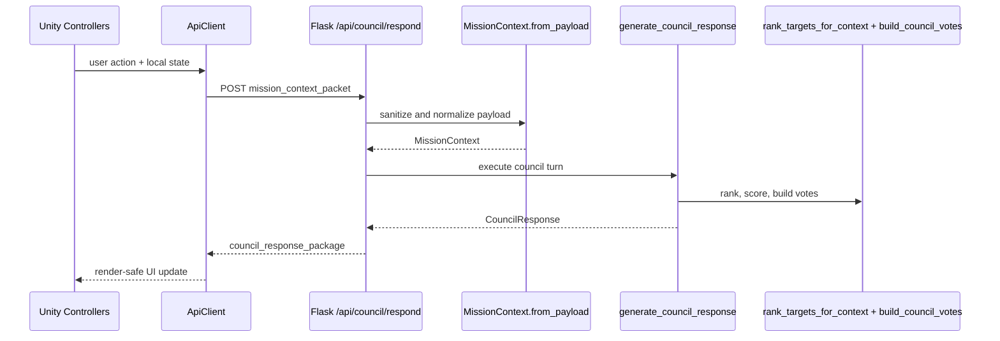

# Atlas Orrery - Technical Architecture

> Tài liệu này mô tả kiến trúc kỹ thuật và ranh giới module của Atlas Orrery. Pipeline vận hành (data refresh, runtime loop, quality gates, rollback) được tách riêng trong `SYSTEM_PIPELINE.md`.

### What this document establishes
- Thành phần sở hữu runtime decision loop (`council_orchestrator.py` + `council_tools.py`).
- Thành phần sở hữu contract và normalization (`council_schemas.py`).
- Thành phần sở hữu publish dataset artifact cho runtime (`refresh_orbital_catalog.py`).
- Boundary module/dependency của runtime system; execution sequencing và rollback nằm trong `SYSTEM_PIPELINE.md`.

## 1) System architecture overview


> PDF note: render Mermaid diagram to SVG before export để giữ chất lượng trình bày.

Hệ thống tách rõ ba lớp runtime: Unity điều khiển interaction và render, Flask cung cấp HTTP boundary, deterministic core xử lý decision logic dựa trên catalog dữ liệu đã được refresh trước đó.

## 2) Runtime architecture

### Client
- `ModeController`: quản lý mode `sandbox/challenge/discovery`.
- `MissionPanelController`: render `headline`, `primary_recommendation`, `player_options`.
- `ConsoleController`: render `council_votes`, trạng thái mission, cảnh báo.
- `ApiClient`: gọi API, xử lý timeout/retry nhẹ ở mức client.
- Local session state: giữ context hiện tại cho lần request kế tiếp.

### Backend API
- Flask routes là request boundary duy nhất giữa Unity và decision core.
- `POST /api/council/respond` là main decision entrypoint.
- Catalog routes trả dữ liệu quỹ đạo/metadata/detail theo nhu cầu UI, không chứa decision synthesis.

### Decision core
- `council_orchestrator.py`: orchestration một vòng quyết định và compose response.
- `council_tools.py`: deterministic scoring/ranking/voting, không phụ thuộc network.
- `council_schemas.py`: parse/normalize input và định nghĩa response contract.

### Data layer
- `orbital_elements.csv`: runtime catalog để build orbital objects.
- `orbital_elements.meta.json`: metadata snapshot (source, refreshed_at_utc, rows, columns).
- `TOI_2025.10.02_08.11.35.csv`: nguồn cho PIZ auxiliary endpoint.

### Auxiliary endpoints / supporting data services
- `GET /api/piz-zones` là endpoint hỗ trợ exploration context từ TOI dataset.
- Endpoint này không tham gia council decision loop; nó bổ trợ UI discovery/navigation.

## 3) Runtime request flow



- Request boundary nằm tại `POST /api/council/respond`.
- Parsing boundary nằm tại `request.get_json(silent=True)` và `MissionContext.from_payload`.
- Decision boundary nằm tại `generate_council_response`.
- Ranking/voting nằm trong `rank_targets_for_context` và `build_council_votes`.
- Response luôn trả cấu trúc ổn định để `MissionPanelController` và `ConsoleController` render an toàn.

## 4) Code map and dependency direction

### Backend
- `server.py`
- Owns HTTP routes, data loading, catalog object preparation.
- Depends on `generate_council_response` cho council decision path.

- `council_orchestrator.py`
- Depends on `MissionContext`, `CouncilResponse`, `CouncilVote` từ `council_schemas.py`.
- Depends on `rank_targets_for_context`, `build_council_votes` từ `council_tools.py`.

- `council_tools.py`
- Pure deterministic computations; không import Flask, không gọi network.

- `council_schemas.py`
- Shared contract layer cho input normalization và output schema.
- Không phụ thuộc server/runtime state.

### Scripts
- `scripts/refresh_orbital_catalog.py`: fetch NASA TAP, normalize, publish CSV + meta.
- `scripts/install_nightly_refresh_launchd.py`: cài lịch refresh local và log sink.

### Tests
- `test_council_orchestrator.py`: xác nhận branch behavior và response shape cho council loop.

### Dependency rules
- Unity UI không sở hữu scientific scoring logic.
- Flask route layer không embed scoring rules; chỉ orchestration entry + data access.
- Decision core không gọi network ở runtime path.
- Schema layer là canonical boundary để giảm contract drift giữa client và backend.

### Implementation anchors
- `server.py` owns HTTP boundary và route dispatch.
- `council_orchestrator.py` owns branch synthesis cho `candidate_found`, `candidate_with_risk`, `insufficient_evidence`.
- `council_tools.py` owns deterministic scoring/ranking/voting primitives.
- `council_schemas.py` owns payload normalization và response contract dataclasses.
- `test_council_orchestrator.py` verifies branch behavior và response stability ở council path.

## 5) API surface

### Council decision
- `POST /api/council/respond`

### Catalog delivery
- `GET /api/orbital-objects`
- `GET /api/orbital-meta`
- `GET /api/planets` (legacy projection)
- `GET /api/planet/<planet_id>`

### Auxiliary data
- `GET /api/piz-zones`

## 6) Technical contracts

### Input contract (`mission_context_packet`)

```json
{
  "mode": "challenge",
  "player_goal": "find high-potential habitable candidates in 5 minutes",
  "selected_planet_id": "Kepler-442 b",
  "selected_piz_id": null,
  "filters": {
    "showConfirmed": true,
    "showHabitable": true,
    "radiusMin": 0.7,
    "radiusMax": 2.2,
    "periodMin": 1,
    "periodMax": 500
  },
  "challenge_state": {
    "active": true,
    "objective": "Find 2 candidate worlds",
    "progress": 1
  },
  "recent_actions": ["spiral_scan", "open_planet_modal"]
}
```

### Output contract (`council_response_package`)

```json
{
  "mission_status": "candidate_with_risk",
  "headline": "Council uu tien Kepler-442 b cho buoc ke tiep",
  "primary_recommendation": {
    "action": "targeted_scan",
    "target_id": "Kepler-442 b",
    "reason": "Scored 0.81 on baseline habitability under current goal"
  },
  "council_votes": [
    {
      "agent": "Navigator",
      "stance": "support",
      "confidence": 0.82,
      "message": "Recommend targeted follow-up based on ranking gain.",
      "evidence_fields": ["pl_orbper", "pl_orbsmax", "sy_dist"]
    },
    {
      "agent": "Astrobiologist",
      "stance": "support",
      "confidence": 0.8,
      "message": "Radius-temperature-insolation triad is within exploratory viability bounds.",
      "evidence_fields": ["pl_rade", "pl_eqt", "pl_insol"]
    },
    {
      "agent": "Climate",
      "stance": "caution",
      "confidence": 0.71,
      "message": "Orbital uncertainty needs deeper verification.",
      "evidence_fields": ["pl_orbeccen", "pl_orbper", "pl_orbincl"]
    }
  ],
  "player_options": [
    "Run targeted scan",
    "Compare nearest analogs",
    "Open full data dossier"
  ],
  "discovery_log_entry": "Kepler-442 b promoted after council triage.",
  "evidence_summary": {
    "radius_earth": 1.34,
    "temp_k": 285.0,
    "insolation": 0.95,
    "eccentricity": 0.08,
    "period_days": 112.4
  }
}
```

### Guardrails / invariants
- `mode` chỉ nhận `sandbox`, `challenge`, `discovery`; invalid mode về `discovery`.
- `radiusMin/radiusMax`, `periodMin/periodMax` được normalize và swap nếu đảo ngược.
- `recent_actions` luôn được chuẩn hóa về `list[str]` và cap 20 entries.
- Council response giữ stable keyset cho cả nhánh success và `insufficient_evidence`.

### Source of truth boundaries
- Dataset source of truth: published artifact `data/orbital_elements.csv` sau refresh validation.
- Contract source of truth: `council_schemas.py` (`MissionContext`, `CouncilResponse`, `CouncilVote`).
- Runtime decision source of truth: deterministic orchestration tại `generate_council_response` + tools layer.

## 7) Responsibility boundaries

| Component | Owns | Out of scope |
|---|---|---|
| Unity controllers + ApiClient | User interaction, API calls, UI rendering | Scientific scoring, dataset mutation |
| Flask API routes | Request boundary, payload intake, endpoint response | Business decision rules inside UI layer |
| `council_orchestrator.py` | Branch decision, recommendation synthesis, response composition | Raw file IO for dataset |
| `council_tools.py` | Deterministic score/rank/vote functions | Network calls, session persistence |
| `council_schemas.py` | Input normalization and schema contracts | Endpoint transport logic |
| Refresh scripts | Catalog refresh and metadata publish | Runtime council decision handling |

## 8) Deployment and runtime assumptions

### Assumption boundaries

| Boundary | Statement |
|---|---|
| Guaranteed | Runtime council path không phụ thuộc network/model provider; Unity nhận stable response keyset ở mọi mission status. |
| Assumed | Catalog runtime size nằm trong ngưỡng demo target; refresh hoàn tất trước phiên demo; backend chạy single-instance local process. |
| Out of scope | Horizontal scaling, distributed orchestration, multi-region deployment. |

### Non-goals
- Không xây distributed architecture trong MVP.
- Không dùng real-time stream processing cho catalog updates.
- Không để Unity sở hữu scientific scoring/ranking.
- Không dùng LLM để thay deterministic ranking core trong MVP.

### Key architectural decisions

| Decision | Why | Trade-off |
|---|---|---|
| Deterministic council core | Demo stability, explainability, testability | Giảm độ linh hoạt ngôn ngữ so với LLM-driven loop |
| Single-instance local Flask runtime | Giảm failure domain và setup time cho hackathon | Không nhắm scale production |
| Contract ownership tập trung ở `council_schemas.py` | Giảm contract drift giữa Unity và backend | Cần discipline khi mở rộng schema |
| Artifact snapshot trước demo | Tránh rủi ro refresh fail sát giờ chấm | Dữ liệu có thể không phải mới nhất tuyệt đối |
| Tách architecture doc và pipeline doc | Boundary rõ giữa design ownership và execution controls | Reviewer cần đọc cả 2 file để có full picture |

## 9) NFR and SLO for hackathon demo

### Performance
- `POST /api/council/respond` p95 < 1200ms (local).
- Ranking p95 < 120ms với catalog runtime <= 900 objects.

### Reliability
- Payload bẩn không làm crash endpoint; luôn normalize về default an toàn.
- No-candidate path phải trả `insufficient_evidence` thay vì lỗi runtime.

### Security
- Không hardcode secrets trong repo.
- Nếu mở rộng LLM layer sau MVP, credentials đi qua `.env`.

### Observability
- Runtime logs tối thiểu: `request_id`, `mode`, `candidate_count`, `mission_status`, `latency_ms`.
- Refresh logs tách riêng qua `logs/orbital_refresh.*.log`.

## 10) Architectural risks and mitigations

1. Contract drift giữa Unity và backend.
- Mitigation: giữ schema boundary trong `council_schemas.py`, kiểm tra required keys ở mọi status.

2. Dataset refresh lỗi sát giờ demo.
- Mitigation: refresh sớm, freeze artifact snapshot trước phiên chấm, không overwrite khi validation fail.

3. Filter quá hẹp tạo dead-end.
- Mitigation: branch `insufficient_evidence` trả action `widen_filters` và options hành động rõ.

4. Cold cache gây spike ở first request.
- Mitigation: warm API catalog trước khi chạy live walkthrough.

### Verification mapping

| Concern | Verified by |
|---|---|
| Branch correctness | `test_council_orchestrator.py` |
| Contract stability | schema guardrails + contract checks trong pipeline gate |
| Dataset validity | refresh validation trước publish artifact |
| Runtime readiness | API smoke checks + rehearsal pass |
| Performance target | latency verification theo SLO demo |

## 11) Evolution path

### MVP
- Deterministic council end-to-end với contract ổn định.

### Hybrid
- Thêm model-assisted explanation layer sau council deterministic output.
- Không thay scoring/ranking core bằng LLM.

### Adaptive
- Tối ưu recommendation theo user behavior và acceptance pattern, vẫn giữ guardrails contract.

## 12) Conclusion

Kiến trúc hiện tại tập trung đúng vào bài toán hackathon: runtime loop rõ, decision deterministic, contract ổn định cho Unity, và data refresh có kiểm soát để demo chạy chắc trong điều kiện single-instance local deployment.
