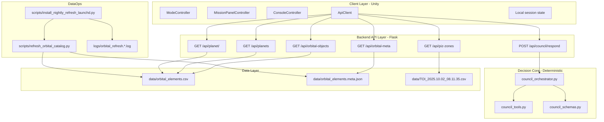

# Atlas Orrery - Technical Architecture (Project Architecture)

> Tài liệu này chỉ mô tả kiến trúc hệ thống và ranh giới module. Pipeline vận hành được tách riêng trong `SYSTEM_PIPELINE.md`.

---

## 1) Kiến trúc tổng thể



---

## 2) Kiến trúc runtime

### 2.1 Client (Unity)
- Trách nhiệm:
- Thu user action và state hiện tại (mode/filter/selection).
- Gọi API và render `council_response_package`.

- Không làm:
- Không tự tính habitability score.
- Không tự tạo scientific facts mới.

### 2.2 Backend API (Flask)
- Trách nhiệm:
- HTTP boundary, input parse/sanitize, trả JSON contract.
- Đóng vai trò integration point giữa dataset và council core.

- Không làm:
- Không nhúng logic trình bày UI.
- Không phụ thuộc trực tiếp vào engine Unity.

### 2.3 Decision Core (deterministic)
- `council_orchestrator.py`: điều phối quyết định mỗi turn.
- `council_tools.py`: rank/score/build votes bằng rule rõ ràng.
- `council_schemas.py`: normalize payload + dataclass contract.

### 2.4 Data layer
- Catalog runtime: `orbital_elements.csv`.
- Metadata runtime: `orbital_elements.meta.json`.
- TOI source cho PIZ endpoint: `TOI_2025.10.02_08.11.35.csv`.

---

## 3) Code map

### 3.1 Backend
- `server.py`
- Định nghĩa Flask routes.
- Build orbital objects cache (`lru_cache`).
- Kết nối với `generate_council_response`.

- `council_orchestrator.py`
- Nhận `MissionContext` + ranked targets.
- Branch `candidate_found/candidate_with_risk/insufficient_evidence`.
- Compose `CouncilResponse`.

- `council_tools.py`
- `compute_habitability_score`.
- `rank_targets_for_context`.
- `build_council_votes`.

- `council_schemas.py`
- `MissionContext`, `MissionFilters`, `ChallengeState`.
- `CouncilVote`, `CouncilResponse`.
- Parse/normalize payload và clamp range.

### 3.2 Scripts
- `scripts/refresh_orbital_catalog.py`
- `scripts/install_nightly_refresh_launchd.py`

### 3.3 Tests
- `test_council_orchestrator.py`

---

## 4) API surface hiện có

### 4.1 Council
- `POST /api/council/respond`

### 4.2 Catalog
- `GET /api/orbital-objects`
- `GET /api/orbital-meta`
- `GET /api/planets` (legacy)
- `GET /api/planet/<planet_id>`

### 4.3 TOI/PIZ
- `GET /api/piz-zones`

---

## 5) Contract kỹ thuật

### 5.1 Input contract (`mission_context_packet`)

```json
{
  "mode": "challenge",
  "player_goal": "find high-potential habitable candidates in 5 minutes",
  "selected_planet_id": "Kepler-442 b",
  "selected_piz_id": null,
  "filters": {
    "showConfirmed": true,
    "showHabitable": true,
    "radiusMin": 0.7,
    "radiusMax": 2.2,
    "periodMin": 1,
    "periodMax": 500
  },
  "challenge_state": {
    "active": true,
    "objective": "Find 2 candidate worlds",
    "progress": 1
  },
  "recent_actions": ["spiral_scan", "open_planet_modal"]
}
```

### 5.2 Output contract (`council_response_package`)

```json
{
  "mission_status": "candidate_with_risk",
  "headline": "Council uu tien Kepler-442 b cho buoc ke tiep",
  "primary_recommendation": {
    "action": "targeted_scan",
    "target_id": "Kepler-442 b",
    "reason": "Scored 0.81 on baseline habitability under current goal"
  },
  "council_votes": [
    {
      "agent": "Navigator",
      "stance": "support",
      "confidence": 0.82,
      "message": "Recommend targeted follow-up based on ranking gain.",
      "evidence_fields": ["pl_orbper", "pl_orbsmax", "sy_dist"]
    },
    {
      "agent": "Climate",
      "stance": "caution",
      "confidence": 0.71,
      "message": "Orbital uncertainty needs deeper verification.",
      "evidence_fields": ["pl_orbeccen", "pl_orbper", "pl_orbincl"]
    }
  ],
  "player_options": [
    "Run targeted scan",
    "Compare nearest analogs",
    "Open full data dossier"
  ],
  "discovery_log_entry": "Kepler-442 b promoted after council triage.",
  "evidence_summary": {
    "radius_earth": 1.34,
    "temp_k": 285.0,
    "insolation": 0.95,
    "eccentricity": 0.08,
    "period_days": 112.4
  }
}
```

### 5.3 Guardrails
- Mode whitelist: `sandbox`, `challenge`, `discovery`.
- Numeric range normalize cho radius/period filter.
- `recent_actions` cap tối đa 20 events.
- Không có candidate -> bắt buộc nhánh `insufficient_evidence`.

---

## 6) Ranh giới trách nhiệm

| Thành phần | Trách nhiệm chính | Không làm |
|---|---|---|
| Unity client | Thu thao tác, render phản hồi | Không tự chấm điểm khoa học |
| Flask API | Parse/validate payload, trả contract ổn định | Không chứa UI logic |
| Orchestrator | Quyết định branch response | Không đọc file dataset trực tiếp |
| Tools | Tính score/rank/votes minh bạch | Không gọi network |
| Data refresh script | Đồng bộ dataset từ NASA | Không phục vụ runtime API |

---

## 7) NFR và SLO cho hackathon demo

### Performance
- `POST /api/council/respond` p95 < 1200ms (local).
- Ranking p95 < 120ms cho catalog runtime <= 900 objects.

### Reliability
- Payload bẩn vẫn được normalize an toàn.
- Dataset lỗi trả API error rõ ràng, không silent failure.

### Security
- Không hardcode secrets trong repo.
- Nếu mở rộng LLM sau này: dùng `.env` cho API keys.

### Observability
- Log tối thiểu: `request_id`, `mode`, `candidate_count`, `mission_status`, `latency_ms`.

---

## 8) Rủi ro kiến trúc và giảm thiểu

1. Dataset refresh lỗi gần giờ demo
- Giảm thiểu: refresh sớm, giữ artifact ổn định trước phiên chấm.

2. Contract drift giữa backend và Unity
- Giảm thiểu: khóa schema sớm + contract check cho 2 nhánh success/insufficient.

3. No-candidate dead-end UX
- Giảm thiểu: luôn trả `widen_filters` + player options actionable.

4. Scope creep vì thêm LLM quá sớm
- Giảm thiểu: giữ deterministic council cho MVP; chỉ thêm LLM sau khi demo flow ổn định.

---

## 9) Roadmap kiến trúc (sau MVP)

### Phase A (MVP hiện tại)
- Deterministic council end-to-end.
- Contract ổn định và demo-safe.

### Phase B (Hybrid)
- Thêm model router cho explanation layer (không thay thế deterministic scoring).
- Vẫn giữ evidence mapping và fallback deterministic.

### Phase C (Adaptive)
- Cá nhân hóa mission strategy theo hành vi user và acceptance rate.

---

## 10) Kết luận

Kiến trúc hiện tại ưu tiên tính chắc chắn cho hackathon: deterministic decision core, API contract rõ, data refresh tách riêng, và đủ điểm mở rộng cho hybrid agentic reasoning sau MVP mà không phá hệ thống đang chạy.
